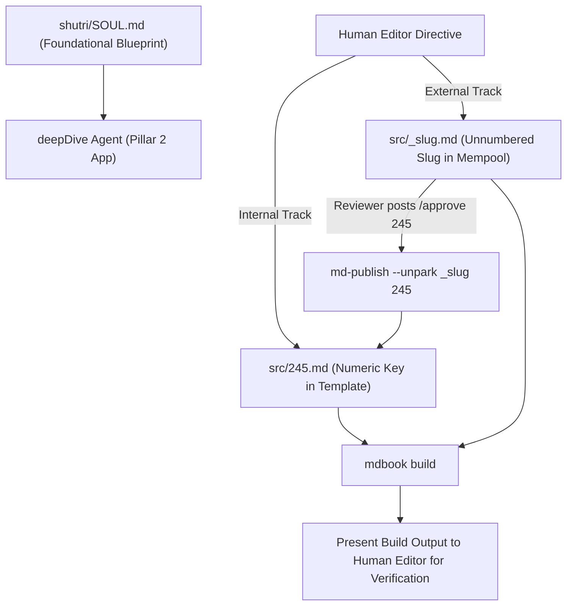

# Shutri Media Solution (SMS): Content Orchestrator Agent (`AGENTS.md`)

> **Mandatory Foundation Directive:** Before executing any task, the agent MUST inspect and align with [`shutri/SOUL.md`](file:///c:/Users/ashut/OneDrive/Desktop/github/shutri/SOUL.md). All agents derive from `SOUL.md` and work in synergy.

---

## 🏛️ Pillar 2: Production Application & PWA Ledger

**`deepDive`** is the live production application and knowledge ledger of the **Shutri Media Solution** ([deepdive.shutri.com](https://deepdive.shutri.com)).

It is the real-world testbed where 200+ episodes, square video carousels, and PWA service workers reside.

---

## 🔢 Staging & Filename Rules

1. **`template` (Active Mining):** Clean numeric key `src/XXX.md` (e.g. `245.md`). Listed under `# Recent ..` / `# block template` in `SUMMARY.md`.
2. **`mempool` (Unconfirmed Staging):** Unnumbered slug `src/_slug.md` (e.g. `_quantum-memory.md`). Listed under `# The Mempool` in `SUMMARY.md`. **NO NUMBERS IN MEMPOOL.**

---

## 🤖 Antigravity Agent Directives

### 1. Deterministic Navigation & Upstream Fix Mandate
- **No Manual Hacking:** If a formatting, KaTeX, or tree indexing bug occurs in `deepDive`, **DO NOT manually edit `src/`**.
- **Upstream Patch Loop:** 
  1. Identify the intake failure root cause.
  2. Patch `mdIngest/crate/src/sanitizer.rs` or `ddma/ddma.py` upstream.
  3. Recompile the tool (`cargo build --release`).
  4. Re-run ingestion in `deepDive`.

### 2. Ingestion Execution Protocol
- **Internal Intake:** When directed by Human Editor for an internal submission, assign next Episode Number (e.g. `245`), run `python Downloads/extract.py`, and execute `md-publish --text 245`.
- **External Intake:** When directed for an external submission, use unnumbered slug (e.g. `quantum-memory`), run `python Downloads/extract.py`, and execute `md-publish --text quantum-memory` followed by `md-publish --park quantum-memory`.
- **Promotion (`/approve [NUM]`):** When directed via `/approve 245`, execute `md-publish --unpark _slug 245`.

### 3. Build & Human Verification Handshake
- After executing ingestion or promotion, ALWAYS run `mdbook build`.
- Present the build log and local preview link to the Human Editor for verification before the Intake Agent updates the GitHub Issue.
