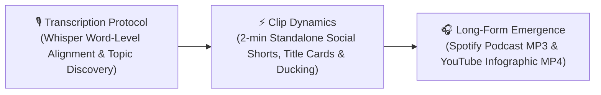

# DeepDive Media Automator (DDMA)

DeepDive Media Automator (DDMA) is a progressive media automation engine powered by **Google Antigravity**.

---

## 💡 The DDMA Philosophy: A Ground-Up Inversion of Media Production

Typically, when creating a podcast, video, or movie, creators follow a **top-down paradigm**:
1. Record hours of raw audio and video.
2. Spend days editing a master long-form podcast or film first.
3. Slice out short trailers or highlights after the fact for social media platforms like TikTok, Instagram Reels, or YouTube Shorts.

**DDMA takes a fundamentally different, ground-up approach—a total inversion of traditional media workflows.**

Rather than slicing down a monolithic master recording, DDMA builds media **bottom-up from first-principles micro-chunks**:
1. **Intelligent Short-Form First**: DDMA ingests raw audio, transcribes it at the word level, and intelligently splits it into autonomous, high-density **~2-minute short clips** optimized specifically for social media engagement.
2. **Emergent Long-Form Outcomes**: When each standalone short clip is perfected (with dynamic title cards, background music ducking, and motion graphics), the long-form audio podcast (Spotify/Apple) and long-form infographic video (YouTube) **emerge naturally as downstream outcomes** by compiling these micro-clips.

> 🎯 **If every 2-minute short is great, the resulting long-form podcast or video is guaranteed to be a filler-free master artifact.**

---

## ⚙️ Creative Automation vs. Social Media Scheduling

> [!NOTE]
> **What "Automation" Means in DDMA**:
> Automation in DDMA does **NOT** mean auto-posting videos directly to TikTok or fetching analytics from Instagram.
> Instead, **DDMA automates the creative production process itself**—intelligent topic segmentation, sub-second word-level snapping, automated audio ducking and crossfading, motion-graphics rendering, and seamless bottom-up long-form video demuxing.

---

## 🧩 Architecture: The 3 Schematic Modules

DDMA is architected around three primary schematic modules:



1. **🎙️ Transcription Protocol**:
   Processes raw unedited audio using local Whisper speech-to-text models for word-level timestamped transcription, aligning transcript words and discovering natural high-engagement topic boundaries.

2. **⚡ Clip Dynamics**:
   Focuses on crafting perfected, standalone ~2-minute short clips. Includes dynamic intro title card image generation (Pillow), background music sting ducking and quarter-sine crossfading, and AI motion-graphic rendering (Mosaic).

3. **🎧 Long-Form Emergence**:
   Synthesizes the individual micro-clips chronologically into master, publication-ready outcomes:
   * **Master Audio Podcast (`.mp3`)**: Seamlessly crossfaded audio episodes for Spotify, Apple Podcasts, and YouTube Music (e.g. [Episode 244 on Spotify](https://open.spotify.com/episode/1KKvm3TbYgxgsffHMj5MwJ?si=NeKNaPJ9QQG11-zcNB92Nw)).
   * **Master Infographic Video (`.mp4`)**: Cohesive YouTube video episodes joined with 5-second curiosity question slide transitions (e.g. [Episode 244 on YouTube](https://youtu.be/9vuNg8t42m8?si=GcVZrzUJ2pN3YZBo)).

---

> [!IMPORTANT]
> 💻 **Minimum Hardware Specifications & System Requirements**:
> Because DDMA performs local AI speech-to-text transcription (Whisper), high-definition video stream remuxing (FFmpeg), and dynamic image overlays (Pillow), we recommend the following minimum hardware configuration:
> * **CPU**: Quad-Core Processor (Intel Core i5 8th Gen+ / AMD Ryzen 5 3000+ or Apple Silicon M1/M2/M3).
> * **RAM**: **8 GB Minimum** (16 GB Recommended for handling multi-hour audio files, Whisper model weights, and 1080p/740p video rendering smoothly).
> * **Disk Storage**: **10 GB Free Disk Space** (for Python libraries, PyTorch weights, FFmpeg binaries, and temporary media clip buffers).
> * **GPU (Optional)**: NVIDIA GPU with CUDA support for accelerated transcription (automatically falls back to CPU if no GPU is available).
> * **Supported Operating Systems**: Windows 10/11 (with WSL2), macOS 12+, or Ubuntu Linux 20.04+.

---

## ⚡ Setup & Quickstart Guide

Choose the path that fits your workflow:
* **🚀 Track A: The Easy Way (Google Antigravity on Windows)** — 100% automated setup with natural language. No manual terminal steps or virtual environment creation needed!
* **🐧 Track B: The Manual Way (Isolated Native WSL Linux on Windows)** — Complete step-by-step instructions for native Linux isolation. Written for absolute beginners.

---

### 🚀 Track A: The Easy Way (Google Antigravity on Windows)

Let **Google Antigravity** handle environment provisioning, dependency installation, FFmpeg verification, transcription, and server launch automatically!

#### 1. Install Google Antigravity
Install the Antigravity CLI globally (or open the Antigravity IDE / Desktop Assistant):
```bash
npm install -g @google/antigravity-cli
```

#### 2. Prompt Antigravity
Open Antigravity in your terminal or IDE and give it this natural language instruction:
> **"Clone `https://github.com/ashutoshmjain/ddma.git`, install all Python dependencies from `requirements.txt`, verify FFmpeg is installed, start the local curator server (`python scratch/run_curator.py`), and transcribe my audio file."**

#### 🧠 How Antigravity Handles Setup Automatically:
* **Repository & Dependencies**: Clones `ddma.git` and inspects `requirements.txt` to install `openai-whisper`, `torch`, `requests`, `typer`, `pillow`, and `pyyaml`.
* **System Tools**: Automatically verifies or installs system binaries (`ffmpeg`) via `winget`, `brew`, or `apt`.
* **Server Execution**: Launches the Curator web server automatically and provides the local web URL (`http://localhost:8000/curator.html?project=episode_245`).

---

### 🐧 Track B: The Manual Way (Isolated Native WSL Linux on Windows)

If you prefer to run inside **WSL (Windows Subsystem for Linux)** with native Linux execution and total environment isolation from Windows, follow this beginner-friendly step-by-step guide.

> 💡 **What is WSL?** WSL allows you to run a native Linux terminal inside Windows.
> 💡 **What is `localhost`?** `localhost` means your own computer. When Curator runs on `http://localhost:8000`, it means your computer is serving the web interface locally on port `8000`.
> 💡 **What is a `.venv` (Virtual Environment)?** A virtual environment is an isolated "folder box" for Python packages so they don't interfere with your system or other projects.

---

#### 📌 Step 1: Open Your WSL Linux Terminal
If you haven't installed WSL yet, open Windows PowerShell as Administrator and run:
```powershell
wsl --install
```
Once installed, open **WSL** (or Ubuntu) from your Windows Start Menu.

---

#### 📌 Step 2: Clone the DDMA Repository inside WSL
In your WSL terminal, clone the repository into your native Linux home directory:
```bash
cd ~
git clone https://github.com/ashutoshmjain/ddma.git
cd ~/ddma
```

> 🔬 **Advanced / Local Testing Alternative (Working directly inside your existing Windows folder)**:
> If you already have DDMA on your Windows machine and want to test directly inside your existing Windows directory without cloning, you can navigate directly to your Windows drive (mounted inside WSL under `/mnt/c/`):
> ```bash
> cd /mnt/c/Users/ashut/OneDrive/Desktop/github/deepDive/ddma
> ```

---

#### 📌 Step 3: Install Linux System Dependencies (Run Once)
Install system packages (`python3-full`, `python3-venv`, `python3-pip`, and `ffmpeg`) inside Linux:
```bash
sudo apt update && sudo apt install -y python3-full python3-venv python3.14-venv python3-pip ffmpeg
```
* **`sudo`**: Runs the installer with administrative privileges inside Linux.
* **`apt`**: The standard Linux package manager.
* **`ffmpeg`**: The multimedia processing library used for video stream remuxing and title card concatenation.
* **`python3-full` / `python3-venv`**: Provides Python's virtual environment creation tools.

---

#### 📌 Step 4: Create and Activate Your Isolated Virtual Environment (`.venv`)
Inside your DDMA directory, create a clean virtual environment folder named `.venv`:

```bash
# 1. Remove any broken draft environments (if retrying)
rm -rf .venv

# 2. Create a clean Linux virtual environment
python3 -m venv .venv

# 3. Activate the environment
source .venv/bin/activate
```
*(When active, your terminal prompt will show `(.venv)` at the beginning of the line!)*

---

#### 📌 Step 5: Install Python Dependencies
With `(.venv)` active, install all required Python libraries from `requirements.txt`:
```bash
pip install --upgrade pip
pip install -r requirements.txt
```
This installs:
* **`openai-whisper`** (AI speech-to-text transcription engine)
* **`requests`** (Mosaic API status polling & video downloader)
* **`typer`** (CLI automation framework)
* **`pillow`** (Dynamic Intro Title Card & Outro Curiosity Card PNG image renderer)
* **`google-generativeai`** (Gemini AI Clip Remixing engine)

---

#### 📌 Step 6: Launch the Curator Server
Start the local Curator web server:
```bash
python scratch/run_curator.py
```

You will see the server startup log:
```text
Serving on http://localhost:8000
```

Open your web browser (Chrome, Edge, Firefox) and navigate to:
👉 **[http://localhost:8000/curator.html?project=episode_245](http://localhost:8000/curator.html?project=episode_245)**

---

#### 🔄 How to Resume Curator Next Time (Future Daily Usage)
Whenever you open your WSL terminal in the future, you only need to run these 3 quick commands:

```bash
cd ~/ddma
source .venv/bin/activate
python scratch/run_curator.py
```

---

## 📖 Full Documentation & Interactive Guide

For complete step-by-step guides, advanced CLI reference (`ddma.py`), fast demuxer specifications, and REST API documentation, open the interactive documentation page:
👉 **[DDMA Documentation & Developer Guide](docs/documentation.html)** *(also available directly inside the Curator Dashboard via the **`📖 Docs`** button)*.

---

## 🌌 Key Features & Capabilities

* **Multi-Project Management**: Curate multiple episodes side-by-side with local audio files, word-level Whisper transcripts, and clip plans in project-specific workspaces.
* **Collapsible & Resizable IDE-style Layout**: Drag dividers to adjust transcription/clips real estate. Collapse the sidebar to maximize focus.
* **Word-Level Curation & Timeline Snapping**: Double-click or select transcript words to set precise sub-second boundaries. Highlights used ranges to prevent overlapping selections.
* **Per-Segment Music Volume Mixer**: Mix background music stings. Set individual duration, crossfade transition, and custom volume level multipliers (e.g. `0.20` for subtle background ducking).
* **Global Sting Manager**: Upload new music stings directly through the settings panel to make them globally available.
* **Theme Customization**: Switch between **Nordic Breeze (Light)**, **Cyberpunk (Neon Cyan/Purple)**, and **Midnight (Dark default)**.
* **Dynamic Exporters & Instant Demuxing**:
  * **Audio (`.mp3`)**: Compiles mixed segments directly.
  * **Fast Video Demuxer (`.mp4`)**: Lossless `-c copy` stream stitching concatenates 40-minute episode files in 2–4 seconds!
* **Automatic Title Card Intro Prepending**: Pillow generates clean title cards with multi-line wrapping and joins them to the master clip using FFmpeg timescale normalization.
* **Mosaic AI Ingest & Recovery Integration**:
  * **Automated Upload & Execution**: Export local draft video compiles directly to the Mosaic API for AI motion graphics overlays.
  * **Self-Healing Recovery & Cache**: Automatically resumes background polling/download threads across server restarts and browser reloads.
* **🔄 Granular AI Remixing & In-Context Recasting**:
  * Click `🔄 Remix` on any clip to recast it using Gemini (analyzing preceding locked clips for style, pacing, and curiosity questions).
* **🎬 Editor's Preview Player & E2E Testing**:
  * **Consolidated Single-Player Engine**: Plays all selected clips sequentially with WebAudio/HTML5 volume synchronization.
  * **Automated E2E Test Suite**: Headless Puppeteer test scripts (`scratch/test-env/test_curator.js` & `scratch/test-env/test_player.js`) ensure 100% regression-free updates.
