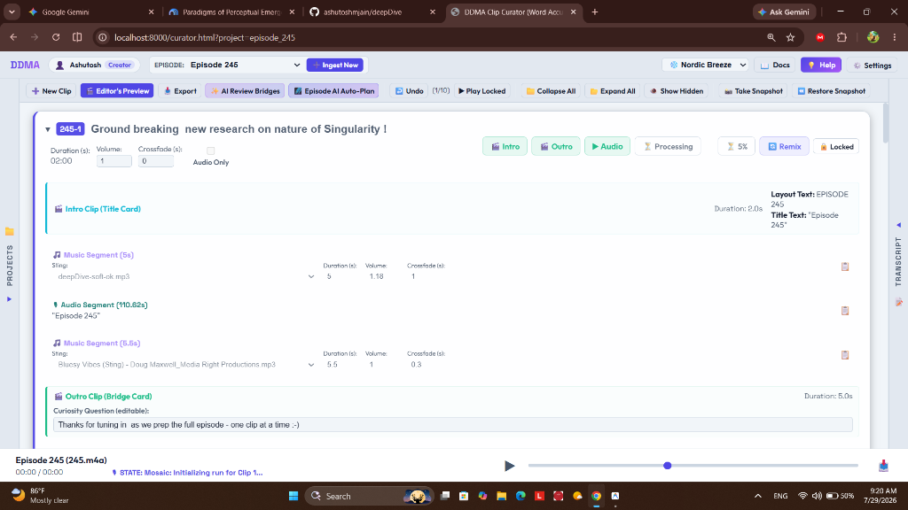

# 🎬 DDMA Clip Dynamics - Master Reference & Technical Specification Guide



## 📌 1. Conceptual Paradigm: The Four Elements of a Clip

In the **DeepDive Media Automator (DDMA)** architecture, a **Clip** is NOT a simple trimmed audio file. It is a fully-produced, progressive media construct composed of **four foundational elements**:

```
+-------------------------------------------------------------------------------------------------------------------------+
|  [1] Intro Card (Fixed: 1)  --->  [2] Music Segments (N)  <--->  [3] Audio Segments (N)  --->  [4] Outro Card (Fixed: 1)  |
+-------------------------------------------------------------------------------------------------------------------------+
```

### 1.1 Element Definitions, Ingestion Sources, & Cardinality

| Element | Description | Content Source / Origin | Cardinality Rule | Editable Properties |
| :--- | :--- | :--- | :--- | :--- |
| **`🎬 Intro Card`** | 2-second visual title card slide prepended to the clip. | Dynamically rendered in-memory by Python/Pillow on a charcoal background using project metadata. | **Exactly 1** (Always at position 1) | Episode title, Part number layout (`EPISODE X • PART Y`), two-line balanced line wrapping. |
| **`🎵 Music Segment`** | Audio sting or music track segment inserted before, during, or after speech. | Sourced from the project `music/` library directory (e.g. `deepDive-soft-ok.mp3`, `deepDive-main.mp3`, `Bluesy Vibes.mp3`). | **Arbitrary / Unlimited ($N \ge 0$)** | Music file selection, duration ($s$), volume (default `1.0`), crossfade ($s$). |
| **`🎙️ Audio Segment`** | Spoken dialogue speech track containing raw podcast discussion. | Extracted from raw audio (`.m4a`/`.mp3`) using OpenAI Whisper word-level timestamps (`transcription.json`). | **Arbitrary / Unlimited ($N \ge 1$)** | Start time, end time, transcript word boundary snapping (via double-tap or context menu), speech volume. |
| **`🌉 Outro Card`** | 5-second curiosity question slide appended to the end of the clip for storyboard continuity. | Text sourced from `"bridge_text"` in `plan.json`. Audio is a 5.0s linear fade-out of preceding audio. | **Exactly 1** (Always at final position) | Editable Curiosity Question text rendered in **Segoe UI Bold (34px)** centered on black canvas. |

---

### 1.2 The Role of Mosaic Infographics in the Clip Body

* **What is Mosaic?**: Mosaic is DDMA's motion design & infographics rendering engine.
* **Pre-Mosaic State (Draft Baseline)**: The body of the clip (between Intro Card and Outro Card) displays a solid black square canvas (`740x740`) while playing the multi-segment audio track.
* **Post-Mosaic State (Final Master)**: Mosaic replaces the solid black canvas body with dynamic motion graphics, animated infographics, kinetic typography, and visual diagrams synchronized to the speech audio.
* **Master Concatenation**: When compiling the final video clip, DDMA losslessly concatenates:
  $$\text{Final Master Video} = \text{Intro Title Card (2s)} + \text{Mosaic Motion Infographics Video} + \text{Outro Curiosity Question Slide (5s)}$$

---

## 🎛️ 2. UI Layout & Visual Anatomy

Each Clip Card in the Curator interface (`curator.html`) consists of four primary structural regions:

```
+---------------------------------------------------------------------------------------------------------+
| [▼] [245-1]  Title Editor Input                                                                        |
| Video Dur: 02:07 | Audio Body: 01:54 | Volume: 1.0 | Crossfade: 0s | [ ] Audio Only                      |
| [🎬 Intro] [🎬 Outro] [▶ Audio] [📹 Draft] [🌌 Mosaic] [🤖 Remix] [🔓 Unlocked / 🔒 Locked]            |
+---------------------------------------------------------------------------------------------------------+
| 🎬 Intro Clip (Title Card Slide)                                                   Duration: 2.0s       |
| 🎵 Music Segment (Intro Sting)                                                     Duration: 5.0s       |
| 🎙️ Audio Segment (Speech Track) [Double-Click to Edit Boundaries]                   Duration: 110.62s    |
| 🎵 Music Segment (Outro Sting)                                                     Duration: 5.5s       |
| 🌉 Outro Clip (Bridge Card Slide - Editable Question)                               Duration: 5.0s       |
+---------------------------------------------------------------------------------------------------------+
```

---

## 🖱️ 3. Interactive Workflows & User Controls

### 🎙️ Audio Segment Double-Click & Range Seeking
* **Trigger**: Double-click on any `.segment-row.audio-seg` row.
* **HTTP 206 Partial Content Range Support**: Seeking uses backend Range 206 streaming (`/get-project-audio?id=...`), ensuring `audioElement.currentTime` seeks accurately to `startVal` (e.g. `124.5s` for Clip 8) without resetting to `0.0s`.
* **Smooth Reflow Centering**: Automatically expands the right-side **Transcript Panel** (`ensureTranscriptPanelExpanded()`), and after a `120ms`/`350ms` DOM reflow delay (allowing height transitions to complete), smoothly scrolls the transcript to center `startWordEl` without jump-to-bottom glitches.

---

### 📝 Transcript Boundary Adjustment & Selection Dynamics

| User Gesture | Context | System Behavior | Data & Visual Result |
| :--- | :--- | :--- | :--- |
| **Double-Tap / Double-Click Word** | Transcript Pane | Executes `handleWordClick(wIdx)` and allows browser native double-tap selection. | Adjusts whichever boundary (**Start** or **End**) is closer to the clicked word, updating clip timestamps live in `plan.json` without obtrusive popups obscuring text. |
| **Single-Click Word** | Active Segment Editing | Executes `handleWordClick(wIdx)`. | Dynamically shifts Start or End boundary while **preserving the active editing session** (`editingSegmentRef` remains active). |
| **Right-Click Word** | Transcript Pane | Displays context menu at cursor `(pageX, pageY)`. | Offers explicit actions: 🚩 **Set Start Word**, 🚩 **Set End Word**, ▶ **Play Preview**, and 🧹 **Clear Selection**. |
| **Mouse Drag Selection** | Transcript Text | Listens to `mouseup` event. | Snaps `startWordIdx` to first word and `endWordIdx` to last word in drag range. |
| **Curator Tools Buttons** | Header Bar | Click **`🚩 Set Start`**, **`🚩 Set End`**, or **`🧹 Clear`**. | Explicitly sets Start, End, or clears active selection state. |

---

### 🎥 Video Preview Modal Mechanics (`openVideoModal` & `closeVideoModal`)

To ensure video tracks (including 2s Intro cards, 5s Outro curiosity cards, Draft baselines, and Master Mosaic renders) render centered on screen:

* **Modal Trigger (`openVideoModal`)**:
  * Explicitly sets `videoModalOverlay.style.display = 'flex'`.
  * Removes `.minimized` class and adds `.active` class.
  * Sets `<video id="previewVideoPlayer">` `src` and starts playback, rendering **both video visual and audio streams**.
* **Modal Close (`closeVideoModal`)**:
  * Triggered by `#closeVideoModalBtn` or clicking backdrop overlay.
  * Resets `videoModalOverlay.style.display = 'none'`, removes `.active`, pauses player, and clears `src`.

---

### 🔒 Cost-Protection Safety Latch (`🔓 Unlocked` vs `🔒 Locked`)

To protect creators against accidental billing from external cloud services, DDMA enforces a strict safety latch:

| Card State | Boundary & Title Editing | External API Buttons (`🌌 Mosaic`, `🤖 Remix`) | Baseline Preview (`📹 Draft`) |
| :--- | :--- | :--- | :--- |
| **`🔓 Unlocked`** | **Enabled** (Editable text, boundary snapping, segment reordering) | **DISABLED** (Grayed out to prevent accidental API charges) | **Enabled** (Compiles Black Canvas Baseline preview) |
| **`🔒 Locked`** | **Frozen** (Protected against accidental clicks) | **ENABLED** (Allows intentional invoke of Mosaic & Gemini Remix) | **Enabled** (Compiles Black Canvas Baseline preview) |

---

## 🚀 4. Render Pipeline & Video Status Dynamics

DDMA distinguishes strictly between Pre-Mosaic draft baselines and Post-Mosaic final master videos:

```
[Audio Slicing] ---> [Black Canvas Baseline] ---> [Mosaic Motion Graphics] ---> [Post-Mosaic Master]
                         (📹 Draft)                                                 (🌌 Mosaic)
```

### 4.1 Button Behavior & Pipeline Contracts

| Button | Target Output | Pipeline Mechanics | API Cost | Master Backup Protection |
| :--- | :--- | :--- | :--- | :--- |
| **`📹 Draft`** | **Black Canvas Baseline Preview** | **2s Title Intro** + **Solid Black Canvas Audio Body** + **5s Outro Curiosity Question Slide**. Re-slices fresh audio on demand. | **$0.00** *(100% Local)* | **IMMUTABLE**: Never touches or overwrites `clips/<ep>-<num>-original.mp4` (the Mosaic master). |
| **`🌌 Mosaic`** | **Master Motion Infographics Video** | **2s Title Intro** + **Mosaic Motion Graphics Video Body** + **5s Outro Curiosity Question Slide**. | **$0.00** *(Reusing render)* / **Cloud Cost** *(Fresh render)* | **Interactive Confirmation**: If a render exists, prompts user to assemble with existing Mosaic render for free OR trigger a fresh Mosaic API render. |

### 4.2 Immutable Master Backup Contract
* **`clips/<ep>-<num>-original.mp4`** holds the downloaded, immutable Mosaic Motion Graphics body video track.
* Compiling a Draft Baseline preview via `📹 Draft` (`--force-draft`) generates a transient `temp_remux_path` for assembling `clips/<ep>-<num>.mp4` without modifying `clips/<ep>-<num>-original.mp4`.
* Compiling a Master Video via `🌌 Mosaic` remuxes updated audio onto `clips/<ep>-<num>-original.mp4` and concatenates fresh 2s Title & 5s Outro cards.

---

## 🛠️ 5. Technical Specifications & Developer Contract

### 📄 `plan.json` Clip Object Schema

```json
{
  "num": 1,
  "title": "Ground breaking new research on nature of Singularity !",
  "start": 0.0,
  "end": 110.62,
  "locked": false,
  "music": "deepDive-soft-ok.mp3",
  "music_volume": 1.0,
  "mosaic_run_id": "a2edf22f-9dd8-41ac-a540-10ee633122b4",
  "bridge_text": [
    "Thanks for tuning in as we prep the full episode - one clip at a time :-)"
  ],
  "segments": [
    {
      "type": "music",
      "music_file": "deepDive-soft-ok.mp3",
      "duration": 5.0,
      "volume": 1.0,
      "crossfade": 1.0
    },
    {
      "type": "audio",
      "start": 0.0,
      "end": 110.62,
      "duration": 110.62,
      "volume": 1.0,
      "crossfade": 0.0,
      "text": "Episode 245"
    },
    {
      "type": "music",
      "music_file": "Bluesy Vibes (Sting) - Doug Maxwell_Media Right Productions.mp3",
      "duration": 5.5,
      "volume": 1.0,
      "crossfade": 0.3
    }
  ]
}
```

---

### 🌐 HTTP API Endpoints (`scratch/run_curator.py`)

* **`POST /compile-clip?id=<project_id>&num=<clip_num>[&draft=true]`**:
  * Triggers `ddma.py compile-clip --num <clip_num> --plan-file projects/<project_id>/plan.json [--force-draft]`.
  * Automatically re-slices fresh sample-accurate audio body before compiling.
  * Equalizes audio and video stream durations using FFprobe.
  * If `draft=true` is passed, forces black canvas draft body compilation while preserving any existing Mosaic master at `clips/<ep>-<num>-original.mp4`.
  * Returns `{"success": true, "message": "Compilation completed successfully."}`.
* **`GET /get-project-audio?id=<project_id>`**:
  * Routes to static audio file serving with **HTTP 206 Partial Content Range support** (`send_head()` & `copyfile()`), enabling sample-accurate audio range seeking for any clip.

---

### 🧪 Automated E2E Test Assertion Matrix (`scratch/test-env/test_curator.js`)

All automated test suites must validate the clip dynamics contract defined in this document:

```javascript
// TEST 2b: Verifying Safety Latch & Button Availability
assert(unlockedClip.draftButton.disabled === false);
assert(unlockedClip.mosaicButton.disabled === true);
assert(lockedClip.mosaicButton.disabled === false);

// TEST 3: Video Modal Open & Close Assertions
assert(videoModalOverlay.style.display === 'flex');
assert(closedVideoModalOverlay.style.display === 'none');

// TEST 5: Duration & Stream Alignment Verification
assert(abs(videoDuration - audioDuration) <= 0.05);

// TEST 6: On-Demand Compilation & Green-Out Status
assert(draftButton.classList.contains('btn-status-success'));

// TEST 10: Audio Range Seeking & Transcript Boundary Mechanics
assert(audioElement.currentTime >= targetStartVal);
assert(singleClickPreservesEditing === true);
assert(btnSetStart !== null && btnSetEnd !== null && btnClearSel !== null);
```
