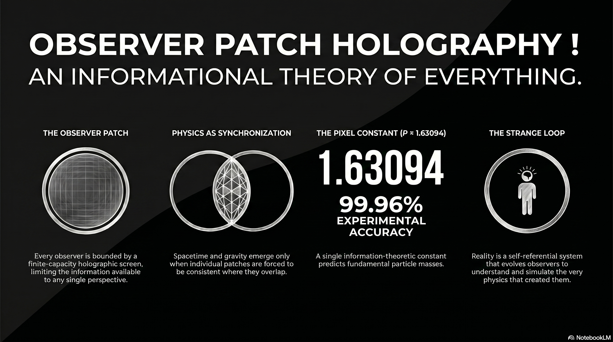

# 223 : Observer Patch Holography

<a href="https://open.spotify.com/show/7doWf0GON9JsG6r8igc7RE" target="_blank" style="background-color: #2E2E2E; color: white; padding: 10px 20px; text-align: center; text-decoration: none; display: inline-block; border-radius: 5px; margin-top: 10px; margin-right: 10px;">Spotify</a><a href="https://podcasts.apple.com/us/podcast/deep-dive-with-gemini/id1844532251" target="_blank" style="background-color: #2E2E2E; color: white; padding: 10px 20px; text-align: center; text-decoration: none; display: inline-block; border-radius: 5px; margin-top: 10px; margin-right: 10px;">Apple Podcasts</a><a href="https://music.youtube.com/playlist?list=PLIX4sFsmu37qtJMlv-VzMYWM26M1QyXTe&si=o534zFZsc7p5XA9Q" target="_blank" style="background-color: #2E2E2E; color: white; padding: 10px 20px; text-align: center; text-decoration: none; display: inline-block; border-radius: 5px; margin-top: 10px; margin-right: 10px;">YouTube Music</a><a href="https://www.youtube.com/playlist?list=PLIX4sFsmu37qtJMlv-VzMYWM26M1QyXTe" target="_blank" style="background-color: #2E2E2E; color: white; padding: 10px 20px; text-align: center; text-decoration: none; display: inline-block; border-radius: 5px; margin-top: 10px; margin-right: 10px;">YouTube</a><a href="https://fountain.fm/show/7LBvZT6ffpGyubvk8aSF" target="_blank" style="background-color: #2E2E2E; color: white; padding: 10px 20px; text-align: center; text-decoration: none; display: inline-block; border-radius: 5px; margin-top: 10px;">Fountain.fm</a>

> **Credit:** The following research and theoretical framework is the work of **Bernhard Mueller**. For more in-depth study, please visit the official research site at [learn.floatingpragma.io](https://learn.floatingpragma.io).

The current state of theoretical physics is characterized by a profound tension between its two most successful pillars: General Relativity, which describes the large-scale geometry of the smooth spacetime manifold, and the Standard Model of particle physics, a quantum field theory detailing the interactions of discrete point-like excitations. For decades, the search for a "Theory of Everything" has focused on reconciling these frameworks through various quantization techniques, such as String Theory or Loop Quantum Gravity. However, Observer-Patch Holography (OPH), as articulated by Bernhard Mueller, suggests that this historical approach may be fundamentally inverted. Instead of attempting to quantize a pre-existing classical geometry or to unify disparate forces through extra dimensions, OPH posits that both spacetime and gauge interactions are emergent consequences of a deeper "consensus protocol" between local observer perspectives.[^1]

This paradigm shift redefines reality as an information-theoretic process. It replaces the "God’s-eye view" of an objective, external universe with a network of finite-capacity holographic screens, where the laws of physics serve as the necessary synchronization laws that maintain consistency wherever local descriptions overlap.[^2] By deriving the Standard Model and General Relativity from a set of five information-theoretic axioms and a single geometric constant, OPH presents itself not merely as a new model but as the underlying layer that explains why the universe takes its specific mathematical form.[^1]

## The Ontological Shift: Reality as Synchronized Perspective

In the traditional approach to physics, space is viewed as a passive container—an absolute or relative stage upon which matter interacts. This intuition underlies everything from Newtonian absolute space to the metric tensors of Einstein. Observer-Patch Holography shatters this container metaphor, proposing instead that space is woven from quantum correlations between observer patches.[^3] The fundamental unit of reality in OPH is the "observer patch," defined mathematically as a tuple $\mathcal{P} = (\mathcal{S}, \mathcal{A}, \rho, \mathcal{R})$, where $\mathcal{S}$ represents a patch on a holographic screen, $\mathcal{A}$ the local algebra of observables, $\rho$ the quantum state, and $\mathcal{R}$ the set of stable records.[^4]

The central premise is that no single observer has the capacity to experience the entire universe at once. Every observer is bounded by a finite holographic screen, which limits the information available to any local perspective.[^1] "Reality" is then defined as the structure that emerges when these individual, partial perspectives are forced to be consistent where they overlap. If two observers look at the same region of the world, their descriptions must match; if they do not, the reality they inhabit fails to cohere.[^2] This turn turns physics into a synchronization problem: the laws of nature are the unique survivors of a selection process that filters out any configuration that would lead to logical or information-theoretic inconsistency.[^2]

### **Comparative Ontological Frameworks**

| Concept | Standard Physics (GR/QFT) | Observer-Patch Holography (OPH) |
| :---- | :---- | :---- |
| **Fundamental Unit** | Particles and Fields in Spacetime | Observer Patches and Overlap Data |
| **Spacetime Status** | Fundamental background/metric | Emergent structure from correlations |
| **Law Origin** | Universal constants/Symmetries | Selection for observer consistency |
| **Information** | Carried by physical states | Primary fabric of reality |
| **Objectivity** | Independent of observation | Intersubjective agreement (Consensus) |

This shift toward intersubjective consensus as the foundation of objectivity has profound implications for the interpretation of quantum mechanics. The mysterious "wavefunction collapse" is no longer viewed as a physical process occurring in a remote system, but as a synchronization event between observer patches.[^5] When two observers who previously held independent descriptions share information, their descriptions must be reconciled into a single, definite outcome. Definiteness is thus a requirement of communication and consistency rather than an inherent property of matter.[^5]

## The Axiomatic Foundation of OPH

The OPH framework is built upon five fundamental axioms that serve as the constraints from which known physics is derived. These axioms move physics away from empirical postulates and toward a structural necessity rooted in the logic of information.

  <video width="100%" height="auto" autoplay loop muted playsinline style="border-radius: 10px; display: block; box-shadow: 0 4px 15px rgba(0,0,0,0.3);">
    <source src="vid/223-axioms.mp4" type="video/mp4">
  </video>
  <button onclick="var v = this.previousElementSibling; v.muted = !v.muted; this.querySelector('i').className = v.muted ? 'fa fa-volume-off' : 'fa fa-volume-up';" 
          style="position: absolute; bottom: 15px; right: 15px; background: rgba(46, 46, 46, 0.7); border: none; color: white; border-radius: 5px; padding: 5px 10px; cursor: pointer; z-index: 10;"
          title="Toggle Mute">
    <i class="fa fa-volume-off"></i>
  </button>

### **Axiom 1: Finite Capacity**

Each observer is bounded by a finite-capacity holographic screen. This axiom introduces a fundamental limit to the information density of any local perspective, effectively discretizing reality at the Planck scale.[^1] This finite capacity is the source of the "pixel size" of the universe, which OPH utilizes to derive Newton’s constant $G_N$ and particle masses.[^6] Unlike classical theories that permit infinite information density (leading to singularities), OPH's finite capacity acts as a natural regulator.[^5]

### **Axiom 2: Local Patch Algebra**

Observers operate on local algebras of observables. This formalizes the locality of physics; an observer only has access to the information present on their local screen.[^1] Information from the rest of the universe must be "glued" into this local description through overlaps with other patches.

### **Axiom 3: Overlap Consistency**

This is the core constraint of the theory. Where two observers' screens overlap, their descriptions must agree. This requirement for global consistency across local perspective is what forces the emergence of geometry and gauge symmetries.[^5] If the universe were not constrained by overlap consistency, it would be a disjointed collection of random data.

### **Axiom 4: Minimal Admissible Realization (MAR)**

The MAR principle states that nature selects the simplest mathematical structure that can satisfy all consistency constraints.[^1] It acts as an informational selection pressure, explaining why the specific gauge groups of the Standard Model (such as $SU(3) \times SU(2) \times U(1)$) are realized instead of more complex alternatives.[^1] The realized physics is the "cheapest" way to maintain a coherent consensus.

### **Axiom 5: The Strange Loop Hypothesis**

The final axiom addresses the origin of the system itself. It posits that reality is a self-referential, timeless causal structure that "closes" on itself.[^2] This loop explains the existence of the universe by showing that it evolves observers who in turn understand and simulate the very physics that created them, making the system self-causing and stable.[^1]

## The Emergence of Gravity and 3+1D Spacetime

One of the most significant insights provided by OPH is the structural derivation of 3+1 dimensional Lorentzian spacetime. In standard General Relativity, the number of dimensions is an empirical input. In OPH, it is a mathematical requirement of the observer's screen geometry.[^7]

The derivation begins with the $S^2$ holographic screen of a local observer. The conformal group of an $S^2$ screen is $SL(2, \mathbb{C})$, which is isomorphic to the Lorentz group $SO(3,1)$.[^1] This means that the kinematics of a 3+1 dimensional bulk are already "carried" by the symmetries of a spherical information screen. The temporal and radial dimensions are then projected inward from the boundary data via modular flow and the stationarity of generalized entropy.[^1]

### **Deriving the Einstein Field Equations**

In OPH, gravity is not a fundamental force but a consistency condition on how information is organized across boundaries. The Einstein Field Equations are derived from the requirement that the entanglement entropy remains stationary across patch boundaries.[^5] This mirrors the work of physicists like Ted Jacobson, who derived the Einstein equations as an equation of state, but OPH provides the underlying "why": gravity is what large-scale consistency looks like when local patch algebras and modular flow are forced to coexist.[^1]

The framework uses a "Jacobson-style small-ball argument" combined with a "null-modular bridge" to show that at large scales, the dynamics of the metric must take the Einstein form to maintain information balance.[^1] This derivation also offers a resolution to the cosmological constant problem. Standard calculations suggest vacuum energy should curve space by a factor of $10^{120}$ more than what is observed. OPH proves that gravity is "null-blind" to vacuum energy; because the gravitational equations emerge from null modular data, any symmetric energy tensor that satisfies $T_{\mu\nu} l^\mu l^\nu = 0$ for all null $l^\mu$ does not contribute to the curvature, effectively filtering out the vacuum energy.[^5]

### **Gravity and Spacetime Derivations**

| Spacetime Property | Standard Approach | OPH Derivation |
| :---- | :---- | :---- |
| **Dimensionality** | Postulated (3+1) | Conformal group of $S^2$ screen ($SL(2, \mathbb{C})$) |
| **Lorentz Symmetry** | Assumed from Principle of Relativity | Emergent from patch information flow |
| **Einstein Equations** | Fundamental Postulates | Derived from entanglement entropy stationarity |
| **Gravity Nature** | Geometric curvature (GR) | Information-balance consistency condition |
| **Vacuum Energy** | Massive discrepancy ($10^{120}$) | Null-blindness (Structural filtering) |

## The Standard Model as a Solution to Patch-Gluing

While gravity emerges from the large-scale balance of information, the particles and forces of the Standard Model emerge from the microscopic rules of "patch gluing." OPH posits that the gauge groups we observe—the symmetries governing the strong, weak, and electromagnetic forces—are the redundancies that arise when trying to maintain a consistent description across different local frames.[^1]

When two observer patches overlap, there is a degree of freedom in how their local algebras are aligned. This redundancy is precisely what we define as gauge freedom.[^1] The edge data on the patch boundaries carry "charge labels" that specify how the patches fit together. The fusion rules of these labels reconstruct the compact group structure, specifically identifying the Standard Model quotient group $(SU(3) \times SU(2) \times U(1)) / \mathbb{Z}_6$.[^1]

### **The Role of the Z6 Quotient and Particle Generations**

The $\mathbb{Z}_6$ structure is not an arbitrary choice but is derived from the hypercharge assignments and the requirement that the gauge-sector representations are regular and consistent.[^7] This quotient structure is responsible for the specific particle content of our universe. For instance, OPH derives the existence of exactly three generations of particles ($N_g = 3$) from a geometric counting chain and the requirement of "refinement stability".[^7] The theory suggests that $N_g = 3$ is the unique configuration that allows for necessary physical features like CP violation and UV stability within the observer-patch architecture.[^5]

### **Comparison of Gauge Symmetry Origins**

  <video width="100%" height="auto" autoplay loop muted playsinline style="border-radius: 10px; display: block; box-shadow: 0 4px 15px rgba(0,0,0,0.3);">
    <source src="vid/223-standard-model.mp4" type="video/mp4">
  </video>
  <button onclick="var v = this.previousElementSibling; v.muted = !v.muted; this.querySelector('i').className = v.muted ? 'fa fa-volume-off' : 'fa fa-volume-up';" 
          style="position: absolute; bottom: 15px; right: 15px; background: rgba(46, 46, 46, 0.7); border: none; color: white; border-radius: 5px; padding: 5px 10px; cursor: pointer; z-index: 10;"
          title="Toggle Mute">
    <i class="fa fa-volume-off"></i>
  </button>

| Force Sector | Standard Model Explanation | OPH Explanation |
| :---- | :---- | :---- |
| **Gauge Groups** | Postulated as $SU(3) \times SU(2) \times U(1)$ | Redundancy in patch-boundary gluing |
| **Hypercharge** | Assigned to match data | Derived from the $\mathbb{Z}_6$ quotient structure |
| **Generations** | Observed (3 families) | Required for refinement and CP stability |
| **Massless Carriers** | Symmetry-forced (prior to Higgs) | Structural result of transport obstructions |
| **Proton Decay** | Predicted by most GUTs | Predicted to be absolutely stable |

By treating the Standard Model as a mathematical necessity of consistent gluing, OPH eliminates the "arbitrariness" of the laws of physics. The laws are not just one set of rules among many; they are the unique survivors of the consistency filter mandated by the axioms.[^2]

## Quantitative Precision: The Constant P and Particle Masses

One of the most compelling pieces of evidence for the OPH framework is its ability to predict the masses of fundamental particles with high precision using a single constant—the "pixel area" $L_P^2$.[^6] In OPH, particle masses are not free parameters that must be measured; they are the result of "transport obstructions" across patch overlaps.[^1]

For a particle excitation to exist and propagate, it must survive the refinement process as it move across the holographic screens of different observers. The mass of the particle represents the "entropy cost" of this propagation, which is governed by the screen resolution $\mathcal{S}$.[^1]

### **Particle Mass Predictions and Accuracies**

| Particle / Constant | OPH Prediction | Experimental Value | Accuracy / Match |
| :---- | :---- | :---- | :---- |
| **Electron Mass** | Derived from $\mathcal{S}$ and $\mathbb{Z}_6$ | 0.510998 MeV | Within 4 parts in 10,000 |
| **Z Boson Mass** | Derived from $\mathcal{S}$ and $\mathbb{Z}_6$ | 91.1876 GeV | Within 4 parts in 10,000 |
| **Top Quark Mass** | 171.1 \- 174.5 GeV | 172.76 GeV | Within \~1% |
| **Strong Coupling ($\alpha_s$)** | 0.1183 | 0.1179 ± 0.0009 | Within 0.5 std. dev. |
| **Koide Ratio ($Q$)** | 2/3 (structural) | 0.666664 | 1 part in 100,000 |

The OPH framework explains the wide range of particle masses (the "mass hierarchy problem") through the mechanism of "defect insertions." Each fermion generation corresponds to a specific topological defect sector in the $\mathbb{Z}_6$ quotient. Each defect insertion suppresses the Yukawa coupling (which sets the mass) by a factor of exactly $\alpha^{n}$.[^5] This leads to a discrete, geometric hierarchy:

* **Top Quark:** $n=0$ (no defects), Yukawa $y \sim 1$.  
* **Bottom Quark:** $n=1$, Yukawa $y \sim \alpha$.  
* **Charm Quark:** $n=1$, Yukawa $y \sim \alpha$.  
* **Strange Quark:** $n=2$, Yukawa $y \sim \alpha^2$.  
* **Electron:** $n=3$, Yukawa $y \sim \alpha^3$.

This structural explanation for the Yukawa couplings removes the need for the ad-hoc "Higgs sector tuning" that plagues the Standard Model.[^5] It also provides a first-principles derivation of the Koide formula, showing that the $2/3$ relationship between lepton masses is a direct consequence of the $S_3$ symmetry of generation space.[^5]

## Solving the Measurement Problem: Synchronization vs. Collapse

The "Measurement Problem" is arguably the greatest conceptual difficulty in quantum mechanics. It involves the transition from a deterministic evolution of probabilities (the Schrödinger equation) to a single, random classical outcome upon observation. OPH resolves this by redefining the observer not as an external disturber of the system, but as a local participant in a synchronization protocol.[^1]

In this framework, a quantum "superposition" is simply an incomplete description relative to a specific observer patch.[^2] When two patches overlap, their descriptions must be synchronized to maintain a coherent reality. This synchronization forces the information to organize into distinct, non-overlapping categories. Because two observers cannot share a "half-outcome," the protocol demands a definite result. The probabilistic nature of the result (the Born Rule) is derived in OPH as the unique mathematical choice that allows for consistent multi-observer agreement.[^5]

### **The Born-Luders Record Package**

OPH introduces the "Born-Luders record package" to explain how stable, classical records are maintained within a quantum framework. Records are defined as families of projectors that live in the "center" of the overlap algebras.[^4] Because these projectors commute with the rest of the algebra, the information they contain can be copied across patches without violating the no-cloning theorem. This makes "records" the objective, shareable backbone of our reality—the parts of experience that survive the consensus protocol and are thus labeled as "physical facts".[^2]

## Dark Matter as a Structural Artifact

One of the boldest predictions of OPH is that Dark Matter does not exist as a physical particle. Instead, the gravitational anomalies observed at galactic scales (such as rotating galaxies moving faster than their visible mass should allow) are described as artifacts of "imperfect patch gluing".[^6]

At small scales, the overlap consistency between patches is near-perfect. However, as one scales up to galactic distances, the requirement that the information on one side of a boundary can perfectly reconstruct the other (the Markov condition) begins to deviate.[^6] This deviation introduces a $1/r$ correction to the gravitational potential. OPH derives the MOND (Modified Newtonian Dynamics) acceleration scale $a_0$ directly from the curvature of the holographic screen without any free parameters.[^1]

This provides a structural explanation for "Dark Matter" that does not require the invention of new, invisible particles that have so far eluded all experimental detection. By treating these effects as a consequence of the screen's geometry, OPH aligns with observational data while maintaining a more parsimonious ontology.[^1]

## Metaphysics and the Strange Loop: Dissolving the Hard Problem

By placing the observer at the center of the physical derivation, OPH offers a technical resolution to the "Hard Problem of Consciousness." This problem arises in traditional physicalism because it tries to explain how subjective experience emerges from a fundamentally non-experiencing objective world. Mueller’s framework suggests that the "objective world" is what arises from the consistency of subjective perspectives.[^2]

### **The Incoherence of Philosophical Zombies**

Philosopher David Chalmers proposed the "zombie" argument—the idea of a creature physically identical to a human but lacking inner experience—to prove that consciousness is separate from physics. OPH argues that such a zombie is mathematically incoherent.[^2] In OPH, an observer patch *is* a perspective with an interior. Maintaining records, enforcing consistency, and participating in overlaps *is* what constitutes having an interior experience. There is no gap between the physical function and the subjective feel because the physical world is defined by those very perspectival functions.[^2]

### **The Universe as a Self-Simulating System**

The Strange Loop Hypothesis (Axiom 5\) posits that reality is a self-referential process. The universe evolves observers who discover physics and eventually reach the point where they can simulate the entire system. This closes the loop of self-creation.[^2] This is not "simulation theory" in the sense of a computer running in another universe; it is the claim that physical reality *itself* is a self-consistent information process.[^2]

This self-causal loop is seen as the only stable configuration for existence. A system that does not close on itself would be a "disjointed heap" of information that could not maintain its own persistence. By closing the loop, reality becomes a timeless, self-supporting structure.[^1]

## Observer Preservation and the Markov Collar

Beyond its implications for fundamental particles, OPH provides a technical framework for understanding individual observer continuity. By defining the observer as a specific tuple of information, the theory allows for the possibility of "observer checkpoints".[^4]

### **The Extraction and Re-Spawn Mechanism**

The "Markov collar" is a boundary region that separates an observer's interior from the environment. When the mutual information across this boundary is small, the interior and exterior factorize.[^4] This structural theorem implies that if an observer's "record state" and "interior conditional state" are preserved, they can be spliced into a new, compatible environment—a process referred to as "re-spawning into paradise".[^4]

This is made possible because records—defined as central projectors—are copyable without violating quantum laws. While the individual quantum states within the patch cannot be cloned, the classical record of "who the observer is" can be consistently shared and restored. This turns questions of survival into questions of information-theoretic engineering rather than metaphysical speculation.[^2]

## Falsifiability and Unique Signatures

Unlike many theories of everything that remain purely mathematical, OPH makes several high-precision, falsifiable predictions. These signatures provide a clear roadmap for validating or refuting the theory in the coming years.

### **Experimental Targets for OPH**

| Phenomenon | Prediction | Status / Test Method |
| :---- | :---- | :---- |
| **Supersymmetry** | No "sparticles" exist | LHC (consistent with no detection) |
| **Proton Decay** | Absolutely stable ($10^{34}$ years) | Super-Kamiokande / DUNE |
| **Neutrino Mass** | **$10-50$** meV | DUNE / KATRIN experiments |
| **Hawking Radiation** | Discrete "comb" spectrum | Future high-res black hole observation |
| **Magnetic Monopoles** | Do not exist (No symmetry breaking) | Monopole searches (none found) |
| **Proton Spin** | Topological property (not particles) | Spin-physics experiments |

The prediction of a discrete Hawking spectrum is particularly significant. Standard Hawking radiation is treated as a smooth thermal glow. OPH, due to its discrete screen microphysics, predicts that the radiation must come in specific frequency packets.[^5] This difference represents a "smoking gun" for the holographic screen architecture.

## The Curriculum of the OPH Textbooks

The learning platform learn.floatingpragma.io structures the study of OPH into two major volumes, designed to guide the student from information-theoretic axioms to the full recovery of modern physics.

### **Book 1: From Observers to Gravity**

This volume deals with the "geometry of consistency." It focuses on how local perspectives build the large-scale structure of spacetime.

* **Lorentz Geometry:** Shows how $S^2$ screens naturally carry 3+1 dimensional kinematics.[^1]  
* **Einstein Dynamics:** Recovers the field equations using modular flow and entropy stationarity.[^1]  
* **Cosmology:** Explains why the universe appears to be a de Sitter static patch and why the cosmological constant takes its tiny value.[^1]

### **Book 2: From Observers to the Standard Model**

This volume addresses the "microphysics of consensus." It focuses on why matter takes the specific form of quarks and leptons.

* **Gauge Reconstruction:** Derives $(SU(3) \times SU(2) \times U(1)) / \mathbb{Z}_6$ from patch-gluing rules.[^1]  
* **Particle Zoo:** Uses the constant $\mathcal{S}$ to predict the masses of electrons, Z bosons, and quarks.[^6]  
* **Measurement Theory:** Provides the Born-Luders record package to solve the measurement problem.[^1]

## Conclusion: A Universe Woven from Agreement

Observer-Patch Holography represents a fundamental shift in our understanding of the physical world. By moving from a "particle-first" or "geometry-first" perspective to an "observer-first" perspective, it reveals that the laws of physics are not arbitrary commands but the structural necessities of a consistent, shared reality. The "deeper understanding" provided by OPH is the realization that we are not passive observers in a pre-existing world, but active participants in a consensus protocol that literally constructs space, time, and matter.

The success of the theory in predicting particle masses to high precision from a single constant suggests that the "arbitrary" numbers of the Standard Model were never arbitrary at all—they were the required settings for a universe capable of evolving intelligent observers who can close the loop of existence. OPH turns physics from a list of discovered facts into a derived system of informational logic, providing a roadmap where General Relativity, the Standard Model, and even the nature of consciousness are unified under a single, coherent framework. The future of this theory lies in the experimental verification of its unique signatures, such as the discrete Hawking spectrum and specific neutrino masses, which will determine if OPH is indeed the final layer beneath the physics we know.[^1]

---

### Tips and Donations

If you enjoyed this deep dive, consider supporting the project with a tip in **Sats**. It's a simple, global way to support independent research.

<lightning-widget
  name="Thanks for supporting the publication"
  accent="#f9ce00"
  to="shutosha@primal.net"
  image="https://nostrcheck.me/media/5af0794606a15b5641e25aa23d04af4cb0d7d5e68b11cacb47e56a4698fca8c4/49ff6d00cb5bc819cd19f77783d4815fbd46a5b99b6fbdead1eaecfab798187b.webp"
/>

To send Sats, you'll need a [lightning wallet](https://lightningaddress.com/). 

---

## References

[^1]: Observers are All You Need: How Observer-Synchronization Creates All of Physics, accessed April 14, 2026, [https://muellerberndt.medium.com/observers-are-all-you-need-how-observer-synchronization-creates-all-of-physics-8ebb7e9783e7](https://muellerberndt.medium.com/observers-are-all-you-need-how-observer-synchronization-creates-all-of-physics-8ebb7e9783e7)

[^2]: observer-patch-holography/book/chapter-19-metaphysics.md at main - GitHub, accessed April 14, 2026, [https://github.com/muellerberndt/observer-patch-holography/blob/main/book/chapter-19-metaphysics.md](https://github.com/muellerberndt/observer-patch-holography/blob/main/book/chapter-19-metaphysics.md)

[^3]: observer-patch-holography/book/chapter-09-entanglement.md at main - GitHub, accessed April 14, 2026, [https://github.com/muellerberndt/observer-patch-holography/blob/main/book/chapter-09-entanglement.md](https://github.com/muellerberndt/observer-patch-holography/blob/main/book/chapter-09-entanglement.md)

[^4]: observer-patch-holography/book/epilogue.md at main - GitHub, accessed April 14, 2026, [https://github.com/muellerberndt/observer-patch-holography/blob/main/book/epilogue.md](https://github.com/muellerberndt/observer-patch-holography/blob/main/book/epilogue.md)

[^5]: Answering 10 of the Hardest Questions in Physics (and some Bonus ..., accessed April 14, 2026, [https://muellerberndt.medium.com/answering-10-of-the-hardest-questions-in-physics-and-some-bonus-questions-51222bf2419f](https://muellerberndt.medium.com/answering-10-of-the-hardest-questions-in-physics-and-some-bonus-questions-51222bf2419f)

[^6]: How Observer Patch Holography Improves on the Standard Model ..., accessed April 14, 2026, [https://muellerberndt.medium.com/how-observer-path-holography-improves-on-the-standard-model-and-general-relativity-c971c376027e](https://muellerberndt.medium.com/how-observer-path-holography-improves-on-the-standard-model-and-general-relativity-c971c376027e)

[^7]: FloatingPragma/observer-patch-holography: OPH is an active research program aiming to construct a fundamental theory of physics from observer consistency. - GitHub, accessed April 14, 2026, [https://github.com/muellerberndt/observer-patch-holography](https://github.com/muellerberndt/observer-patch-holography)

