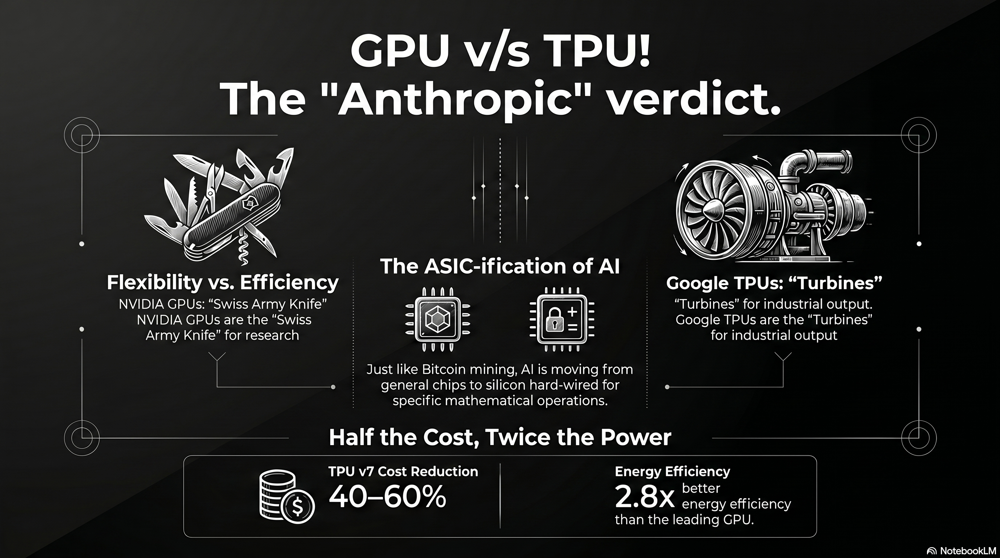

# 224 : TPUs vs GPUs: AI Commodification

<a href="https://open.spotify.com/show/7doWf0GON9JsG6r8igc7RE" target="_blank" style="background-color: #2E2E2E; color: white; padding: 10px 20px; text-align: center; text-decoration: none; display: inline-block; border-radius: 5px; margin-top: 10px; margin-right: 10px;">Spotify</a><a href="https://podcasts.apple.com/us/podcast/deep-dive-with-gemini/id1844532251" target="_blank" style="background-color: #2E2E2E; color: white; padding: 10px 20px; text-align: center; text-decoration: none; display: inline-block; border-radius: 5px; margin-top: 10px; margin-right: 10px;">Apple Podcasts</a><a href="https://music.youtube.com/playlist?list=PLIX4sFsmu37qtJMlv-VzMYWM26M1QyXTe&si=o534zFZsc7p5XA9Q" target="_blank" style="background-color: #2E2E2E; color: white; padding: 10px 20px; text-align: center; text-decoration: none; display: inline-block; border-radius: 5px; margin-top: 10px; margin-right: 10px;">YouTube Music</a><a href="https://www.youtube.com/playlist?list=PLIX4sFsmu37qtJMlv-VzMYWM26M1QyXTe" target="_blank" style="background-color: #2E2E2E; color: white; padding: 10px 20px; text-align: center; text-decoration: none; display: inline-block; border-radius: 5px; margin-top: 10px; margin-right: 10px;">YouTube</a><a href="https://fountain.fm/show/7LBvZT6ffpGyubvk8aSF" target="_blank" style="background-color: #2E2E2E; color: white; padding: 10px 20px; text-align: center; text-decoration: none; display: inline-block; border-radius: 5px; margin-top: 10px;">Fountain.fm</a>

The artificial intelligence industry has reached a fundamental inflection point, transitioning from an "experimental era" defined by model breakthroughs to an "industrial era" where intelligence is a manufactured utility. In 2026, the hardware landscape is bifurcating along the lines of a historical precedent: the specialization of Bitcoin mining. As the mathematical operations for modern AI become standardized, the market is shifting from flexible, general-purpose Graphic Processing Units (GPUs) toward Application-Specific Integrated Circuits (ASICs), specifically Google’s Tensor Processing Units (TPUs).

## Technical Foundation: What is Accelerated Computing?

To understand why the industry is moving toward specialized silicon, one must first define "accelerated computing." Standard computing is sequential, governed by a Central Processing Unit (CPU) that handles instructions one after another. Accelerated computing is a paradigm that separates the data-intensive parts of an application and processes them on a separate device, leaving only the control functionality to the CPU.

### **Massive Parallelization vs. Sequential Processing**

The defining characteristic of accelerators is massive parallelization. While a CPU is like a high-speed courier handling one package at a time, an accelerator is like a massive cargo ship carrying thousands of containers simultaneously.

* **Refactoring the Algorithm:** To achieve speedups that exceed the mere addition of more computers, algorithms must be refactored and "sharded"—breaking the model and the data into pieces that can be distributed across a massive fabric.  
* **Full-Stack Co-Design:** Accelerated computing is not just about the chip; it is a "full-stack" problem. It requires a synchronized design of the silicon, the interconnects (like NVLink or Optical Circuit Switching), the libraries (like cuDNN or XLA), and the algorithms themselves to ensure that the hardware stays "busy" and efficient.

## The Bitcoin Parallel: The ASIC-ification of Intelligence

The AI hardware market is currently following the path of Bitcoin mining.1 In the early 2010s, Bitcoin was mined on CPUs and then moved to NVIDIA GPUs because their parallel architecture was better at repetitive cryptographic math. Eventually, as the hashing algorithm became the fixed industry standard, miners transitioned entirely to ASICs—chips built from the silicon up to do nothing but hash that specific algorithm.

### **Standardization of the "Math of AI"**

AI is entering a similar phase of "ASIC-ification." Once the industry understands exactly which mathematical operations are required for high-volume tasks—such as the dense matrix multiplications used in the Transformer architecture—the flexibility of a GPU becomes a costly liability.2

* **Performance per Watt:** ASICs like TPUs "hard-wire" these specific operations directly into the silicon, eliminating extraneous control logic and registers required for general-purpose tasks. This allows them to achieve 2x to 3x better energy efficiency and significantly lower total cost of ownership (TCO) for predictable, industrial-scale workloads.2  
* **Resale Value vs. Efficiency:** While GPUs maintain secondary market value (for gaming or video editing), ASICs are "paperweights" if their specific algorithm becomes obsolete. However, at the gigawatt scale of modern AI factories, the efficiency gains of ASICs far outweigh the "capital protection" of GPUs.

## The Anthropic Verdict: TPUs as the Production Standard

For several years, the industry viewed the adoption of TPUs through the lens of corporate ideology. When Apple chose to use Google TPUs to train its "Apple Intelligence" models, many analysts dismissed the move as a "No NVIDIA" ideological stance—a desire to avoid vendor lock-in and high margins rather than a technical preference.

### **Validation through Anthropic**

Anthropic’s recent multi-gigawatt commitment—specifically the **3.5GW** deal with Google and Broadcom—has fundamentally changed this narrative.4

* **Pure AI Perspective:** Unlike Apple, which has its own silicon interests, Anthropic is a pure-play AI lab born out of the same research lineage as OpenAI. Their decision to move massive workloads onto the TPU stack serves as the "Anthropic Verdict": purely from an AI perspective, TPUs have won the race for production-scale compute.6  
* **Commercial Maturity:** Securing Anthropic, a lab with a revenue run rate exceeding **30,000,000,000 USD**, provides the commercial validation needed to transition TPUs from a primarily internal Google asset to a market-grade infrastructure offering for elite labs.4

## Model Training: Beyond Inference Specialization

While TPUs are often associated with inference, they have proven to be the premier engine for massive training runs as well. Google’s **Gemini 3** and **PaLM** models were trained on TPU pods, demonstrating that once the training "math" is understood, ASICs can handle the "sprint" of creation as well as the "marathon" of deployment.3

### **Pod-Scale Training Performance**

The latest **TPU v7 (Ironwood)** architecture represents a historic milestone where specialized silicon matches the raw training performance of the leading-edge GPU.10

* **Exascale Scaling:** Google’s proprietary Optical Circuit Switching (OCS) allows Ironwood pods to scale to **9,216 chips**, creating a unified supercomputer capable of **42.5 FP8 exaFLOPS**.10  
* **Cost Efficiency:** While an NVIDIA Blackwell-class chip (B200) costs roughly **6.30 USD/hour**, Google’s internal cost for TPU v7 is approximately **3.50 USD/hour**, providing a massive structural advantage for training the world’s largest foundation models.13

| Metric | Google TPU v7 (Ironwood) | NVIDIA B200 (Blackwell) |
| :---- | :---- | :---- |
| **FP8 Performance** | 4.6 PFLOPS | 4.5 PFLOPS 15 |
| **HBM Memory** | 192 GB | 192 GB 10 |
| **Energy Efficiency** | 2.8x better perf/watt vs H100 | Prioritizes absolute performance 12 |
| **System Cost** | 40%–60% reduction vs. NVIDIA | "NVIDIA Tax" (78% margins) 16 |

## Conclusion: The Era of the Industrial Intelligence Factory

The commodification of AI workloads in 2026 signifies that efficiency has overtaken flexibility as the primary driver of AI strategy. The hardware market has permanently split:

1. **NVIDIA GPUs** remain the "Swiss Army knife" of the laboratory, used to discover the next generation of accelerated computing applications in robotics, physical AI, and novel algorithms.17  
2. **Google TPUs** (and other custom ASICs) have become the "turbines" of the factory, producing tokens and training massive models at scale and minimal cost.

As the industry matures, Google’s vertical integration—owning the silicon, the networking, and the cloud—has given it a structural advantage. Anthropic’s move proves that for those operating at the frontier, the "ASIC-ification" of AI is no longer an ideological choice, but a technical and economic necessity.

---

### Tips and Donations

If you enjoyed this deep dive, consider supporting the project with a tip in **Sats**. It's a simple, global way to support independent research.

<lightning-widget
  name="Thanks for supporting the publication"
  accent="#f9ce00"
  to="shutosha@primal.net"
  image="https://nostrcheck.me/media/5af0794606a15b5641e25aa23d04af4cb0d7d5e68b11cacb47e56a4698fca8c4/49ff6d00cb5bc819cd19f77783d4815fbd46a5b99b6fbdead1eaecfab798187b.webp"
/>

To send Sats, you'll need a [lightning wallet](https://lightningaddress.com/). 

---

## References

1. Why ASICs Dominate Bitcoin Mining (and Why GPUs Lost) - PatSnap Eureka, accessed April 16, 2026, [https://eureka.patsnap.com/article/why-asics-dominate-bitcoin-mining-and-why-gpus-lost](https://eureka.patsnap.com/article/why-asics-dominate-bitcoin-mining-and-why-gpus-lost)
2. Google TPU vs NVIDIA GPU: A Comprehensive Technical Comparison - LoveChip, accessed April 16, 2026, [https://www.lovechip.com/blog/google-tpu-vs-nvidia-gpu-a-comprehensive-technical-comparison](https://www.lovechip.com/blog/google-tpu-vs-nvidia-gpu-a-comprehensive-technical-comparison)
3. ASIC vs GPU: What Are The Main Differences To Consider - Bitdeer, accessed April 16, 2026, [https://www.bitdeer.com/learn/asic-vs-gpu-what-are-the-main-differences-to-consider](https://www.bitdeer.com/learn/asic-vs-gpu-what-are-the-main-differences-to-consider)
4. Anthropic's Gigawatt-Scale TPU Deal with Broadcom Creates a Structural Advantage, accessed April 16, 2026, [https://futurumgroup.com/insights/anthropics-gigawatt-scale-tpu-deal-with-broadcom-creates-a-structural-advantage/](https://futurumgroup.com/insights/anthropics-gigawatt-scale-tpu-deal-with-broadcom-creates-a-structural-advantage/)
5. Anthropic, Google, Broadcom announce 3.5GW TPU deal, accessed April 16, 2026, [https://www.siliconrepublic.com/machines/anthropic-google-broadcom-announce-3-5gw-tpu-deal](https://www.siliconrepublic.com/machines/anthropic-google-broadcom-announce-3-5gw-tpu-deal)
6. Jensen Huang says the next AI boom belongs to inference - Quartz, accessed April 16, 2026, [https://qz.com/nvidia-gtc-2026-jensen-huang-keynote-takeaways](https://qz.com/nvidia-gtc-2026-jensen-huang-keynote-takeaways)
7. Anthropic Secures Multi-Gigawatt TPU Deal With Google, Broadcom, accessed April 16, 2026, [https://www.datacenterknowledge.com/data-center-chips/anthropic-secures-multi-gigawatt-tpu-deal-with-google-broadcom](https://www.datacenterknowledge.com/data-center-chips/anthropic-secures-multi-gigawatt-tpu-deal-with-google-broadcom)
8. Anthropic expands partnership with Google and Broadcom for multiple gigawatts of next-generation compute, accessed April 16, 2026, [https://www.anthropic.com/news/google-broadcom-partnership-compute](https://www.anthropic.com/news/google-broadcom-partnership-compute)
9. Research \ Anthropic, accessed April 16, 2026, [https://www.anthropic.com/research](https://www.anthropic.com/research)
10. Claude Mythos Preview System Card - Anthropic, accessed April 16, 2026, [https://www.anthropic.com/claude-mythos-preview-system-card](https://www.anthropic.com/claude-mythos-preview-system-card)
11. From ASICs to GPUs: Why Mining-to-AI Transitions Are Hard - Hashrate Index, accessed April 16, 2026, [https://hashrateindex.com/blog/bitcoin-mining-ai-transition-harder-asic-gpu/](https://hashrateindex.com/blog/bitcoin-mining-ai-transition-harder-asic-gpu/)
12. Google's Massive Anthropic Cloud Deal: The Hidden Winner in the AI Gold Rush, accessed April 16, 2026, [https://www.investing.com/analysis/googles-massive-anthropic-cloud-deal-the-hidden-winner-in-the-ai-gold-rush-200668877](https://www.investing.com/analysis/googles-massive-anthropic-cloud-deal-the-hidden-winner-in-the-ai-gold-rush-200668877)
13. Alphabet (GOOGL) Is Up 6.7% After Deepening Broadcom–Anthropic AI Infrastructure Ties - Has The Bull Case Changed? - Simply Wall St, accessed April 16, 2026, [https://simplywall.st/stocks/us/media/nasdaq-googl/alphabet/news/alphabet-googl-is-up-67-after-deepening-broadcomanthropic-ai](https://simplywall.st/stocks/us/media/nasdaq-googl/alphabet/news/alphabet-googl-is-up-67-after-deepening-broadcomanthropic-ai)
14. GPU vs. TPU: Here are they key differences - Investing.com, accessed April 16, 2026, [https://www.investing.com/news/stock-market-news/gpu-vs-tpu-here-are-they-key-differences-4388353](https://www.investing.com/news/stock-market-news/gpu-vs-tpu-here-are-they-key-differences-4388353)
15. Google's Ironwood TPU vs. NVIDIA Blackwell: AI Chip War! #shorts - YouTube, accessed April 16, 2026, [https://www.youtube.com/shorts/oWRgpzWrQcg](https://www.youtube.com/shorts/oWRgpzWrQcg)
16. Leashing Chinese AI Needs Smart Chip Controls - RAND, accessed April 16, 2026, [https://www.rand.org/pubs/commentary/2025/08/leashing-chinese-ai-needs-smart-chip-controls.html](https://www.rand.org/pubs/commentary/2025/08/leashing-chinese-ai-needs-smart-chip-controls.html)
17. “Companies don't print money”: Nvidia's Jensen Huang recasts the economics of AI | Ctech, accessed April 16, 2026, [https://www.calcalistech.com/ctechnews/article/3g6b31j2p](https://www.calcalistech.com/ctechnews/article/3g6b31j2p)
