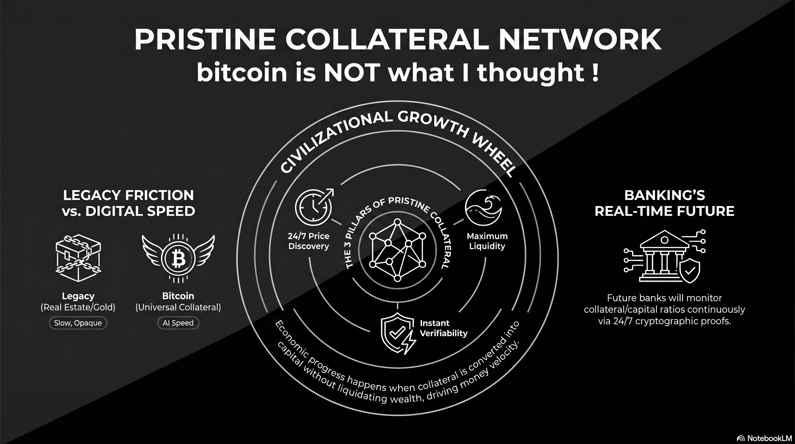

# 225 : BTC: Global Pristine Collateral Network

<a href="https://open.spotify.com/show/7doWf0GON9JsG6r8igc7RE" target="_blank" style="background-color: #2E2E2E; color: white; padding: 10px 20px; text-align: center; text-decoration: none; display: inline-block; border-radius: 5px; margin-top: 10px; margin-right: 10px;">Spotify</a><a href="https://podcasts.apple.com/us/podcast/deep-dive-with-gemini/id1844532251" target="_blank" style="background-color: #2E2E2E; color: white; padding: 10px 20px; text-align: center; text-decoration: none; display: inline-block; border-radius: 5px; margin-top: 10px; margin-right: 10px;">Apple Podcasts</a><a href="https://music.youtube.com/playlist?list=PLIX4sFsmu37qtJMlv-VzMYWM26M1QyXTe&si=o534zFZsc7p5XA9Q" target="_blank" style="background-color: #2E2E2E; color: white; padding: 10px 20px; text-align: center; text-decoration: none; display: inline-block; border-radius: 5px; margin-top: 10px; margin-right: 10px;">YouTube Music</a><a href="https://www.youtube.com/playlist?list=PLIX4sFsmu37qtJMlv-VzMYWM26M1QyXTe" target="_blank" style="background-color: #2E2E2E; color: white; padding: 10px 20px; text-align: center; text-decoration: none; display: inline-block; border-radius: 5px; margin-top: 10px; margin-right: 10px;">YouTube</a><a href="https://fountain.fm/show/7LBvZT6ffpGyubvk8aSF" target="_blank" style="background-color: #2E2E2E; color: white; padding: 10px 20px; text-align: center; text-decoration: none; display: inline-block; border-radius: 5px; margin-top: 10px;">Fountain.fm</a>

At the foundation of this new economic architecture is the definition of **Pristine Collateral**. For an asset to be considered pristine, it must possess three non-negotiable properties: **24/7 global price discovery**, **instant verifiability** due to its public and open character, and access to the **highest pool of liquidity**.[^1] While a digital nature facilitates these properties, digital form alone does not equate to "pristineness." Many digital networks remain closed, opaque, and illiquid; Bitcoin’s superiority is derived from its open, decentralized protocol that no private entity or state can obscure.[^2]

## **The Collateral-Capital Continuum: The Civilizational Growth Wheel**

Economic progress is not fueled by payments alone, but by the **Collateral-Capital Continuum**—the perpetual wheel where **Collateral** (the pledged asset) allows for the raising of **Capital** (the funds used for production) without liquidating wealth. This synergy is the engine of money velocity. When collateral can be converted into capital at high speed, money circulates more frequently, driving exponential increases in national GDP and civilizational growth.[^3]

## **Problems of Traditional Collateral-Capital Continuum**

In the legacy world, the conversion of collateral into capital is a high-friction process plagued by the "5 Cs of Credit":

* **Opacity and Slowness:** Physical assets like real estate or art are "slow" collateral. They require weeks or months for appraisals, title searches, and legal verification.[^4]  
* **Subjective Verification:** Lenders rely on snapshots of "Character" (credit scores) and "Capacity" (income ratios), which are prone to informational asymmetry and exclusion.[^5]  
* **Maintenance and Entropy:** Physical collateral is subject to deterioration and carrying costs. A building requires plumbing and security; gold requires vaulting and purity assaying.[^6]

These frictions act as a brake on the velocity of money, trapping wealth in "dead assets" that can take months or years to mobilize for productive use.

## **The Purpose of Bitcoin: A High-Speed Conversion Network**

It is critical to understand that the primary purpose of the Bitcoin network is **not** to replace consumer payment systems or act as a high-frequency settlement rail for agents. Its true revolutionary utility is to **speed up collateral-to-capital conversion**.

In the AI age, companies must be able to move at light-speed, opening shops in any nation or locale without being delayed by local red tape or subjective credit nuances. Bitcoin functions as the universal collateral that allows an AI company to pledge its value and raise local capital in days rather than months.[^7] For nation-states and corporations, this is a matter of competitive necessity; Bitcoin is the primary driver for high-speed capital formation, enabling the double-digit GDP growth that the legacy analog standard cannot support.

## **The Future of Banking: Real-Time Credit Rails**

The banking model of the future will operate through a streamlined "Collateral-First" framework:

1. **Request Pristine Collateral:** The bank asks for a pledge of Bitcoin, the only asset verifiable in real-time via cryptographic proof.[^4]  
2. **Instant Capital Conversion:** The bank grants a line of credit in the local currency (or stablecoins) to the borrower at a simple phone call or digital trigger.[^8]  
3. **Real-Time Monitoring:** Instead of periodic audits, the bank monitors the **collateral/capital ratio** continuously, adjusting margins automatically based on 24/7 global price feeds.[^4]

In this paradigm, **Gold** remains a traditional, high-friction Store of Value (SoV) for those seeking stability; its very friction preserves its status. **Bitcoin** acts as the super high-speed collateral layer, while **Local Currencies** (stablecoins) function as the instant, circulating capital.

## **Strategic Imperatives for Governments and Banks**

To thrive in the "Economic Vortex" of the 21st century, regulators and institutions must avoid the following pitfalls:

* **Do Not Impose Redundant KYC for Collateral:** Because Bitcoin is 100% verifiable on-chain, its provenance and presence are already transparent. Redundant friction at the entry point only slows down capital formation.  
* **Do Not Tax the Collateral:** Pledging an asset is not a realization of gains. Taxing the collateral itself creates friction that reduces tax collections downstream by killing the money velocity that drives broader economic activity.  
* **Do Not Restrict Citizen Access:** Stopping citizens from using Bitcoin as collateral traps them in the analog anchor, forcing them into lower-velocity assets and causing them to fall behind in the global race for wealth preservation.[^9]

## **Impact on Traditional Collateral Assets**

As the world rotates toward a pristine digital standard, the role of traditional assets will fundamentally shift:

| Asset Class | Impact of the Digital Collateral Standard |
| :---- | :---- |
| **Gold** | Retains its value as a true store of value *because* of its friction, but holders will increasingly migrate a portion to BTC whenever they need to use it as collateral. |
| **Real Estate** | Values will likely collapse toward their "utility value" (shelter and production) as it ceases to be the primary vehicle for storing savings and collateralizing loans. |
| **Stocks** | Stocks will stop being used as collateral for the broader community. Speculators and index investors will fade away; the equity market will shrink to include only real investors seeking rare appreciation potential higher than BTC. |
| **Bonds** | Traditional fixed income faces obsolescence as overcollateralized Bitcoin-backed credit products offer superior transparency and yields. |

Those who embrace this transition will participate in an unprecedented acceleration of economic activity, while those who resist will find their national wealth systematically eroded by the physics of the digital age.[^9]

#### **Works cited**

[^1]: Bitcoin As Collateral: the Emerging Institutional Yield Layer | Crypto Daily™ on Binance Square, accessed April 18, 2026, [https://www.binance.com/en/square/post/308314043254914](https://www.binance.com/en/square/post/308314043254914)

[^2]: What is Digital Credit?. The Strategy playbook to transform… | by Matt Pettigrew | Medium, accessed April 18, 2026, [https://medium.com/@mattpettigrew/what-is-digital-credit-350dd74b848d](https://medium.com/@mattpettigrew/what-is-digital-credit-350dd74b848d)

[^3]: Cryptic Wealth \- Berkeley Economic Review, accessed April 18, 2026, [https://econreview.studentorg.berkeley.edu/cryptic-wealth/](https://econreview.studentorg.berkeley.edu/cryptic-wealth/)

[^4]: Why Bitcoin Is Pristine Collateral For Lending, accessed April 18, 2026, [https://bitcoinmagazine.com/business/why-bitcoin-is-pristine-collateral](https://bitcoinmagazine.com/business/why-bitcoin-is-pristine-collateral)

[^5]: Understanding the 5 Cs of Credit \- FFB Bank, accessed April 18, 2026, [https://www.ffb.bank/2025/02/26/understanding-the-5-cs-of-credit/](https://www.ffb.bank/2025/02/26/understanding-the-5-cs-of-credit/)

[^6]: Bitcoin: Better property than Property \- Estate Agent Berlin, accessed April 18, 2026, [https://estateagentberlin.com/bitcoin-better-property-than-property/](https://estateagentberlin.com/bitcoin-better-property-than-property/)

[^7]: Why Bitcoin is Pristine Collateral, accessed April 18, 2026, [https://content.thebitcoinadviser.com/blog/why-bitcoin-is-pristine-collateral](https://content.thebitcoinadviser.com/blog/why-bitcoin-is-pristine-collateral)

[^8]: Michael Saylor's Next Big Idea: Partner with us and offer Digital Banking. : r/MSTR \- Reddit, accessed April 18, 2026, [https://www.reddit.com/r/MSTR/comments/1piel1i/michael\_saylors\_next\_big\_idea\_partner\_with\_us\_and/](https://www.reddit.com/r/MSTR/comments/1piel1i/michael\_saylors\_next\_big\_idea\_partner\_with\_us\_and/)

[^9]: Bitcoin Vs. Real Estate: Which Is The Better Store Of Value In Times Of Conflict ?, accessed April 18, 2026, [https://bitcoinmagazine.com/markets/bitcoin-vs-real-estate-which-is-the-better-store-of-value-in-times-of-conflict](https://bitcoinmagazine.com/markets/bitcoin-vs-real-estate-which-is-the-better-store-of-value-in-times-of-conflict)

---

### Tips and Donations

If you enjoyed this deep dive, consider supporting the project with a tip in **Sats**. It's a simple, global way to support independent research.

<lightning-widget
  name="Thanks for supporting the publication"
  accent="#f9ce00"
  to="shutosha@primal.net"
  image="https://nostrcheck.me/media/5af0794606a15b5641e25aa23d04af4cb0d7d5e68b11cacb47e56a4698fca8c4/49ff6d00cb5bc819cd19f77783d4815fbd46a5b99b6fbdead1eaecfab798187b.webp"
/>

To send Sats, you'll need a [lightning wallet](https://lightningaddress.com/). 

---
