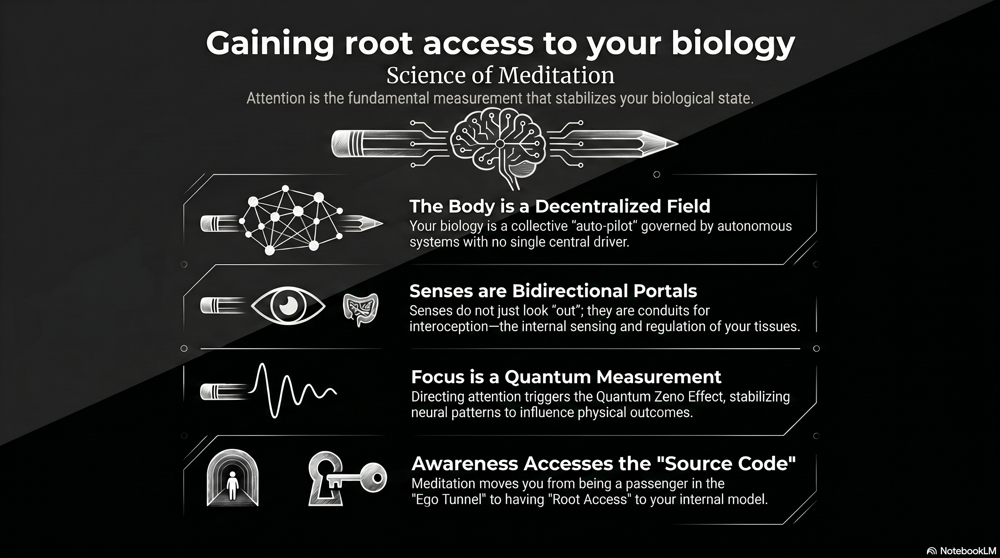

# 226 : Root access to self \-

<a href="https://open.spotify.com/show/7doWf0GON9JsG6r8igc7RE" target="_blank" style="background-color: #2E2E2E; color: white; padding: 10px 20px; text-align: center; text-decoration: none; display: inline-block; border-radius: 5px; margin-top: 10px; margin-right: 10px;">Spotify</a><a href="https://podcasts.apple.com/us/podcast/deep-dive-with-gemini/id1844532251" target="_blank" style="background-color: #2E2E2E; color: white; padding: 10px 20px; text-align: center; text-decoration: none; display: inline-block; border-radius: 5px; margin-top: 10px; margin-right: 10px;">Apple Podcasts</a><a href="https://music.youtube.com/playlist?list=PLIX4sFsmu37qtJMlv-VzMYWM26M1QyXTe&si=o534zFZsc7p5XA9Q" target="_blank" style="background-color: #2E2E2E; color: white; padding: 10px 20px; text-align: center; text-decoration: none; display: inline-block; border-radius: 5px; margin-top: 10px; margin-right: 10px;">YouTube Music</a><a href="https://www.youtube.com/playlist?list=PLIX4sFsmu37qtJMlv-VzMYWM26M1QyXTe" target="_blank" style="background-color: #2E2E2E; color: white; padding: 10px 20px; text-align: center; text-decoration: none; display: inline-block; border-radius: 5px; margin-top: 10px; margin-right: 10px;">YouTube</a><a href="https://fountain.fm/show/7LBvZT6ffpGyubvk8aSF" target="_blank" style="background-color: #2E2E2E; color: white; padding: 10px 20px; text-align: center; text-decoration: none; display: inline-block; border-radius: 5px; margin-top: 10px;">Fountain.fm</a>

The historical trajectory of human self-understanding has long been dominated by the dualistic metaphor of the "biological chariot"—a complex physical vessel steered by a singular, albeit invisible, driver. This conceptual framework, rooted in the logical deduction that every effect must possess a cause, has persisted despite the total absence of physical evidence for such a centralized pilot. In the contemporary era, the search for this "driver" has transitioned from the realm of philosophical speculation to the rigorous laboratory of neurobiology and theoretical physics. As medical science has dissected the body "inside out," examining every tissue and neural pathway, it has failed to identify a singular locus of control. Instead, what has emerged is a picture of an exquisitely decentralized system—a "collective auto-pilot" of staggering complexity. However, the question of how we know our own bodies, and the nature of the entity that perceives the world, suggests that our initial premise may be flawed. The sensory apparatus, traditionally viewed as a unidirectional diagnostic tool for external experience, appears instead to be a bidirectional portal. In this paradigm, the senses do not merely provide a window for the organism to look out; they serve as a conduit through which the universe itself interacts with and "records" the state of the individual. This report explores the scientific grounding for the hypothesis that senses are not one-way functions, but rather the portal of a participatory reality where attention constitutes the fundamental measurement on a quantum register.

## **The Decentralized Chariot: Autonomic Homeostasis and the Absence of a Central Driver**

The human body operates as a high-fidelity homeostatic system that functions almost entirely without conscious oversight. This "auto-pilot" mechanism is governed by the Autonomic Nervous System (ANS), which regulates vital functions such as heart rate, respiratory rate, digestion, and pupillary response.[^1] The ANS is divided into the sympathetic system, which mobilizes the body for "fight or flight," and the parasympathetic system, which promotes "rest and digest" states.[^2] The coordination of these systems does not stem from a singular command center but emerges from integrated reflexes spanning the brainstem, spinal cord, and peripheral organs.[^1]

The hypothalamus acts as a critical integrator for these functions, receiving visceral and somatic input as well as emotional signals from the limbic system.[^3] Yet, even the hypothalamus is not a "driver" in the traditional sense; it is a relay and regulation hub. The decentralized nature of bodily control is most evident in the enteric nervous system (ENS), which contains approximately 200 million neurons embedded in the gastrointestinal tract.[^1] The ENS communicates with the central nervous system but is capable of regulating gut function independently, illustrating that the "biological chariot" is composed of multiple autonomous systems working in concert.[^1]

### **Functional Divisions of the Autonomic System and Regulatory Mechanisms**

| System Component | Primary Function | Neurotransmitters Involved | Regulatory Hub |
| :---- | :---- | :---- | :---- |
| Sympathetic Nervous System | Energy mobilization (Fight or Flight) | Norepinephrine, Epinephrine | Lateral gray column (T1-L2), Adrenal Medulla |
| Parasympathetic Nervous System | Energy conservation (Rest and Digest) | Acetylcholine (ACh) | Brainstem (Cranial nerves), Sacral spinal cord |
| Enteric Nervous System | Gastrointestinal regulation (Independent) | Diverse (Serotonin, ACh, etc.) | Myenteric and Submucosal plexuses |
| Hypothalamus | Homeostatic integration | Various releasing hormones | Diencephalon |

1

The development and maintenance of the body—from infancy to old age—are similarly automated. Growth factors and genetic programs orchestrate the migration of neural crest cells and the elongation of axons without the need for conscious direction.[^2] Sleep, hunger, and thirst are triggered by internal sensors that monitor plasma osmolarity, blood glucose, and body temperature, initiating corrective behaviors through the brainstem and hypothalamus.[^4] This biological autonomy raises the "Hard Problem" of consciousness: if the body is a self-regulating machine, why does it possess a subjective "Knower" who feels like the occupant of the vessel?

## **The Sensory Portal: Bidirectional Information Exchange**

The traditional view of the senses as "one-way" exteroceptive tools—designed only to see "outwards"—is challenged by the discovery of the interoceptive nervous system. Interoception is the process by which the nervous system senses and integrates signals regarding the internal state of the body.[^5] While exteroception (vision, hearing, touch) is optimized for rapid, digital-like signaling to process environmental changes, interoception utilizes analogue-like processing to map the internal milieu in real-time.[^6]

This interoceptive system is physically distinct. It relies on unmyelinated and lightly myelinated afferent neurons, such as those found in the vagus nerve and the lamina I spinothalamocortical pathway.[^6] These pathways carry sympathetic and parasympathetic afferents that signal the physiological condition of all tissues in the body, providing the foundational substrate for what we experience as "subjectivity" and "homeostatic feelings".[^6]

### **Comparative Analysis of Exteroceptive and Interoceptive Systems**

| Feature | Exteroception | Interoception |
| :---- | :---- | :---- |
| Primary Objective | External environmental experience | Internal milieu mapping/Homeostasis |
| Signal Nature | Rapid, precise, digital-like | Continuous, analogue-like |
| Neural Fiber Type | Heavily myelinated (fast) | Unmyelinated/Lightly myelinated (slow) |
| Cortical Destination | Primary sensory cortices (e.g., V[^1], A1) | Insular cortex, Anterior Cingulate (ACC) |
| Communication Direction | Primarily Afferent (Inward) | Bidirectional (Sensing and Regulating) |

5

The sensory portal is not merely a receiving station but a bidirectional channel. In modern neurobiology, interoception is increasingly defined to include not only the "ascending" sensing of bodily states but also the "descending" regulation of those states by the brain.[^5] This leads to the concept of the "sensor-effector loop," where the distinction between a sense and an action becomes blurred. For example, thermoception—the sense of temperature—is not just a measurement of the environment; it is an inference about the thermal state of the body that is directly coupled to thermoregulatory processes like sweating or shivering.[^7] This coupling suggests that the senses are the interface where the internal and external worlds meet and modify one another.

## **The Quantum Register: Observation as Measurement and Record**

The user's argument suggests that the universe "tracks" our attention and that perception is a recorded measurement on a "quantum register of reality." This aligns with the "Participatory Universe" hypothesis proposed by John Archibald Wheeler.[^8] Wheeler argued that the universe does not exist as a static, independent entity but comes into being through the act of observation.[^8] This is grounded in the "delayed-choice" experiment, which demonstrates that a decision made in the present (the choice of how to measure a photon) can retroactively determine the path that the photon "must have taken" billions of years ago.[^9]

In this framework, the "Knower" is not a passive witness but a "participator" in the actualization of reality. Every act of conscious attention extracts "bits" of information from the quantum foam of possibility, collapsing wavefunctions and crystallizing potentiality into actuality.[^9] This is summarized in Wheeler's "It from Bit" principle: all physical things are information-theoretic in origin.[^8]

### **Information-Theoretic Perspectives on Reality**

| Principle | Core Concept | Physical Basis |
| :---- | :---- | :---- |
| It from Bit | Physical reality is derived from information. | Quantum information theory 11 |
| Participatory Universe | Observers are required to bring reality into being. | Delayed-choice experiments 13 |
| Quantum Darwinism | Environment "selects" and records robust states. | Decoherence and pointer states 14 |
| Holographic Principle | Volume information is encoded on a boundary. | Bekenstein bound and black hole entropy 16 |

11

The "Quantum Register" can be understood through the lens of Quantum Darwinism, proposed by Wojciech Zurek. This theory posits that the "objective" classical world emerges because the environment—the sea of photons and air molecules surrounding us—acts as an active monitor.[^10] When a quantum system interacts with its environment, it leaves redundant copies of its information in the surroundings.[^11] Multiple observers can then access these distinct replicas of information to reach a "consensus" on reality.[^12] Thus, the act of perception is not just a private experience; it is a physical interaction that "imprints" information onto the environment, effectively creating a recorded measurement that defines the state of the world.[^11]

## **Attention as the "Spotlight" of the Knower**

If the senses are the portal, attention is the mechanism by which the Knower chooses what information to integrate and record. Selective attention is the brain's ability to prioritize specific information while filtering out the vast amount of irrelevant environmental noise.[^13] This process is governed by a hierarchical organization where top-down signals from the frontal and parietal lobes modulate the activity of sensory neurons.[^13]

According to Global Workspace Theory (GWT), consciousness arises when information is "selected" and then "broadcast" throughout the brain.[^14] This creates a serial bottleneck in an otherwise parallel, unconscious system.[^14] Information that enters the global workspace becomes "globally available" to multiple cognitive systems, allowing for flexible, voluntary control.[^14] In the "theater" metaphor of GWT, attention acts as the "spotlight" on the stage; only the actors illuminated by this light are conscious and their "speeches" (information) are heard by the "audience" (the rest of the brain's specialized modules).[^15]

### **The Selection-Broadcast Cycle of Consciousness**

| Phase | Neural Mechanism | Functional Outcome |
| :---- | :---- | :---- |
| Competition | Local modular activity (e.g., visual processing) | Parallel, unconscious processing of stimuli |
| Selection | Attentional spotlight (Frontal Eye Fields, Parietal) | Choice of task-relevant information |
| Integration | Recruitment of the Global Workspace (PFC, ACC) | Unified conscious representation |
| Broadcast | Recurrent signaling across long-range axons | Global availability for action and memory |

22

The movement of attention is, as the user suggests, the "true knowledge." In quantum mechanical terms, Henry Stapp proposes that this conscious effort of attention triggers the Quantum Zeno Effect (QZE) in the brain.[^16] The QZE is a phenomenon where rapid, repeated observations of a quantum system can "freeze" its evolution.[^16] By focusing attention, the Knower stabilizes specific patterns of neural activity, effectively "holding" a thought or intention in place long enough to produce a macroscopic physical effect.[^17] This provides a science-based causal mechanism for how "conscious intent" can influence the "biological chariot".[^18]

## **The Ego Tunnel: Why the Knower Feels Separated**

The question of "how do we know our body" is complicated by the fact that we do not experience our body directly; we experience a *model* of it. Thomas Metzinger’s "Ego Tunnel" theory suggests that no such thing as a "self" exists in the world; instead, the brain creates a Phenomenal Self-Model (PSM).[^19] This PSM is a virtual image of the organism as a whole, including its body, emotions, and relationship to time.[^20]

Crucially, this model is "transparent"—the brain cannot recognize it as a model, so we look "through" it as if it were a direct window onto reality.[^20] This transparency is what creates the robust "first-person perspective" and the feeling of being a "driver" inside the head.[^21] The "Ego Tunnel" is a selective way of representing information, a "low-dimensional projection" of an inconceivably richer physical reality.[^22] Our senses evolved for survival, not for depicting objective reality, and so they "drill a tunnel" through the environment, painting its walls with colors and sounds that exist only within the internal model.[^20]

### **Attributes of the Phenomenal Self-Model (PSM)**

| Attribute | Description | Functional Role |
| :---- | :---- | :---- |
| Transparency | The inability to recognize the model *as* a model. | Creates the feeling of "direct" experience. |
| Unity | Integration of disparate senses into a single world. | Solves the "binding problem".[^19] |
| Presence | The feeling of being "here and now." | Flags survival-relevant information.[^20] |
| Agency | The sense of ownership over actions. | Facilitates goal-directed behavior. |
| Perspective | A centered, first-person point of view. | Creates the "Ego" as a reference point.[^21] |

30

This explains why we cannot see our neurons firing: the evolution of the PSM "hid the simulation" because seeing the underlying biological mechanics would be metabolically expensive and counterproductive for survival.[^20] We "know" our body through the interoceptive signals that filter into this model, giving us a sense of ownership over the "biological chariot" without revealing its complex internal diagnostics.[^20]

## **The Body as the Field and the Search for "Root Access"**

The argument posits that "The body is the field; the senses are the portal." In systems biology, this "field" is understood as a network of multiscale feedback control loops.[^23] Homeostasis is maintained through negative feedback loops that counteract changes to keep variables within an optimal range, such as blood glucose or body temperature.[^24]

The desire for "root access"—to see our own "file system" and understand our own structure—is the drive toward metacognition and interoceptive awareness. Metacognition is "thinking about thinking," the ability to monitor one's own cognitive processes.[^25] Interoceptive awareness specifically refers to the metacognitive monitoring of interoceptive processing.[^26] While most people have poor "interoceptive accuracy" (e.g., they cannot accurately track their own heartbeat), individuals can develop greater awareness through practices like mindfulness, which brings deliberate attention to bodily sensations.[^27]

### **Dimensions of Interoceptive and Metacognitive Knowledge**

| Domain | Measure | Description |
| :---- | :---- | :---- |
| Interoceptive Accuracy | Objective Detection | Performance on tasks like heartbeat perception.[^27] |
| Interoceptive Sensibility | Subjective Report | Self-perceived ability to sense internal states.[^28] |
| Interoceptive Awareness | Metacognition | Confidence/knowledge about one's own sensing accuracy.[^29] |
| Metacognitive Control | Regulation | The ability to adapt thinking strategies.[^25] |

6

The "Theory of Everything" that we crave is often sought in the external world, but if humans are the most complex of creations, the key may lie in the "internal field." Integrated Information Theory (IIT) suggests that the quality of our experience is specified by the set of informational relationships generated within the brain's complex of elements.[^30] This complex is the "maximally irreducible conceptual information structure," or "quale," which is identical to an experience.[^31] If we understand our own structure—the way our brain integrates information to create the self—we are essentially viewing the "source code" of the observer through which all other knowledge is filtered.

## **The Knower and the Act of Measurement**

The user asks: "What if the senses are communicating the spot of our attention... the act of perception is a recorded measurement on the quantum register of reality." This aligns with the "Black Box" model of the observer, where the observer is coupled to the environment and any exchange of information involves a physical interaction and exchange of energy.[^32]

In this view, the universe is not just "watching" us as an active surveillance, but rather, the "Knower" and the "Known" are entangled. The "spot of our attention" is a choice of what question to ask nature.[^33] In quantum theory, this is the "Heisenberg choice"—the selection of which observable to measure.[^34] This choice is not determined by any known physical laws, yet it has direct effects on the subsequent course of physically described events.[^35]

### **The Process of Quantum-Conscious Interaction**

1. **Process 2 (The Field):** The brain evolves according to the Schroedinger equation, creating a superposition of many possible states and actions.[^36]  
2. **Process 1 (The Portal/Choice):** The "Knower" makes a "free choice" of which question to put to nature—this is the focus of attention.[^35]  
3. **The Measurement (The Record):** Nature provides an answer ("Dirac choice"), collapsing the superposition into a single actuality.[^34]  
4. **The Quantum Register:** This outcome is recorded via decoherence in the environment and the brain's own memory systems, defining a new "starting point" for reality.[^11]

This cyclic process suggests that "God is always watching" is a metaphor for the fact that the universe is a "self-excited circuit" where every act of perception is a permanent update to the information state of the cosmos.[^9]

## **Synthesis: Knowing the Self as the Ultimate Exploration**

The path of the "Knower" who aspires to know himself is the process of turning the "sensory portal" inward. This is not just a spiritual exercise but a scientific frontier. By understanding the "efference copy"—the brain's internal prediction of its own actions—we can begin to distinguish the "self" from the "field".[^37] The efference copy allows us to predict the sensory consequences of our movements, enabling the brain to "cancel out" self-generated noise and maintain a stable perception of the world.[^37]

When this mechanism is impaired, as in certain neurological disorders, the boundary between the self and the external world begins to dissolve.[^38] For the "Knower," the key is to achieve a state of "root access" where the internal models (the Ego Tunnel) become transparent *not* in the sense of being invisible, but in the sense of being recognized for what they are: simulations.[^20]

If we understand our own self—the "most complex of creation"—there is little left to explore because the "rest" of the world is only known through the medium of the self.[^39] As Wheeler's "Leibniz logic loop" suggests, the analysis of the physical world, pursued to sufficient depth, leads back to the conscious mind, tied through the acts of observation and participation to the very foundations of the universe.[^40] The sensory portal is the interface where this loop is closed, and the "Knower" finally recognizes that the "tiny box" of their physical vicinity is a reflection of the infinite information structure that constitutes their true identity.

The body, then, is not a "chariot" being driven by a hidden soul, but a decentralized, self-organizing "field" of information.[^41] The "Knower" is the emergent property of this field's complexity, a "virtual organ" that allows the system to monitor itself and its environment.[^20] The senses are the portals that facilitate this monitoring, serving as the "quantum register" where our attention is measured and our existence is affirmed. In the end, to know the body is to know the portal, and to know the portal is to understand that we are active participants in the ongoing dialogue that brings the universe into being.

---

### Tips and Donations

If you enjoyed this deep dive, consider supporting the project with a tip in **Sats**. It's a simple, global way to support independent research.

<lightning-widget
  name="Thanks for supporting the publication"
  accent="#f9ce00"
  to="shutosha@primal.net"
  image="https://nostrcheck.me/media/5af0794606a15b5641e25aa23d04af4cb0d7d5e68b11cacb47e56a4698fca8c4/49ff6d00cb5bc819cd19f77783d4815fbd46a5b99b6fbdead1eaecfab798187b.webp"
/>

To send Sats, you'll need a [lightning wallet](https://lightningaddress.com/). 

---

#### **Works cited**

[^1]: Autonomic nervous system \- Wikipedia, accessed April 14, 2026, [https://en.wikipedia.org/wiki/Autonomic\_nervous\_system](https://en.wikipedia.org/wiki/Autonomic_nervous_system)

[^2]: Physiology, Autonomic Nervous System \- StatPearls \- NCBI Bookshelf, accessed April 14, 2026, [https://www.ncbi.nlm.nih.gov/books/NBK538516/](https://www.ncbi.nlm.nih.gov/books/NBK538516/)

[^3]: 14.4: Central Control of Autonomic Function \- Medicine LibreTexts, accessed April 14, 2026, [https://med.libretexts.org/Bookshelves/Anatomy\_and\_Physiology/Human\_Anatomy\_(Lange\_et\_al.)/14%3A\_Autonomic\_Nervous\_System/14.04%3A\_Central\_Control\_of\_Autonomic\_Function](https://med.libretexts.org/Bookshelves/Anatomy_and_Physiology/Human_Anatomy_\(Lange_et_al.\)/14%3A_Autonomic_Nervous_System/14.04%3A_Central_Control_of_Autonomic_Function)

[^4]: Physiology of the Autonomic Nervous System \- PMC \- NIH, accessed April 14, 2026, [https://pmc.ncbi.nlm.nih.gov/articles/PMC1959222/](https://pmc.ncbi.nlm.nih.gov/articles/PMC1959222/)

[^5]: The Emerging Science of Interoception: Sensing, Integrating, Interpreting, and Regulating Signals within the Self \- PMC, accessed April 14, 2026, [https://pmc.ncbi.nlm.nih.gov/articles/PMC7780231/](https://pmc.ncbi.nlm.nih.gov/articles/PMC7780231/)

[^6]: The physiology of interoception and its adaptive role in ... \- PMC \- NIH, accessed April 14, 2026, [https://pmc.ncbi.nlm.nih.gov/articles/PMC12612705/](https://pmc.ncbi.nlm.nih.gov/articles/PMC12612705/)

[^7]: A computationally informed distinction of interoception and exteroception \- PubMed, accessed April 14, 2026, [https://pubmed.ncbi.nlm.nih.gov/38432449/](https://pubmed.ncbi.nlm.nih.gov/38432449/)

[^8]: John Archibald Wheeler | The Spiritual Arts Foundation, accessed April 14, 2026, [https://www.spiritualarts.org.uk/john-archibald-wheeler/](https://www.spiritualarts.org.uk/john-archibald-wheeler/)

[^9]: The Participatory Universe: How Consciousness Shapes Reality | by Dinis Guarda \- Medium, accessed April 14, 2026, [https://dinisguarda.medium.com/the-participatory-universe-how-consciousness-shapes-reality-0de6157b7372](https://dinisguarda.medium.com/the-participatory-universe-how-consciousness-shapes-reality-0de6157b7372)

[^10]: Quantum Darwinism and the Emergence of Objective Reality | by Adithyan Jayakumar, accessed April 14, 2026, [https://medium.com/@adithyanjayakumar/quantum-darwinism-and-the-emergence-of-objective-reality-7d53838ed4c4](https://medium.com/@adithyanjayakumar/quantum-darwinism-and-the-emergence-of-objective-reality-7d53838ed4c4)

[^11]: Quantum Darwinism, accessed April 14, 2026, [https://www.physicalism.com/quantum-darwinism.pdf](https://www.physicalism.com/quantum-darwinism.pdf)

[^12]: Quantum Darwinism, an Idea to Explain Objective Reality, Passes First Tests | Quanta Magazine : r/Physics \- Reddit, accessed April 14, 2026, [https://www.reddit.com/r/Physics/comments/cgi0bt/quantum\_darwinism\_an\_idea\_to\_explain\_objective/](https://www.reddit.com/r/Physics/comments/cgi0bt/quantum_darwinism_an_idea_to_explain_objective/)

[^13]: The Neural Basis of Selective Attention: Cortical Sources and Targets of Attentional Modulation \- PMC, accessed April 14, 2026, [https://pmc.ncbi.nlm.nih.gov/articles/PMC2681259/](https://pmc.ncbi.nlm.nih.gov/articles/PMC2681259/)

[^14]: Global Workspace Theory: A Mechanistic Approach to Consciousness, accessed April 14, 2026, [https://theoriesofconsciousness.com/global-workspace-theory-consciousness/](https://theoriesofconsciousness.com/global-workspace-theory-consciousness/)

[^15]: Global workspace theory \- Wikipedia, accessed April 14, 2026, [https://en.wikipedia.org/wiki/Global\_workspace\_theory](https://en.wikipedia.org/wiki/Global_workspace_theory)

[^16]: \[quant-ph/0003065\] Decoherence, Quantum Zeno Effect, and the Efficacy of Mental Effort, accessed April 14, 2026, [https://arxiv.org/abs/quant-ph/0003065](https://arxiv.org/abs/quant-ph/0003065)

[^17]: \[0803.1633\] A model of the quantum-classical and mind-brain connections, and of the role of the quantum Zeno effect in the physical implementation of conscious intent \- arXiv, accessed April 14, 2026, [https://arxiv.org/abs/0803.1633](https://arxiv.org/abs/0803.1633)

[^18]: Quantum Physics in Neuroscience and Psychology: A Neurophysical Model of Mind/Brain Interaction, by Jeffrey M. Schwartz, Henry P. Stapp, and Mario Beauregard \- New Dualism Archive, accessed April 14, 2026, [http://newdualism.org/papers/H.Stapp/Stapp-PTB6.htm](http://newdualism.org/papers/H.Stapp/Stapp-PTB6.htm)

[^19]: The Ego Tunnel: The Science of the Mind and the Myth of the Self by Thomas Metzinger | Goodreads, accessed April 14, 2026, [https://www.goodreads.com/book/show/5895503-the-ego-tunnel](https://www.goodreads.com/book/show/5895503-the-ego-tunnel)

[^20]: The Ego Tunnel by Thomas Metzinger | Summary, Audio, Quotes, FAQ \- SoBrief, accessed April 14, 2026, [https://sobrief.com/books/the-ego-tunnel](https://sobrief.com/books/the-ego-tunnel)

[^21]: The Ego Tunnel: The Science of the Mind and the Myth of the Self \- ISPR, accessed April 14, 2026, [https://ispr.info/2009/10/18/the-ego-tunnel-the-science-of-the-mind-and-the-myth-of-the-self/](https://ispr.info/2009/10/18/the-ego-tunnel-the-science-of-the-mind-and-the-myth-of-the-self/)

[^22]: Review: Thomas Metzinger's “The Ego Tunnel” \- words and dirt, accessed April 14, 2026, [https://www.words-and-dirt.com/words/review-thomas-metzingers-the-ego-tunnel/](https://www.words-and-dirt.com/words/review-thomas-metzingers-the-ego-tunnel/)

[^23]: Biological feedback control—Respect the loops \- ResearchGate, accessed April 14, 2026, [https://www.researchgate.net/publication/352474371\_Biological\_feedback\_control-Respect\_the\_loops](https://www.researchgate.net/publication/352474371_Biological_feedback_control-Respect_the_loops)

[^24]: Homeostasis and feedback loops (article) \- Khan Academy, accessed April 14, 2026, [https://www.khanacademy.org/science/hs-bio/x230b3ff252126bb6:from-cells-to-organisms/x230b3ff252126bb6:homeostasis/a/homeostasis-and-feedback-loops](https://www.khanacademy.org/science/hs-bio/x230b3ff252126bb6:from-cells-to-organisms/x230b3ff252126bb6:homeostasis/a/homeostasis-and-feedback-loops)

[^25]: The Neuroscience of Metacognition: Understanding Your Mind (12 Minutes) \- YouTube, accessed April 14, 2026, [https://www.youtube.com/watch?v=gIbTxkT4eck](https://www.youtube.com/watch?v=gIbTxkT4eck)

[^26]: (PDF) The Relationship Between Interoception and Metacognition \- ResearchGate, accessed April 14, 2026, [https://www.researchgate.net/publication/291346678\_The\_Relationship\_Between\_Interoception\_and\_Metacognition](https://www.researchgate.net/publication/291346678_The_Relationship_Between_Interoception_and_Metacognition)

[^27]: The roles of interoceptive sensitivity and metacognitive interoception in panic \- PMC \- NIH, accessed April 14, 2026, [https://pmc.ncbi.nlm.nih.gov/articles/PMC4422149/](https://pmc.ncbi.nlm.nih.gov/articles/PMC4422149/)

[^28]: Editorial: Exploring the interplay of interoception in emotion, cognition, and mental health, accessed April 14, 2026, [https://www.frontiersin.org/journals/neuroscience/articles/10.3389/fnins.2025.1676040/full](https://www.frontiersin.org/journals/neuroscience/articles/10.3389/fnins.2025.1676040/full)

[^29]: A Primer on Interoception and its Importance in Psychiatry \- PMC, accessed April 14, 2026, [https://pmc.ncbi.nlm.nih.gov/articles/PMC10157017/](https://pmc.ncbi.nlm.nih.gov/articles/PMC10157017/)

[^30]: Consciousness as Integrated Information: a Provisional Manifesto | The Biological Bulletin: Vol 215, No 3 \- The University of Chicago Press: Journals, accessed April 14, 2026, [https://www.journals.uchicago.edu/doi/full/10.2307/25470707](https://www.journals.uchicago.edu/doi/full/10.2307/25470707)

[^31]: Integrated information theory of consciousness: an updated account \- Esalq, accessed April 14, 2026, [http://www.esalq.usp.br/lepse/imgs/conteudo\_thumb/Integrated-information-theory-of-consciousness-an-updated-account.pdf](http://www.esalq.usp.br/lepse/imgs/conteudo_thumb/Integrated-information-theory-of-consciousness-an-updated-account.pdf)

[^32]: Building the Observer into the System: Toward a Realistic Description of Human Interaction with the World \- arXiv, accessed April 14, 2026, [https://arxiv.org/pdf/1411.3405](https://arxiv.org/pdf/1411.3405)

[^33]: The Observer in the Quantum Experiment \- arXiv, accessed April 14, 2026, [https://arxiv.org/pdf/quant-ph/0011086](https://arxiv.org/pdf/quant-ph/0011086)

[^34]: Problems in Henry Stapp's interpretation of quantum physics, accessed April 14, 2026, [http://settheory.net/stapp](http://settheory.net/stapp)

[^35]: Henry P. Stapp Theoretical Physics Group Lawrence Berkeley National Laboratory University of California Berkeley, California 947, accessed April 14, 2026, [https://www-physics.lbl.gov/\~stapp/QMA.pdf](https://www-physics.lbl.gov/~stapp/QMA.pdf)

[^36]: Henry Stapp \- Can We Explain Cosmos and Consciousness?, accessed April 14, 2026, [https://www.reddit.com/r/consciousness/comments/1l5w5s0/henry\_stapp\_can\_we\_explain\_cosmos\_and/](https://www.reddit.com/r/consciousness/comments/1l5w5s0/henry_stapp_can_we_explain_cosmos_and/)

[^37]: Efference copy \- Wikipedia, accessed April 14, 2026, [https://en.wikipedia.org/wiki/Efference\_copy](https://en.wikipedia.org/wiki/Efference_copy)

[^38]: Efference copy/corollary discharge function and targeted cognitive training in patients with schizophrenia \- PMC, accessed April 14, 2026, [https://pmc.ncbi.nlm.nih.gov/articles/PMC6616012/](https://pmc.ncbi.nlm.nih.gov/articles/PMC6616012/)

[^39]: A “Participatory Universe” of J. A. Wheeler as an Intentional Correlate of Embodied Subjects and an Example of Purposivene \- arXiv, accessed April 14, 2026, [https://arxiv.org/pdf/1304.2277](https://arxiv.org/pdf/1304.2277)

[^40]: At Home in a Super-Copernican Cosmos: The Genesis of John Wheeler's Participatory Universe \- MPG.PuRe, accessed April 14, 2026, [https://pure.mpg.de/rest/items/item\_3614780\_3/component/file\_3614781/content](https://pure.mpg.de/rest/items/item_3614780_3/component/file_3614781/content)

[^41]: Self-organization \- Wikipedia, accessed April 14, 2026, [https://en.wikipedia.org/wiki/Self-organization](https://en.wikipedia.org/wiki/Self-organization)