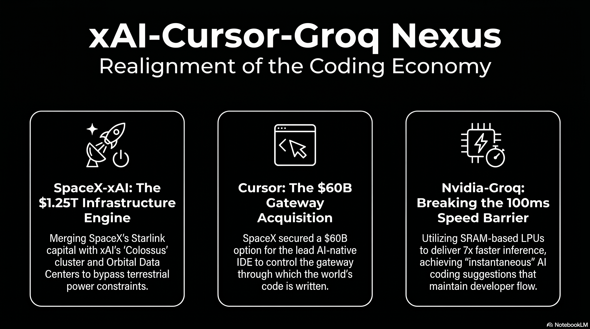

# 227 : 60 billion call option

<a href="https://open.spotify.com/show/7doWf0GON9JsG6r8igc7RE" target="_blank" style="background-color: #2E2E2E; color: white; padding: 10px 20px; text-align: center; text-decoration: none; display: inline-block; border-radius: 5px; margin-top: 10px; margin-right: 10px;">Spotify</a><a href="https://podcasts.apple.com/us/podcast/deep-dive-with-gemini/id1844532251" target="_blank" style="background-color: #2E2E2E; color: white; padding: 10px 20px; text-align: center; text-decoration: none; display: inline-block; border-radius: 5px; margin-top: 10px; margin-right: 10px;">Apple Podcasts</a><a href="https://music.youtube.com/playlist?list=PLIX4sFsmu37qtJMlv-VzMYWM26M1QyXTe&si=o534zFZsc7p5XA9Q" target="_blank" style="background-color: #2E2E2E; color: white; padding: 10px 20px; text-align: center; text-decoration: none; display: inline-block; border-radius: 5px; margin-top: 10px; margin-right: 10px;">YouTube Music</a><a href="https://www.youtube.com/playlist?list=PLIX4sFsmu37qtJMlv-VzMYWM26M1QyXTe" target="_blank" style="background-color: #2E2E2E; color: white; padding: 10px 20px; text-align: center; text-decoration: none; display: inline-block; border-radius: 5px; margin-top: 10px; margin-right: 10px;">YouTube</a><a href="https://fountain.fm/show/7LBvZT6ffpGyubvk8aSF" target="_blank" style="background-color: #2E2E2E; color: white; padding: 10px 20px; text-align: center; text-decoration: none; display: inline-block; border-radius: 5px; margin-top: 10px;">Fountain.fm</a>

The landscape of artificial intelligence in early 2026 has transitioned from a period of speculative research and model-centric competition to an era of industrial-scale vertical integration and conglomerate-led deployment.[^1] This shift is most prominently evidenced by a sequence of massive private sector transactions involving xAI, SpaceX, Cursor, and Groq, which collectively represent the largest concentration of capital, compute, and talent in the history of the technology industry.[^2] The strategic logic underpinning these deals indicates a fundamental rejection of the unbundled software-as-a-service (SaaS) model in favor of a vertically integrated "super-stack" that controls every layer of the intelligence lifecycle, from specialized inference silicon and massive training superclusters to the integrated development environments (IDEs) through which the world's code is written.[^3]

## **The Emergence of the Musk Conglomerate and the SpaceX-xAI Consolidation**

In February 2026, the formal merger of SpaceX and xAI created a 1,250,000,000,000 USD entity that serves as the primary engine for this industrial realignment.[^4] This transaction is not merely a financial consolidation but a direct strategic response to the physical constraints currently limiting the scaling of artificial intelligence: power availability and terrestrial infrastructure bottlenecks.[^5] By bringing xAI under the corporate governance of SpaceX, the entity leverages the substantial cash flows of the Starlink satellite internet constellation to fund the multi-billion-dollar research and development cycles of the Grok model family.[^6]

The financial structure of the merger utilizes a "Valuation Matryoshka" strategy, wherein standalone business units with high volatility or capital requirements are folded into a larger, narrative-driven conglomerate.[^3] This maneuver allows xAI—which reported losses of 6,400,000,000 USD in 2025—to be shielded from the immediate scrutiny of independent valuation by the 4,420,000,000 USD in operating profit generated by Starlink in the same period.[^6] The acquisition of xAI by SpaceX at a 250,000,000,000 USD valuation provides the aerospace giant with a critical layer of intelligence capability as it prepares for a historic IPO targeting a 1,750,000,000,000 USD valuation and a 75,000,000,000 USD raise in June 2026\.[^7]

### **Orbital Compute and the Terrestrial Power Bottleneck**

A primary rationale for the SpaceX-xAI union is the development of Orbital Data Centers (ODCs).[^4] Between 2025 and 2026, AI development encountered its first hard constraint in the form of power grid capacity, with U.S. transmission infrastructure build-outs estimated to take 10 to 15 years.[^5] SpaceX has filed requests with the Federal Communications Commission (FCC) contemplating a constellation of up to one million satellites designed to provide "energy-efficient AI compute" from orbit, utilizing solar power and natural vacuum cooling to bypass terrestrial land and power constraints.[^8] The entity aims to deploy 100 gigawatts of AI computing capacity per year from orbit, which analysts suggest could deliver compute at a cost 25% lower than ground-based alternatives.[^9]

| SpaceX Business Unit | 2025 Reported Metrics | 2026 Forward Projections | Strategic Role in AI Stack |
| :---- | :---- | :---- | :---- |
| **Starlink** | 20,000,000,000 USD+ Revenue 13 | 10M+ Subscribers 13 | Primary cash flow engine for AI CAPEX.[^6] |
| **xAI** | 6,400,000,000 USD Loss 2 | Grok 5 Training 16 | Intelligence layer/Model developer.[^3] |
| **Launch/Starship** | 165 Missions 13 | Sub-100 USD/kg to orbit 13 | Logistics for Orbital Data Centers.[^4] |
| **Colossus Cluster** | 200,000 H100s 18 | 1M GPU equivalents 19 | Dedicated training infrastructure.[^10] |

The Colossus supercomputer cluster in Memphis, Tennessee, serves as the terrestrial anchor for this infrastructure.[^11] Built in a record 122 days using liquid-cooled Supermicro racks, Colossus currently operates with over 200,000 Nvidia H100 GPUs and consumes approximately 250 megawatts of power, with plans to scale to one million units by late 2026\.[^12] To maintain grid independence, the site utilizes 35 gas turbines capable of producing 420 megawatts alongside 208 Tesla Megapack battery systems.[^12]

## **The 60,000,000,000 USD Strategic Premium for Cursor**

The announcement in April 2026 that SpaceX has secured a call option to acquire Cursor (parent company Anysphere) for 60,000,000,000 USD represents a monumental escalation in the competition for the AI-assisted software development market.[^13] Cursor, which reached 2,000,000,000 USD in annualized recurring revenue (ARR) in February 2026, has emerged as the leading AI-native IDE, with adoption across more than half of the Fortune 500\.[^6]

The deal structure is highly non-traditional, offering SpaceX two paths: a 60,000,000,000 USD buyout later in 2026 or a 10,000,000,000 USD payment for joint development.[^7] This 10,000,000,000 USD "cooperation fee" effectively functions as an options premium, securing exclusive rights to the asset while SpaceX completes its IPO.[^3] For Cursor, the deal provides transformational capital; the 10,000,000,000 USD partnership payment alone dwarfs the 3,300,000,000 USD the startup raised throughout 2025\.[^14]

### **Position Pricing and the Decoupling from Retail Model Costs**

The financial significance of the 60,000,000,000 USD valuation lies in "position pricing" rather than traditional revenue multiples.[^3] While the entire AI coding tools market is projected to reach less than 10,000,000,000 USD by 2026, SpaceX is paying a massive premium to control the "gateway" through which expert engineers interact with AI models.[^3] This transaction aims to solve the primary economic weakness of the AI coding tool layer: model dependency.[^15]

Previously, Cursor operated at a structural disadvantage by paying retail prices to Anthropic and OpenAI for access to the Claude and GPT families.[^6] Every dollar of revenue earned by Cursor partially funded its direct competitors, who were simultaneously rolling out integrated tools like Claude Code and Codex.[^6] By leveraging xAI's Colossus infrastructure—which SpaceX now controls—Cursor can train its proprietary Composer model at a scale that eliminates its dependence on third-party labs, fundamentally restructuring the unit economics of the business.[^16]

### **Talent Consolidation and the Rebuilding of xAI**

The strategic importance of the Cursor deal is further emphasized by the migration of key personnel.[^17] In March 2026, Cursor’s product engineering leads, Andrew Milich and Jason Ginsberg, left the startup to join xAI, reporting directly to Elon Musk.[^7] This move coincided with a broader management reorganization at xAI following the departure of nearly all 11 original co-founders.[^18] The infusion of Cursor's talent, regarded as elite in the field of "AI \+ compiler" integration, is intended to close the seven-month developmental gap that currently separates Grok from tier-one models like Anthropic's Claude and OpenAI's GPT.[^19]

| Feature/Metric | Cursor 3 (Glass) | Anysphere Historical Context |
| :---- | :---- | :---- |
| **Founder Profile** | 4 MIT alumni 26 | Founded 2022 26 |
| **Revenue Growth** | 100,000,000 USD (Jan 2025\) to 2,000,000,000 USD (Feb 2026\) 26 | Fastest-growing SaaS startup 31 |
| **Model Strategy** | Proprietary Composer model \+ BYOK support 26 | Moving toward full in-house training 38 |
| **Primary Workflow** | "Vibe Coding" / Agentic management 34 | Transitioning from IDE to console 40 |

## **The Nvidia-Groq Deal and the Birth of the Inference Economy**

In parallel to the software and infrastructure consolidation within the Musk ecosystem, Nvidia's 20,000,000,000 USD transaction with Groq in late 2025 has redefined the hardware landscape for 2026\.[^2] Structured as a non-exclusive licensing agreement for Groq's Language Processing Unit (LPU) technology and an "acqui-hire" of its engineering leadership, the deal marks Nvidia's transition from a GPU-only strategy to a heterogeneous data center architecture.[^20]

### **Architectural Divergence: SRAM vs. HBM**

The financial and technical significance of the Groq deal centers on the memory wall—the primary bottleneck in modern AI inference.[^20] Traditional GPUs utilize High Bandwidth Memory (HBM) stored off-chip, necessitating high-latency "reach-out" operations for every token generation cycle.[^20] In contrast, Groq's LPU architecture uses on-chip Static Random Access Memory (SRAM) as its primary storage medium.[^20] This architectural choice eliminates the memory bandwidth bottleneck, delivering 150 TB/s of bandwidth per chip—nearly seven times faster than Nvidia's Vera Rubin GPU.[^20]

| Performance Metric | Groq LPU (SRAM) | Traditional GPU (HBM) | Relative Advantage |
| :---- | :---- | :---- | :---- |
| **Memory Bandwidth** | 150 TB/s per chip | \~22 TB/s per chip | \~7x Faster 41 |
| **Token Generation** | 500–750 tokens/sec | \~100 tokens/sec | 5–7x Faster 41 |
| **Energy Efficiency** | 1–3 joules/token | 10–30 joules/token | \~10x Efficient 41 |
| **Execution Model** | Deterministic/Compiler-led | Dynamic/Hardware-led | Zero Jitter 42 |

At the GTC 2026 conference, Nvidia unveiled the Groq 3 LPX inference accelerator, the first product of this integration.[^20] Manufactured by Samsung on a 4nm process to diversify supply chain risk away from TSMC, the LPX rack system features 256 interconnected LPUs.[^20] Nvidia claims that a system combining Vera Rubin GPUs for "prefill" and LPUs for "decode" delivers 35 times higher inference throughput per megawatt than the previous-generation Blackwell platform for trillion-parameter models.[^21]

### **Implications for Coding Agents and the 150ms Threshold**

The speed of inference is uniquely critical for the coding landscape, where developer productivity is governed by cognitive flow states.[^22] Research in early 2026 identifies a "150ms Latency Threshold" for AI coding assistants: suggestions arriving in under 100ms are perceived as "instantaneous," resulting in a 75% acceptance rate.[^22] When latency exceeds 350ms, acceptance rates drop to below 18%, as the delay breaks the developer’s focus and triggers context switching.[^22] By integrating Groq’s LPU technology, the new generation of coding tools aims for sub-100ms time-to-first-token (TTFT) performance, enabling "magical" autocomplete that feels predictive rather than reactive.[^22]

## **Comparative Analysis of Major AI Investments (2025-2026)**

The scale of the xAI-Cursor-Groq nexus must be benchmarked against the broader landscape of AI capital expenditures, which are projected to reach 700,000,000,000 USD in 2026\.[^23] Private funding for AI startups topped 150,000,000,000 USD over the trailing twelve months, and the combined valuation of the ten largest private AI companies now exceeds 2,000,000,000,000 USD.[^1]

| Deal / Investment | Announced Size | Primary Participant(s) | Strategic Intent |
| :---- | :---- | :---- | :---- |
| **SpaceX-xAI Merger** | 250,000,000,000 USD (xAI Value) | SpaceX, xAI 7 | Vertical stack consolidation.[^4] |
| **OpenAI Series F/G** | 110,000,000,000 USD | OpenAI, Thrive, Microsoft 4 | Model pretraining scale.[^24] |
| **Cursor Buyout Option** | 60,000,000,000 USD | SpaceX, Anysphere 26 | Application layer dominance.[^3] |
| **Electronic Arts Take-Private** | 56,600,000,000 USD | Silver Lake, PIF 48 | Content platform capture.[^25] |
| **Stargate Data Center** | 500,000,000,000 USD | OpenAI, Microsoft, Oracle 39 | Sovereign-scale infra.[^26] |
| **Anthropic Series Round** | 30,000,000,000 USD | Amazon, Google, Anthropic 47 | Strategic compute backing.[^23] |
| **xAI Series E** | 20,000,000,000 USD | Valor, Nvidia, Fidelity 16 | Infrastructure expansion.[^27] |
| **Nvidia-Groq Deal** | 20,000,000,000 USD | Nvidia, Groq 41 | Inference silicon capture.[^20] |

The 60,000,000,000 USD valuation of the Cursor option is particularly striking when compared to historical corporate acquisitions. It exceeds the price paid by Disney for 21st Century Fox (52,400,000,000 USD), despite Cursor having a fraction of the physical assets and workforce.[^3] This "AI Valuation Euphoria" reflects a shift in investor discipline, where premiums are increasingly tied to the ability of a company to operationalize AI within complex workflows rather than raw benchmark scores alone.[^28]

## **Transformation of the Coding Landscape: Claude vs. Codex vs. Cursor**

The convergence of xAI's massive compute with Cursor's distribution has fundamentally altered the competitive map for Anthropic’s Claude and OpenAI’s Codex.[^6] In early 2026, the coding tool market has fractured into three distinct operational lanes: terminal-native agents, AI-native IDEs, and multi-editor extensions.[^29]

### **The "One Stack" Convergence**

An unanticipated trend in April 2026 is the convergence of these tools into a single development environment.[^30] Rather than competing as standalone "black boxes," Cursor, Claude Code, and Codex are being used by early adopters as a layered stack: Cursor serves as the interface and orchestration layer, Claude Code acts as the reasoning engine for complex refactors, and Codex provides high-volume, code-specific generation.[^31] This composable architecture is enabled by the Model Context Protocol (MCP) and Agent-to-Agent (A2A) standards, which reached production-ready v1.0 status in early 2026 under neutral governance.[^29]

| Layer | Primary Tool(s) | Function | 2026 Trend |
| :---- | :---- | :---- | :---- |
| **Orchestration** | Cursor 3 (Glass) 40 | Managing parallel agents.[^30] | Move away from VS Code.[^30] |
| **Execution** | Claude Code, Codex 40 | Raw code generation.[^30] | Model-as-infrastructure.[^30] |
| **Review** | Codex Plugin (in Claude) 40 | Adversarial pressure-testing.[^30] | Automated PR validation.[^30] |

### **Competitive Performance and the "Harness" Advantage**

The performance gap between frontier models has largely collapsed in the Reasoning and Logic categories, with Claude Opus 4.6, GPT-5.4, and Grok 4.1 often scoring within single digits of each other on HumanEval and GPQA Diamond benchmarks.[^32] Consequently, competition has shifted to the "Harness"—the software ecosystem that provides repository-wide context and manages agentic loops.[^26]

Anthropic’s Claude Code has emerged as a favorite among professional engineers, maintaining a 46% "most loved" rating.[^30] Its advantage stems from a sophisticated software harness that includes live repo context, prompt cache reuse, and structured session memory.[^26] OpenAI's Codex, however, remains 2 to 4 times more token-efficient for autonomous background tasks, making it the preferred choice for batch workloads and massive codebase refactors.[^33]

| Benchmark | Claude Opus 4.6 | GPT-5.3 Codex | Grok 4.1 Fast | Kimi K2.5 (Open) |
| :---- | :---- | :---- | :---- | :---- |
| **SWE-bench Verified** | 80.9% 52 | \~80.0% 52 | 70.8% 56 | 71.3% 37 |
| **HumanEval** | \~92.0% 53 | \~96.0% 53 | \~90.0% 57 | 99.0% 53 |
| **GPQA Diamond** | \~85.0% 53 | \~87.0% 53 | \~84.0% 57 | 88.4% 53 |
| **Context Window** | 200K - 1M 52 | 256K - 400K 52 | 2M 58 | 200K - 1M 16 |

## **Regulatory Oversight and Antitrust Scrutiny for Private Sector Transactions**

The sheer magnitude of these deals, combined with the concentration of power in a small number of founder-controlled entities, has triggered an unprecedented response from global regulators.[^20] The Nvidia-Groq and SpaceX-Cursor transactions are being scrutinized as "Reverse Acqui-hires"—deals structured to bypass the Hart-Scott-Rodino (HSR) premerger notification requirements by utilizing licensing agreements while hollowing out a competitor's talent base.[^20]

### **The Senate Investigation and HSR Evasion**

On March 20, 2026, Senators Elizabeth Warren and Richard Blumenthal sent a formal inquiry to Nvidia CEO Jensen Huang, questioning whether the 20,000,000,000 USD Groq licensing deal was deliberately structured to evade antitrust review.[^20] Under current HSR rules, licensing deals are often exempt from filing requirements that apply to traditional acquisitions.[^20] The Senate investigation focuses on whether the hiring of Groq's founder and the majority of its engineering staff constitutes a "merger in disguise," effectively granting Nvidia a monopoly over the emerging low-latency inference market while maintaining the facade of Groq's independence.[^20]

Similarly, the SpaceX-xAI merger raises complex legal questions regarding "Cross-Sector Consolidation".[^34] Because Elon Musk held majority control of both companies before the merger, the transaction was structured as an all-stock deal that did not qualify as a change-in-control event, thus allowing xAI to avoid refinancing 17,000,000,000 USD in debt.[^4] Regulators at the FTC and DOJ are investigating whether this combination allows SpaceX to leverage its dominance in orbital launch and satellite communications to disadvantage competitors in the AI compute market.[^34]

### **Operation AI Comply and Layered Enforcement**

In the absence of a comprehensive federal AI statute, regulatory oversight in 2026 is defined by "Layered Enforcement" utilizing existing consumer protection and antitrust laws.[^35]

* **Federal Trade Commission (FTC):** Chair Andrew Ferguson has launched "Operation AI Comply," a law enforcement sweep targeting deceptive AI claims, "AI washing," and unfair algorithmic pricing.[^36] The FTC has also issued 6(b) inquiries into generative AI investments and partnerships involving Alphabet, Amazon, Anthropic, Microsoft, and OpenAI to scrutinize the impact of these relationships on the competitive landscape.[^37]  
* **Department of Justice (DOJ):** The DOJ National Security Division has implementation a Corporate Enforcement Policy focusing on "hardware-level chip location verification" and restricting "bulk US sensitive personal data" transfers to countries of concern.[^38] A newly formed "AI Litigation Task Force" is empowered to challenge state AI laws that are deemed unconstitutional or burdensome to federal policy.[^39]  
* **State-Level Regulation:** States like California and Colorado have enacted comprehensive AI acts (SB 53, AB 2013, CAIA) that require "frontier developers" to publish risk frameworks, report critical safety incidents, and conduct bias audits.[^40] Penalties in California can reach 1,000,000 USD per violation for large developers.[^41]

The Trump administration’s December 2025 Executive Order, "Ensuring a National Policy Framework for Artificial Intelligence," seeks to centralize oversight at the federal level and preempt what it characterizes as "onerous" state regulations that stifle innovation.[^39] This has created a fractured legal environment where companies must navigate a patchwork of state mandates while the federal government aggressively pushes for deregulation to maintain "global dominance".[^28]

## **Economic Significance: The "SaaSmageddon" and the Private Market Vacuum**

The financial impact of these AI deals has created a "Great Divergence" in the technology sector.[^24] While private market outcomes for AI-native companies like xAI and Cursor are larger than ever, public market software multiples have collapsed to decade lows.[^24]

### **The Software Apocalypse**

Publicly traded SaaS companies are experiencing a "Software Apocalypse," with revenue multiples dropping to 2x-5x, levels historically reserved for consumer packaged goods.[^42] This beat-down is driven by three primary economic fears:

1. **Job Elimination vs. Seat Pricing:** AI productivity gains are expected to reduce the total number of knowledge workers, thus shrinking the addressable market for "per-seat" software subscriptions.[^42]  
2. **Bespoke Development:** The ease of building software with tools like Claude Code allows enterprises to create their own custom solutions, bypassing the need for niche SaaS vendors.[^42]  
3. **CAC Explosion:** The barrier to entry for building new software has dropped so significantly that the market is being flooded with thousands of competing products, driving customer acquisition costs (CAC) to unsustainable levels.[^42]

### **The Venture Capital Concentration Risk**

The economic landscape in early 2026 is characterized by record levels of concentration.[^24] The top 20 venture capital funds are capturing over 80% of all LP dollars, and this capital is being funneled almost exclusively into a small pool of AI, defense, and energy startups.[^42] This has left a vacuum in the rest of the market; historically, a seed-stage company had a 50% chance of raising a Series A within four years, but since 2021, that graduation rate has been cut in half, with no quarterly cohort reaching even a 30% graduation rate.[^42]

| Public Company | May 2025 Context | April 2026 Metric | Economic Signal |
| :---- | :---- | :---- | :---- |
| **Duolingo** | 529 USDIPO Price 73 | 112 USDper share 73 | 14x P/E despite revenue growth.[^42] |
| **PayPal** | Payments leader 73 | 7.45 P/E | Valuation at 1.1x sales.[^42] |
| **Microsoft** | 3,000,000,000,000 USD Valuation 73 | 25x P/E | AI-safe haven status under pressure.[^42] |
| **Amazon** | Hyperscale lead 73 | 27x P/E | Trading lower than Walmart (47x).[^42] |

## **Second and Third-Order Implications for the Global Economy**

The convergence of xAI, Cursor, and Groq suggests several profound shifts that will define the industrial trajectory for the remainder of the decade.

### **From Autocomplete to Agent Management**

The nature of software engineering is undergoing a fundamental mutation.[^43] The IDE is receding as a primary interface, replaced by "Agent Management Consoles" where developers orchestrate swarms of autonomous agents.[^30] In this environment, the primary skill is no longer syntax or implementation, but the ability to articulate architectural goals and manage "Adversarial Review" loops.[^30] This transition has the potential to raise global GDP by 1.3% to 4% over the next decade as AI-driven productivity gains diffuse across sectors.[^44]

### **Geopolitical Compute Sovereignty**

The diversification of Nvidia’s manufacturing to Samsung and the development of SpaceX’s Orbital Data Centers represent a move toward "Geopolitical Compute Sovereignty".[^45] As AI compute becomes recognized as critical national infrastructure—equivalent to energy and logistics—nations are increasingly redrawing access to chips and data infrastructure along geopolitical lines.[^45] Multinationals are being forced to operate separate AI stacks across regions, driven by stricter data sovereignty rules and the need for operational resilience in the face of Taiwan Strait tensions.[^46]

### **The Erosion of Professional Services**

The "multiplier" logic of AI-native tools like Cursor is beginning to impact regulated industries such as medicine and law.[^47] The expansion of the AML (Anti-Money Laundering) perimeter to include "obliged entities" such as real estate agents and accountants reflects a world where AI clears alerts and offboards clients, requiring "glass-box" audit trails for every automated decision.[^47] This "Responsible AI" mandate in hubs like Singapore is a precursor to a global shift from ethical intent to demonstrable, auditable risk control.[^47]

## **Conclusions and Strategic Outlook**

The transactions between xAI, SpaceX, Cursor, and Groq in early 2026 signal the end of the "model-only" era of artificial intelligence.[^48] The industry has entered a phase of industrial consolidation where the most successful entities will be those that control the entire vertical stack: silicon architecture (LPU), training infrastructure (Colossus/Starship), and the professional distribution channel (Cursor).[^3]

The 60,000,000,000 USD option for Cursor and the 20,000,000,000 USD licensing of Groq represent the "market price" for position-taking in an economy where intelligence is rapidly becoming a commodity.[^3] The financial significance of these deals lies in their ability to decouple software innovation from the escalating rental costs of third-party compute, creating a sustainable path to profitability in a public market that has become hostile to the traditional SaaS model.[^14]

For regulators, the challenge of 2026 and beyond will be oversight of these conglomerate-led ecosystem deals that exist in the "regulatory blind spot" of current antitrust and corporate law.[^34] As AI risk migrates across the governance perimeters of aerospace and social media giants, the need for auditable, transparent AI risk management becomes the new global benchmark.[^8] The success of the Musk-led AI ecosystem will ultimately depend on whether its "Valuation Matryoshka" can survive the transition to public markets during the SpaceX IPO, establishing a definitive new playbook for the age of industrial intelligence..[^3]

---

### Tips and Donations

If you enjoyed this deep dive, consider supporting the project with a tip in **Sats**. It's a simple, global way to support independent research.

<lightning-widget
  name="Thanks for supporting the publication"
  accent="#f9ce00"
  to="shutosha@primal.net"
  image="https://nostrcheck.me/media/5af0794606a15b5641e25aa23d04af4cb0d7d5e68b11cacb47e56a4698fca8c4/49ff6d00cb5bc819cd19f77783d4815fbd46a5b99b6fbdead1eaecfab798187b.webp"
/>

To send Sats, you'll need a [lightning wallet](https://lightningaddress.com/). 

---

#### **Works cited**

[^1]: AI Company Rankings 2026: Revenue, Funding & Valuation Data for 2000+ Companies | TLDL, accessed April 22, 2026, [https://www.tldl.io/resources/ai-companies-landscape-2026](https://www.tldl.io/resources/ai-companies-landscape-2026)

[^2]: Three Biggest AI Stories in Jan. 2026: 'real-time AI inference', accessed April 22, 2026, [https://etcjournal.com/2026/01/18/three-biggest-ai-stories-in-jan-2026-real-time-ai-inference/](https://etcjournal.com/2026/01/18/three-biggest-ai-stories-in-jan-2026-real-time-ai-inference/)

[^3]: 6,000,000,000 USD acquisition of Cursor—SpaceX spent money it hasn't raised yet - 深潮TechFlow, accessed April 22, 2026, [https://www.techflowpost.com/en-US/article/31252](https://www.techflowpost.com/en-US/article/31252)

[^4]: SpaceX-xAI Merger: Should ESOP Holders Sell or Wait for IPO? - Eqvista, accessed April 22, 2026, [https://eqvista.com/spacex-xai-merger-esop-holders-analysis/](https://eqvista.com/spacex-xai-merger-esop-holders-analysis/)

[^5]: The Largest IPO in History: In-Depth Analysis — Valuation Logic for SpaceX/xAI, Passive Buying Structure, and Tokenized Entry Path, accessed April 22, 2026, [https://www.techflowpost.com/en-US/article/31240](https://www.techflowpost.com/en-US/article/31240)

[^6]: SpaceX obtains right to buy AI start-up Cursor for 60 USDbn, accessed April 22, 2026, [https://www.ft.com/content/d23bd03a-92ac-4e81-8460-3b867a833860?syn-25a6b1a6=1](https://www.ft.com/content/d23bd03a-92ac-4e81-8460-3b867a833860?syn-25a6b1a6=1)

[^7]: Musk Wants Cursor: 60,000,000,000 USD Acquisition, 10,000,000,000 USD Partnership, and Tech's New Playbook of Buying People Not Companies, accessed April 22, 2026, [https://yage.ai/share/xai-cursor-acquihire-en-20260421.html](https://yage.ai/share/xai-cursor-acquihire-en-20260421.html)

[^8]: The SpaceX–xAI Merger - The D&O Diary, accessed April 22, 2026, [https://www.dandodiary.com/2026/03/articles/director-and-officer-liability/the-spacex-xai-merger/](https://www.dandodiary.com/2026/03/articles/director-and-officer-liability/the-spacex-xai-merger/)

[^9]: ARK’s SpaceX IPO Guide makes a compelling case on why 1,750,000,000,000 USD may not be the ceiling, accessed April 22, 2026, [https://www.teslarati.com/ark-invest-spacex-ipo-valuation-guide/](https://www.teslarati.com/ark-invest-spacex-ipo-valuation-guide/)

[^10]: xAI and Cursor announce partnership to build coding AI | daily.dev, accessed April 22, 2026, [https://app.daily.dev/posts/xai-and-cursor-announce-partnership-to-build-coding-ai-kxp9xx21e](https://app.daily.dev/posts/xai-and-cursor-announce-partnership-to-build-coding-ai-kxp9xx21e)

[^11]: Colossus (xAI) - Glenn K. Lockwood, accessed April 22, 2026, [https://www.glennklockwood.com/garden/systems/Colossus](https://www.glennklockwood.com/garden/systems/Colossus)

[^12]: xAI's Memphis Colossus | Introl Blog, accessed April 22, 2026, [https://introl.com/blog/xai-memphis-colossus-100000-gpu-supercomputer-infrastructure](https://introl.com/blog/xai-memphis-colossus-100000-gpu-supercomputer-infrastructure)

[^13]: SpaceX agrees rights to buy AI coding darling Cursor for 60 USDbn - Silicon Republic, accessed April 22, 2026, [https://www.siliconrepublic.com/business/spacex-agrees-right-to-buy-ai-coding-darling-cursor-for-60bn](https://www.siliconrepublic.com/business/spacex-agrees-right-to-buy-ai-coding-darling-cursor-for-60bn)

[^14]: Why SpaceX just made a 60,000,000,000 USD bet on AI coding ahead of historic IPO - Teslarati, accessed April 22, 2026, [https://www.teslarati.com/spacex-cursor-ai-coding/](https://www.teslarati.com/spacex-cursor-ai-coding/)

[^15]: Anysphere - Summit Ventures Partners, accessed April 22, 2026, [https://www.summit-ventures.net/company/anysphere/](https://www.summit-ventures.net/company/anysphere/)

[^16]: SpaceX secures option to buy AI coding startup Cursor for 60,000,000,000 USD - TNW, accessed April 22, 2026, [https://thenextweb.com/news/spacex-cursor-60-billion-acquisition](https://thenextweb.com/news/spacex-cursor-60-billion-acquisition)

[^17]: Use with Code Editors - xAI Docs, accessed April 22, 2026, [https://docs.x.ai/developers/advanced-api-usage/use-with-code-editors](https://docs.x.ai/developers/advanced-api-usage/use-with-code-editors)

[^18]: SpaceX Has Filed for What Could Be the Largest IPO in History. The AI Layer It Is Pitching Is Being Rebuilt From Scratch. - FinTech Weekly, accessed April 22, 2026, [https://www.fintechweekly.com/news/spacex-ipo-xai-valuation-ai-layer-rebuild-2026](https://www.fintechweekly.com/news/spacex-ipo-xai-valuation-ai-layer-rebuild-2026)

[^19]: SpaceX IPO: Musk Weighs 60,000,000,000 USD Cursor Deal, and Can It Save xAI?, accessed April 22, 2026, [https://www.tradingkey.com/analysis/stocks/us-stocks/261808564-spacex-ipo-elon-musk-cursor-60-billion-tradingkey](https://www.tradingkey.com/analysis/stocks/us-stocks/261808564-spacex-ipo-elon-musk-cursor-60-billion-tradingkey)

[^20]: Nvidia's 20,000,000,000 USD Groq Deal: What the Acqui-Hire Means for AI Investors - TECHi, accessed April 22, 2026, [https://www.techi.com/nvidia-groq-deal-acqui-hire-ai-inference/](https://www.techi.com/nvidia-groq-deal-acqui-hire-ai-inference/)

[^21]: Inside NVIDIA Groq 3 LPX: The Low-Latency Inference Accelerator for the NVIDIA Vera Rubin Platform | NVIDIA Technical Blog, accessed April 22, 2026, [https://developer.nvidia.com/blog/inside-nvidia-groq-3-lpx-the-low-latency-inference-accelerator-for-the-nvidia-vera-rubin-platform/](https://developer.nvidia.com/blog/inside-nvidia-groq-3-lpx-the-low-latency-inference-accelerator-for-the-nvidia-vera-rubin-platform/)

[^22]: Groq AI Coding Assistant Speed Test: Real Developer Benchmarks, accessed April 22, 2026, [https://neuraplus-ai.github.io/blog/groq-ai-coding-assistant-speed-test.html](https://neuraplus-ai.github.io/blog/groq-ai-coding-assistant-speed-test.html)

[^23]: The State Of AI Infrastructure: Demand, Costs, And Custom Silicon - Ark Invest, accessed April 22, 2026, [https://www.ark-invest.com/articles/analyst-research/the-state-of-ai-infrastructure-demand-costs-custom-silicon](https://www.ark-invest.com/articles/analyst-research/the-state-of-ai-infrastructure-demand-costs-custom-silicon)

[^24]: 2026 Software x AI: Software's AI Inflection Point | Sapphire Ventures, accessed April 22, 2026, [https://sapphireventures.com/blog/2026-softwares-ai-inflection-point/](https://sapphireventures.com/blog/2026-softwares-ai-inflection-point/)

[^25]: The Great Delisting: Why North America's Corporate Giants are Fleeing to Private Equity, accessed April 22, 2026, [https://markets.financialcontent.com/stocks/article/marketminute-2026-3-18-the-great-delisting-why-north-americas-corporate-giants-are-fleeing-to-private-equity](https://markets.financialcontent.com/stocks/article/marketminute-2026-3-18-the-great-delisting-why-north-americas-corporate-giants-are-fleeing-to-private-equity)

[^26]: AI News - April 2026: Key Events & Releases - dentro.de/ai, accessed April 22, 2026, [https://dentro.de/ai/news/](https://dentro.de/ai/news/)

[^27]: xAI raises 20,000,000,000 USD Series E at \~230,000,000,000 USD valuation | AINews, accessed April 22, 2026, [https://news.smol.ai/issues/26-01-06-xai-series-e/](https://news.smol.ai/issues/26-01-06-xai-series-e/)

[^28]: AI Trends for 2026 - Morrison Foerster, accessed April 22, 2026, [https://www.mofo.com/ai-trends-for-2026](https://www.mofo.com/ai-trends-for-2026)

[^29]: AI Tools Race Heats Up: Week of March 16 – April 2, 2026 - DEV Community, accessed April 22, 2026, [https://dev.to/alexmercedcoder/ai-tools-race-heats-up-week-of-march-16-april-2-2026-46hp](https://dev.to/alexmercedcoder/ai-tools-race-heats-up-week-of-march-16-april-2-2026-46hp)

[^30]: Cursor, Claude Code, and Codex are merging into one AI coding stack nobody planned, accessed April 22, 2026, [https://thenewstack.io/ai-coding-tool-stack/](https://thenewstack.io/ai-coding-tool-stack/)

[^31]: AI Weekly: Agents, Models, and Chips — April 9–15, 2026 - DEV Community, accessed April 22, 2026, [https://dev.to/alexmercedcoder/ai-weekly-agents-models-and-chips-april-9-15-2026-486f](https://dev.to/alexmercedcoder/ai-weekly-agents-models-and-chips-april-9-15-2026-486f)

[^32]: Open Source vs Closed LLMs: Choosing the Right Model in 2026 - Let's Data Science, accessed April 22, 2026, [https://letsdatascience.com/blog/open-source-vs-closed-llms-choosing-the-right-model-in-2026](https://letsdatascience.com/blog/open-source-vs-closed-llms-choosing-the-right-model-in-2026)

[^33]: OpenAI Codex vs Cursor vs Claude Code: Which AI Coding Tool Should You Use in 2026?, accessed April 22, 2026, [https://www.nxcode.io/resources/news/openai-codex-vs-cursor-vs-claude-code-ai-coding-tools-2026](https://www.nxcode.io/resources/news/openai-codex-vs-cursor-vs-claude-code-ai-coding-tools-2026)

[^34]: Corporate Law in Orbit: The SpaceX–xAI Merger and Regulatory Strain, accessed April 22, 2026, [https://sites.suffolk.edu/jhtl/2026/04/15/corporate-law-in-orbit-the-spacex-xai-merger-and-regulatory-strain/](https://sites.suffolk.edu/jhtl/2026/04/15/corporate-law-in-orbit-the-spacex-xai-merger-and-regulatory-strain/)

[^35]: AI Enforcement Accelerates as Federal Policy Stalls and States Step In - Morgan Lewis, accessed April 22, 2026, [https://www.morganlewis.com/pubs/2026/04/ai-enforcement-accelerates-as-federal-policy-stalls-and-states-step-in](https://www.morganlewis.com/pubs/2026/04/ai-enforcement-accelerates-as-federal-policy-stalls-and-states-step-in)

[^36]: Warren, Wyden, Blumenthal Call on Federal Regulators to Investigate Meta, Google, NVIDIA “Reverse Acqui-hire” Deals, accessed April 22, 2026, [https://www.warren.senate.gov/newsroom/press-releases/warren-wyden-blumenthal-call-on-federal-regulators-to-investigate-meta-google-nvidia-reverse-acqui-hire-deals](https://www.warren.senate.gov/newsroom/press-releases/warren-wyden-blumenthal-call-on-federal-regulators-to-investigate-meta-google-nvidia-reverse-acqui-hire-deals)

[^37]: FTC Launches Inquiry into Generative AI Investments and Partnerships, accessed April 22, 2026, [https://www.ftc.gov/news-events/news/press-releases/2024/01/ftc-launches-inquiry-generative-ai-investments-partnerships](https://www.ftc.gov/news-events/news/press-releases/2024/01/ftc-launches-inquiry-generative-ai-investments-partnerships)

[^38]: AI Technology Export Enforcement: 5 Signals Companies Cannot Afford to Miss, accessed April 22, 2026, [https://www.alvarezandmarsal.com/thought-leadership/ai-technology-export-enforcement-5-signals-companies-cannot-afford-to-miss](https://www.alvarezandmarsal.com/thought-leadership/ai-technology-export-enforcement-5-signals-companies-cannot-afford-to-miss)

[^39]: 2026 AI Laws Update: Key Regulations and Practical Guidance - Gunderson Dettmer, accessed April 22, 2026, [https://www.gunder.com/en/news-insights/insights/2026-ai-laws-update-key-regulations-and-practical-guidance](https://www.gunder.com/en/news-insights/insights/2026-ai-laws-update-key-regulations-and-practical-guidance)

[^40]: U.S. Artificial Intelligence Law Update: Navigating the Evolving State and Federal Regulatory Landscape | Thought Leadership | January 2026 | Baker Botts, accessed April 22, 2026, [https://www.bakerbotts.com/thought-leadership/publications/2026/january/us-ai-law-update](https://www.bakerbotts.com/thought-leadership/publications/2026/january/us-ai-law-update)

[^41]: US AI regulations 2026: federal orders, state laws, and what to comply with now - VerifyWise, accessed April 22, 2026, [https://verifywise.ai/blog/state-of-ai-governance-regulations-united-states-2026](https://verifywise.ai/blog/state-of-ai-governance-regulations-united-states-2026)

[^42]: Navigating AI's impact on public and private markets, accessed April 22, 2026, [https://agfundernews.com/navigating-ais-impact-on-public-and-private-markets](https://agfundernews.com/navigating-ais-impact-on-public-and-private-markets)

[^43]: New AI Model Releases News | April, 2026 (STARTUP EDITION) - Mean CEO, accessed April 22, 2026, [https://blog.mean.ceo/new-ai-model-releases-news-april-2026/](https://blog.mean.ceo/new-ai-model-releases-news-april-2026/)

[^44]: When data centres become targets: It's time to treat AI infrastructure as critical infrastructure - The World Economic Forum, accessed April 22, 2026, [https://www.weforum.org/stories/2026/04/ai-infrastructure-critical-infrastructure/](https://www.weforum.org/stories/2026/04/ai-infrastructure-critical-infrastructure/)

[^45]: Advancing the American AI Stack | Groq is fast, low cost inference., accessed April 22, 2026, [https://groq.com/blog/advancingamericanai](https://groq.com/blog/advancingamericanai)

[^46]: Outlooks 2026: Artificial intelligence, digital finance, cyber risk, and data centers - Moody's, accessed April 22, 2026, [https://www.moodys.com/web/en/us/insights/credit-risk/outlooks/artificial-intelligence-2026.html](https://www.moodys.com/web/en/us/insights/credit-risk/outlooks/artificial-intelligence-2026.html)

[^47]: Responsible AI, stablecoins, and gatekeepers: Charting APAC's top regulatory trends for 2026 - ComplyAdvantage, accessed April 22, 2026, [https://complyadvantage.com/insights/apac-top-regulatory-trends-2026/](https://complyadvantage.com/insights/apac-top-regulatory-trends-2026/)

[^48]: SpaceX says partnering with Cursor, option to buy AI startup for 60,000,000,000 USD in high-stakes pre-IPO move, accessed April 22, 2026, [https://www.livemint.com/companies/news/spacex-says-partnering-with-cursor-option-to-buy-ai-startup-for-60-billion-in-high-stakes-pre-ipo-move-11776813719593.html](https://www.livemint.com/companies/news/spacex-says-partnering-with-cursor-option-to-buy-ai-startup-for-60-billion-in-high-stakes-pre-ipo-move-11776813719593.html)