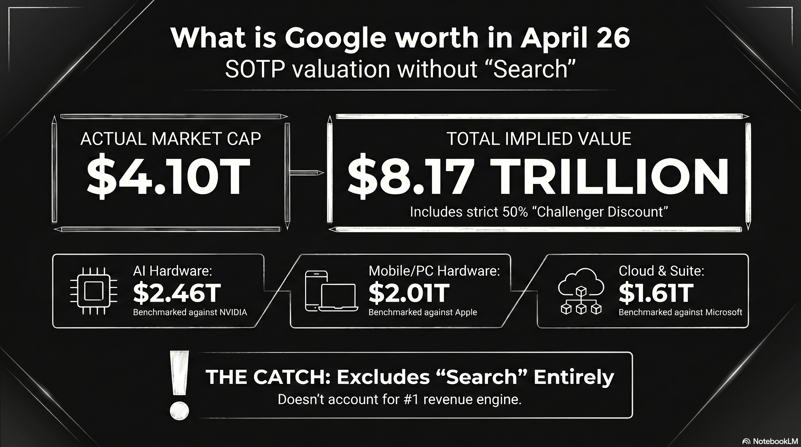

# 228 : What is Google Worth?

<a href="https://open.spotify.com/show/7doWf0GON9JsG6r8igc7RE" target="_blank" style="background-color: #2E2E2E; color: white; padding: 10px 20px; text-align: center; text-decoration: none; display: inline-block; border-radius: 5px; margin-top: 10px; margin-right: 10px;">Spotify</a><a href="https://podcasts.apple.com/us/podcast/deep-dive-with-gemini/id1844532251" target="_blank" style="background-color: #2E2E2E; color: white; padding: 10px 20px; text-align: center; text-decoration: none; display: inline-block; border-radius: 5px; margin-top: 10px; margin-right: 10px;">Apple Podcasts</a><a href="https://music.youtube.com/playlist?list=PLIX4sFsmu37qtJMlv-VzMYWM26M1QyXTe&si=o534zFZsc7p5XA9Q" target="_blank" style="background-color: #2E2E2E; color: white; padding: 10px 20px; text-align: center; text-decoration: none; display: inline-block; border-radius: 5px; margin-top: 10px; margin-right: 10px;">YouTube Music</a><a href="https://www.youtube.com/playlist?list=PLIX4sFsmu37qtJMlv-VzMYWM26M1QyXTe" target="_blank" style="background-color: #2E2E2E; color: white; padding: 10px 20px; text-align: center; text-decoration: none; display: inline-block; border-radius: 5px; margin-top: 10px; margin-right: 10px;">YouTube</a><a href="https://fountain.fm/show/7LBvZT6ffpGyubvk8aSF" target="_blank" style="background-color: #2E2E2E; color: white; padding: 10px 20px; text-align: center; text-decoration: none; display: inline-block; border-radius: 5px; margin-top: 10px;">Fountain.fm</a>

This market cap prediction model uses a **Sum-of-the-Parts (SOTP)** valuation approach. It benchmarks Google's individual business units against the market leaders and applies a **50% "Challenger Discount"** to account for the market leader's secondary moats (e.g., Amazon’s retail logistics or Tesla’s manufacturing scale). [^11] [^34]

Based on 2026 data, here is the breakdown of Google's implied valuation:

---

## **Google SOTP Valuation Model (2026 Projection)**

| Segment | Market Leader | Leader Market Cap | Google "Implied" Value (50% Discount) | Notes on Leader's Moat |
| :---- | :---- | :---- | :---- | :---- |
| **AI Hardware** | **NVIDIA** | 4.92 Trillion USD | **2.46 Trillion USD** | CUDA ecosystem & GPU dominance. |
| **Hardware (Mobile/PC)** | **Apple** | 4.02 Trillion USD | **2.01 Trillion USD** | Premium hardware & ecosystem lock-in. |
| **Suite, Browser, Cloud** | **Microsoft** | 3.21 Trillion USD | **1.61 Trillion USD** | Enterprise sales & Windows integration. |
| **Streaming (YouTube)** | **Netflix** | 350 Billion USD\* | **175 Billion USD** | Content library & brand loyalty. |
| **Cloud Infrastructure** | **Amazon** | 2.58 Trillion USD | **1.29 Trillion USD** | Logistics & e-commerce integration. |
| **Autonomous (Waymo)** | **Tesla** | 1.25 Trillion USD | **625 Billion USD** | Mass production & Supercharger network. |
| **TOTAL IMPLIED CAP** |  |  | **8.17 Trillion USD** |  |

*\*Netflix market cap is an estimate based on 2026 growth trends; others are current market figures.*

---

### **Analysis of the Model**

1. **The "Discount" Paradox:** While we applied a 50% discount for Google being \#2, the model yields an implied market cap of **8.17 Trillion USD**. This is significantly higher than Google's actual 2026 market cap (approx. **4.1 Trillion USD**). [^7]

2. **Market Realities:** In several categories, the market currently discounts Google even further than 50%. For example, while **Waymo** is technologically ahead of Tesla in L4 autonomy, the market values Tesla’s "Autonomy" potential much higher due to its fleet of millions of cars on the road. [^24]

3. **The "Search" Elephant:** This model focuses on specific comparisons, but it excludes Google’s primary engine: **Search**. Google is the undisputed \#1 in Search, which generates the massive cash flow (60 Billion USD+ per quarter) that funds "challenger" bets like Waymo and TPU development. [^5]

By looking at Google this way, you can see that if Google were broken up, the individual pieces might actually be worth more than the whole company is today—a concept known as a "conglomerate discount." Since the biggest component of this valuation model is AI hardware, a deeper look into how Google's hardware (TPU 8) is specifically trying to close the gap with NVIDIA is essential. [^1] [^14]

---

# **Google TPU 8 Family versus NVIDIA Vera Rubin Platform**

The computational infrastructure landscape of 2026 is defined by a fundamental pivot away from general-purpose acceleration toward hyper-specialized, workload-aware silicon architectures. As the industry enters the "agentic era"—characterized by autonomous AI agents capable of multi-step reasoning, planning, and tool execution—the demands placed on hardware have bifurcated. [^11] [^15] [^34]

Model training now requires unprecedented scale-out throughput and resilient synchronization across hundreds of thousands of nodes, while model inference demands ultra-low latency, massive memory bandwidth, and the ability to host multi-trillion parameter weights with minimal energy overhead. 

The recent unveiling of Google’s eighth-generation Tensor Processing Units (TPU 8t and TPU 8i) at Google Cloud Next 2026, alongside the maturation of NVIDIA’s Vera Rubin platform, presents a critical choice for AI developers. [^1] [^3] [^11]

## **The Architectural Divergence**

The central theme of the 2026 hardware cycle is the end of the "one-size-fits-all" accelerator. For the first time, Google has explicitly split its TPU roadmap into two distinct products: the TPU 8t (Sunfish), optimized for massive-scale pre-training, and the TPU 8i (Zebrafish), engineered for high-concurrency reasoning and sampling. [^4] [^21] [^33]

This specialization is a response to the "inference inflection point," where the hardware requirements for serving millions of active agents have diverged sharply from the requirements for building the underlying frontier models. [^7] [^32]

NVIDIA, conversely, continues to leverage its unified architectural approach with the Vera Rubin platform. While NVIDIA has introduced specialized features for inference—such as the Transformer Engine and hardware-accelerated compression for FP4—the Rubin R100 GPU remains a converged powerhouse capable of handling both halves of the AI lifecycle within a single, highly flexible substrate. [^2] [^9] [^18]

### **Google TPU 8t: The Training Powerhouse**

The TPU 8t represents Google’s eighth iteration of its custom AI silicon, developed in collaboration with Broadcom. [^4] [^8] It is designed to minimize the development cycle of frontier models from months to weeks by maximizing "goodput"—the ratio of productive compute time to total uptime. [^10] [^22]

*   **SparseCore Advantage:** Unlike general-purpose GPUs that can struggle with irregular memory access patterns, the TPU 8t features the SparseCore. This handles embedding lookups and data-dependent "all-gather" operations, offloading these from the primary Matrix Multiply Units (MXU). [^1] [^10]
*   **VPU/MXU Overlap:** The 8t architecture implements balanced scaling for its Vector Processing Units (VPU). This allows for the simultaneous execution of quantization, softmax, and layernorm operations alongside matrix multiplications. [^10]
*   **Native FP4 Support:** By introducing native 4-bit floating point (FP4) support, the TPU 8t effectively doubles MXU throughput while maintaining the accuracy of larger models. [^1]

| Feature | TPU 8t (Sunfish) |
| :---- | :---- |
| Primary Workload | Large-scale pre-training |
| Peak Compute (FP4) | $12.6$ Petaflops (Per Chip) |
| HBM Capacity | $216$ GB |
| Interconnect | Virgo (3D Torus) [^1] |
| Scaling | $9,600$ chips/superpod [^10] |

### **Google TPU 8i: The Inference Specialist**

The TPU 8i, co-designed with MediaTek, represents Google’s move to solve the "memory wall" that limits real-time AI agents. [^12] [^14] The chip’s defining feature is its $384$ MB of on-chip SRAM—a three-fold increase over the previous generation—which allows the system to host a significantly larger Key-Value (KV) cache entirely on-silicon. [^10] [^34]

This is critical for long-context reasoning models, as it eliminates the latency associated with fetching KV blocks from HBM during auto-regressive decoding. [^10] Furthermore, the dedicated Collectives Acceleration Engine (CAE) reduces on-chip latency for synchronization steps, facilitating the rapid "chain-of-thought" processing required for agentic workflows. [^1] [^10]

| Feature | TPU 8i (Zebrafish) |
| :---- | :---- |
| Primary Workload | Sampling and Reasoning |
| HBM Capacity | $288$ GB |
| On-Chip SRAM | $384$ MB [^10] |
| Price-Performance | $1.8x$ better than Ironwood [^6] |
| Specialized Engine | Collectives Acceleration Engine (CAE) |

## **NVIDIA Vera Rubin: The Converged Superchip**

The NVIDIA Vera Rubin platform, announced as the successor to Blackwell, represents the zenith of high-density, high-flexibility AI compute. The Rubin R100 GPU is built on TSMC’s 2nm process. [^2] [^20] Unlike the TPU 8 family, which is exclusively available via Google Cloud, Rubin is designed for broad deployment across all hyperscalers and on-premise AI factories. [^3] [^17] [^19]

### **R100 GPU and HBM4 Memory**

The Rubin R100 leverages the first implementation of HBM4 memory, delivering an aggregate bandwidth of up to $22$ TB/s per GPU. [^2] [^26] This represents a massive leap over the Blackwell generation. For an AI developer, this bandwidth is essential for sustaining the compute pipeline during long-context inference where the model must alternate between compute-heavy attention mechanisms and memory-bound KV cache lookups. [^9] [^18]

| Specification | NVIDIA Rubin R100 |
| :---- | :---- |
| Memory Type | HBM4 |
| VRAM Capacity | $288$ GB [^2] |
| Memory Bandwidth | $22$ TB/s [^9] |
| FP4 Inference | $50$ PFLOPS [^2] |
| FP4 Training | $35$ PFLOPS [^2] |
| CPU | Vera (Arm-based Olympus) [^18] |

## **Memory Hierarchy and the "Memory Wall"**

The competition in 2026 is largely a struggle to overcome the "memory wall"—the gap between processor speed and the rate at which data can be fetched from memory. [^33]

### **HBM4 vs. HBM3e Bandwidth**

The NVIDIA Rubin R100’s use of HBM4 provides a clear bandwidth advantage at $22$ TB/s per GPU. This is more than triple the bandwidth available on the TPU 8 family. [^9] [^23] In inference scenarios where the model size exceeds the on-chip cache, the HBM4 bandwidth directly translates to higher tokens per second. [^11] [^18]

### **On-Chip SRAM and KV Cache Strategy**

Google’s TPU 8i takes a different approach by focusing on the "active working set." The $384$ MB of SRAM is sized specifically to host the KV cache for the largest reasoning models at production scale. [^10] By keeping the most frequently accessed data on-silicon, the TPU 8i minimizes the idle time of the compute cores during the decoding phase. [^10] For an AI developer, this means the TPU 8i may provide superior latency for "agentic" tasks that involve long-context reasoning. [^1] [^13]

## **Economic Analysis: Performance-per-Dollar**

For the AI developer, the "best" chip is often the one that provides the most productive compute time per dollar spent. Google’s eighth-generation launch is framed around cost-effectiveness. [^25]

*   **TPU 8t:** $2.7x$ performance increase per dollar compared to Ironwood. [^8] [^22]  
*   **TPU 8i:** $80\%$ better performance-per-dollar for inference tasks. [^10] [^12]

NVIDIA argues that the Rubin platform delivers a significantly lower cost-per-token for inference compared to Blackwell. While the hourly rental rate for a Rubin GPU is higher, NVIDIA’s massive per-chip throughput means the developer needs fewer hours of compute to achieve the same result. [^2] [^27]

## **The Software Ecosystem: Portability vs. Integration**

The choice of hardware often dictates the choice of software framework, which in turn affects developer productivity and the ability to move workloads.

### **CUDA: The Industry Standard**

NVIDIA’s "moat" remains the CUDA software ecosystem. Every major frontier AI lab has its toolsets built specifically around NVIDIA's ecosystem. [^16] [^18]

### **JAX and XLA: The Specialized Alternative**

Google’s TPUs rely on the XLA (Accelerated Linear Algebra) compiler and frameworks like JAX. [^28] [^31] While JAX is praised for its functional design, porting a CUDA-optimized model to TPU is often described as a "software engineering tax". However, Google is closing this gap with **Pallas**, an experimental JAX extension that allows developers to write hardware-aware kernels. [^29] [^30]

## **Conclusion**

For the AI developer in the agentic era, the choice between Google’s TPU 8 family and NVIDIA’s Vera Rubin platform has shifted to a strict calculation of training and operational economics.

The **Google TPU 8t** offers a clear advantage in cluster-level capital efficiency for massive training runs. Its vertically integrated stack minimizes hidden synchronization costs and maximizes the return on every megawatt consumed. [^8]

The **NVIDIA Vera Rubin** platform remains the preferred choice for developers who prioritize the absolute fastest training throughput per chip and the flexibility to deploy high-density compute across multi-cloud or on-premise environments. [^3]

---

### Tips and Donations

If you enjoyed this deep dive, consider supporting the project with a tip in **Sats**. It's a simple, global way to support independent research.

<lightning-widget
  name="Thanks for supporting the publication"
  accent="#f9ce00"
  to="shutosha@primal.net"
  image="https://nostrcheck.me/media/5af0794606a15b5641e25aa23d04af4cb0d7d5e68b11cacb47e56a4698fca8c4/49ff6d00cb5bc819cd19f77783d4815fbd46a5b99b6fbdead1eaecfab798187b.webp"
/>

To send Sats, you'll need a [lightning wallet](https://lightningaddress.com/). 

---

#### **Research**

[^1]: [Google Bolsters AI Hypercomputer with New TPU Chips, Virgo Interconnect, Speedier Lustre - HPCwire](https://www.hpcwire.com/2026/04/22/google-bolsters-ai-hypercomputer-with-new-tpu-chips-virgo-interconnect-speedier-lustre/), April 2026.
[^2]: [NVIDIA Rubin R100 GPU | 288GB HBM4, 50 Petaflops | Next-Gen AI Accelerator - SLYD](https://slyd.com/hardware/nvidia-rubin), April 2026.
[^3]: [Google debuts eighth-gen TPU chips for training and inference with big performance claims - Neowin](https://www.neowin.net/news/google-debuts-eighth-gen-tpu-chips-for-training-and-inference-with-big-performance-claims/), April 2026.
[^4]: [Google TPU 8t and TPU 8i: Nvidia AI Chip Rival 2026 - TECHi](https://www.techi.com/google-tpu-8-nvidia-competition/), April 2026.
[^5]: [Google doesn't pay the Nvidia tax. Its new TPUs explain why. - VentureBeat](https://venturebeat.com/orchestration/google-doesnt-pay-the-nvidia-tax-its-new-tpus-explain-why), April 2026.
[^6]: [Google launches Ironwood TPU and previews eighth-gen split into ... - TheNextWeb](https://thenextweb.com/news/google-ironwood-tpu-inference-cloud-next), April 2026.
[^7]: [Wall Street Pro Thinks Google's AI Chip Edge Is Getting Harder to Ignore - 247wallst](https://247wallst.com/investing/2026/04/23/wall-street-pro-thinks-googles-ai-chip-edge-is-getting-harder-to-ignore/), April 2026.
[^8]: [Google Unveils Eighth-Generation TPU Dual-Chip Strategy, Marking a "Watershed" for Training and Inference - BigGo Finance](https://finance.biggo.com/news/6uYhuZ0B5edQG9E4YqVf), April 2026.
[^9]: [Infrastructure for Scalable AI Reasoning | NVIDIA Vera Rubin Platform](https://www.nvidia.com/en-us/data-center/technologies/rubin/), April 2026.
[^10]: [TPU 8t and TPU 8i technical deep dive | Google Cloud Blog](https://cloud.google.com/blog/products/compute/tpu-8t-and-tpu-8i-technical-deep-dive), April 2026.
[^11]: [Our eighth generation TPUs: two chips for the agentic era - Google Blog](https://blog.google/innovation-and-ai/infrastructure-and-cloud/google-cloud/eighth-generation-tpu-agentic-era/), April 2026.
[^12]: [Google has announced its 8th generation of AI processing chips: TPU 8t and TPU 8i - GIGAZINE](https://gigazine.net/gsc_news/en/20260423-google-tpu-8t-8i/), April 2026.
[^13]: [Google launches two new TPUs at once! With training and inference - Futu](https://q.futunn.com/feed/116453429542916?lang=en-us), April 2026.
[^14]: [Google Unveils Dedicated AI Chips 'TPU 8t & 8i' for Training and Inference - BigGo Finance](https://finance.biggo.com/news/Z5cstZ0B5edQG9E4uHzc), April 2026.
[^15]: [AI infrastructure at Next '26 | Google Cloud Blog](https://cloud.google.com/blog/products/compute/ai-infrastructure-at-next26), April 2026.
[^16]: [AWS and NVIDIA deepen strategic collaboration to accelerate AI from pilot to production - AWS Blog](https://aws.amazon.com/blogs/machine-learning/aws-and-nvidia-deepen-strategic-collaboration-to-accelerate-ai-from-pilot-to-production/), April 2026.
[^17]: [Google Cloud AI infrastructure at NVIDIA GTC 2026 - Google Cloud Blog](https://cloud.google.com/blog/products/compute/google-cloud-ai-infrastructure-at-nvidia-gtc-2026), April 2026.
[^18]: [Inside the NVIDIA Vera Rubin Platform: Six New Chips, One AI Supercomputer - NVIDIA Developer Blog](https://developer.nvidia.com/blog/inside-the-nvidia-rubin-platform-six-new-chips-one-ai-supercomputer/), April 2026.
[^19]: [NVIDIA Rubin R100: Specs, Architecture, and GPU Cloud Availability | Spheron Blog](https://www.spheron.network/blog/nvidia-rubin-r100-guide/), April 2026.
[^20]: [Vera Rubin GPU, Nvidia CES 2026 : r/accelerate - Reddit](https://www.reddit.com/r/accelerate/comments/1q5vqke/vera_rubin_gpu_nvidia_ces_2026/), April 2026.
[^21]: [Google dual tracks TPU 8 to conquer training and inference - The Register](https://www.theregister.com/2026/04/22/google_tpu8_dual_track_training_inference/), April 2026.
[^22]: [Google presents TPU 8t and TPU 8i chips; splits training and ... - Techzine](https://www.techzine.eu/blogs/infrastructure/140680/google-presents-tpu-8t-and-tpu-8i-chips-splits-training-and-inference/), April 2026.
[^23]: [Nvidia reportedly boosts Vera Rubin performance to ward hyperscalers off AMD Instinct AI accelerators - Tom's Hardware](https://www.tomshardware.com/tech-industry/artificial-intelligence/nvidia-reportedly-boosts-vera-rubin-performance-to-ward-hyperscalers-off-amd-instinct-ai-accelerators-increased-boost-clocks-and-memory-bandwidth-pushes-power-demand-by-500-watts-to-2300-watts), April 2026.
[^24]: [Google may have made it official, tells Nvidia: Yes, we are coming after you with our new... - Times of India](https://timesofindia.indiatimes.com/technology/tech-news/google-makes-it-official-tells-nvidia-yes-we-are-coming-after-you-with-our-new-/articleshow/130442836.cms), April 2026.
[^25]: [Google bets on workload-specific TPUs with 8t and 8i launch - Network World](https://www.networkworld.com/article/4162004/google-bets-on-workload-specific-tpus-with-8t-and-8i-launch.html), April 2026.
[^26]: [Rubin vs Blackwell vs Hopper: NVIDIA GPU Architecture Comparison | Spheron Blog](https://www.spheron.network/blog/nvidia-rubin-vs-blackwell-vs-hopper/), April 2026.
[^27]: [NVIDIA AI GPU Prices: H100 ($27K-$40K) & H200 ($315K/8-GPU) Cost Guide - IntuitionLabs](https://intuitionlabs.ai/articles/nvidia-ai-gpu-pricing-guide), April 2026.
[^28]: [JAX CUDA Optimization Guide: XLA and GPU Acceleration - RightNow AI](https://www.rightnowai.co/guides/frameworks/jax), April 2026.
[^29]: [Kade Heckel: Optimizing GPU/TPU code with JAX and Pallas - Open Neuromorphic](https://open-neuromorphic.org/neuromorphic-computing/software/hacking-hours/kade-heckel-jax-pallas-optimization/), April 2026.
[^30]: [Pallas Design - JAX documentation](https://docs.jax.dev/en/latest/pallas/design/design.html), April 2026.
[^31]: [Accelerating Long-Context Model Training in JAX and XLA | NVIDIA Technical Blog](https://developer.nvidia.com/blog/accelerating-long-context-model-training-in-jax-and-xla/), April 2026.
[^32]: [The Custom Silicon Inflection Point: Hyperscaler ASICs Challenge NVIDIA's GPU Dominance in 2026 - Introl](https://introl.com/blog/custom-silicon-inflection-2026-hyperscaler-asics-nvidia-gpu), April 2026.
[^33]: [Google TPU-8 Splits Training and Inference for Agentic Era - byteiota](https://byteiota.com/google-tpu-8-splits-training-and-inference-for-agentic-era/), April 2026.
[^34]: [Google Bets On The Agentic AI Era With Its AI Hypercomputer - Wccftech](https://wccftech.com/google-unveils-the-heart-of-agentic-ai-the-ai-hypercomputer-8th-gen-tpus-nvidia-rubin-axion-cpus/amp/), April 2026.
