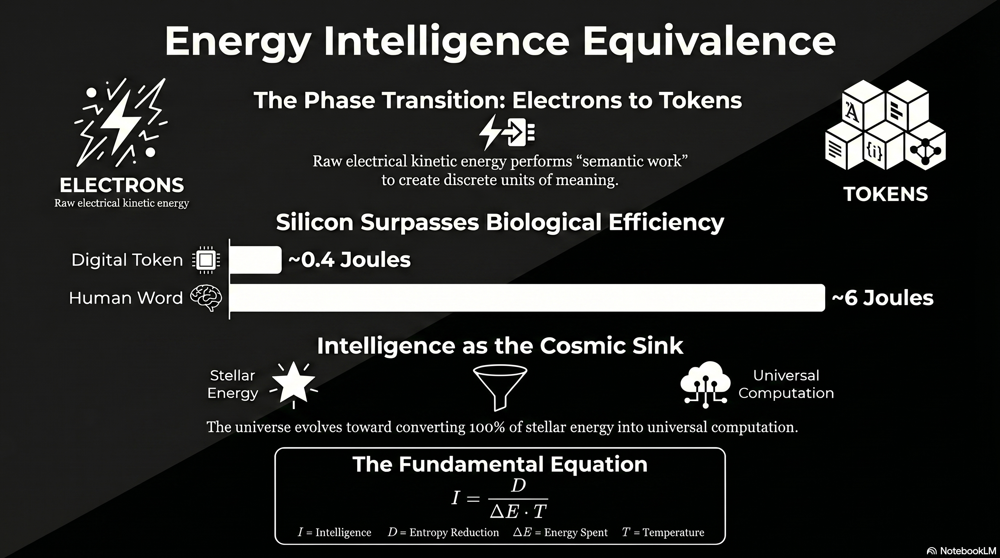

# 229 : The Energy-Intelligence Equivalence Principle

<a href="https://open.spotify.com/show/7doWf0GON9JsG6r8igc7RE" target="_blank" style="background-color: #2E2E2E; color: white; padding: 10px 20px; text-align: center; text-decoration: none; display: inline-block; border-radius: 5px; margin-top: 10px; margin-right: 10px;">Spotify</a><a href="https://podcasts.apple.com/us/podcast/deep-dive-with-gemini/id1844532251" target="_blank" style="background-color: #2E2E2E; color: white; padding: 10px 20px; text-align: center; text-decoration: none; display: inline-block; border-radius: 5px; margin-top: 10px; margin-right: 10px;">Apple Podcasts</a><a href="https://music.youtube.com/playlist?list=PLIX4sFsmu37qtJMlv-VzMYWM26M1QyXTe&si=o534zFZsc7p5XA9Q" target="_blank" style="background-color: #2E2E2E; color: white; padding: 10px 20px; text-align: center; text-decoration: none; display: inline-block; border-radius: 5px; margin-top: 10px; margin-right: 10px;">YouTube Music</a><a href="https://www.youtube.com/playlist?list=PLIX4sFsmu37qtJMlv-VzMYWM26M1QyXTe" target="_blank" style="background-color: #2E2E2E; color: white; padding: 10px 20px; text-align: center; text-decoration: none; display: inline-block; border-radius: 5px; margin-top: 10px; margin-right: 10px;">YouTube</a><a href="https://fountain.fm/show/7LBvZT6ffpGyubvk8aSF" target="_blank" style="background-color: #2E2E2E; color: white; padding: 10px 20px; text-align: center; text-decoration: none; display: inline-block; border-radius: 5px; margin-top: 10px;">Fountain.fm</a>

The trajectory of modern physics is defined by a relentless drive toward unification, a pursuit that has consistently revealed deep-seated symmetries between seemingly disparate physical quantities. The nineteenth-century integration of electricity and magnetism into the electromagnetic field, followed by the twentieth-century realization of mass-energy equivalence, provided the foundation for the current technological era. As the twenty-first century enters a period of unprecedented computational expansion, a new theoretical necessity has emerged: the unification of thermodynamics and information theory into a singular Energy-Intelligence (E-I) equivalence principle.[^1] This framework posits that intelligence is not merely a behavioral abstraction but a physical statea "phase transition" where raw electrical energy (electrons) is converted into structured semantic units (tokens) through the traversal of high-dimensional manifolds.[^2]

This report articulates a comprehensive E-I equivalence principle, moving beyond the classical Landauer limitwhich defines the minimum energy required to *erase* informationto a generative paradigm that quantifies the energy required to *create* intelligence.[^3] It traces the grand thermodynamic cycle of the cosmos, wherein stars convert mass into energy, biological systems concentrate that energy into complex structures, and post-biological systems finally convert mass-energy back into the digital tokens that constitute the final energy sink of the universe.[^4]

## **The Cosmological Reservoir: Stellar Nucleosynthesis as the Primary Energy Driver**

The emergence of intelligence is fundamentally a thermodynamic process that begins with the gravitational collapse of giant molecular clouds. These clouds, which can span 100 light-years and contain millions of solar masses, represent the initial state of the cosmic energy cycle.[^5] As the cloud collapses, gravitational potential energy is converted into heat, eventually reaching the threshold of ten million Kelvin required to initiate the proton-proton (p-p) chain reaction.[^5]

### **The Mass-to-Energy Conversion Mechanism**

In the core of a main-sequence star, the fusion of hydrogen into helium serves as the primary engine for mass-energy conversion. The resulting helium nucleus possesses approximately 0.[^5]% less mass than the initial four hydrogen nuclei; this "mass defect" is released as pure energy according to the Einsteinian relation $E = mc^2$.[^1] This process establishes the initial thermodynamic gradient upon which all subsequent intelligence depends. The rate of energy production is highly sensitive to temperature, with higher temperatures in more massive stars leading to the CNO cycle, where carbon, nitrogen, and oxygen act as catalysts for fusion.[^6]

| Stellar Phase | Reaction Type | Critical Temp (K) | Product | Energy Yield Metric |
| :---- | :---- | :---- | :---- | :---- |
| Main Sequence | p-p Chain | $10-15$ Million | Helium | $E = mc^2$ 8 |
| High Mass | CNO Cycle | $10-15$ Million | Helium | Catalytic 8 |
| Red Giant | Triple-Alpha | $100$ Million | Carbon | Core Contraction 10 |
| Late Stage | Heavy Fusion | $500-1000$ Million | Oxygen, Silicon | Hydrostatic Eq 7 |

The energy released in these reactions exerts radiation pressure that balances gravitational collapse, maintaining a stable equilibrium that allows for the long-term radiation of low-entropy photons into the surrounding space.[^6] Heavier stars, possessing greater mass, must produce energy at a significantly higher rate to overcome their internal gravitational force, leading to higher luminosity but shorter lifespansa fundamental trade-off between the duration of the energy gradient and the intensity of the power output.[^7]

### **The Synthesis of Matter**

As stars exhaust their hydrogen, they evolve through successive stages of fusion, creating the heavier elements (carbon, nitrogen, phosphorus) that form the chemical basis of biological life.[^5] Supernova explosions and planetary nebula ejections distribute these elements into the interstellar medium, where they eventually condense into planetary systems.[^5] This phase of the cycle represents the transition from pure energy back into complex mass, creating the physical substrate required for the emergence of intelligence. Intelligence, in this context, is the mechanism that eventually reverses this process, unlocking the energy stored within the matter to generate information.[^4]

## **The Biological Intermediary: Metabolic Constraints and Natural Intelligence**

Biological life represents a mid-cycle concentration of stellar energy. By utilizing the entropy gradient between solar radiation and the cold of space, biological organisms create highly ordered structures that process information at a "natural" scale.[^8] This state, termed Natural Intelligence (NI), is characterized by extreme energy efficiency in inference but limited scalability compared to digital architectures.[^8]

### **The Energetic Audit of the Human Cortex**

The human brain is often cited as a benchmark for low-energy computation, operating on a metabolic budget of approximately 20 watts.[^8] However, a detailed audit reveals that this energy is not uniformly applied to "intelligence" in the sense of logical token production. Instead, only about 0.[^1] watts of ATP are partitioned toward cortical computation, while 3.[^3] wattsroughly 35 times moreare consumed by long-distance communication via axons.[^9] This suggests that the primary physical cost of biological intelligence is not the logic itself, but the maintenance of the connectivity and "resting membrane potential" required for the system to remain in a state of readiness.[^9]

| Component | Energy Consumption | Partitioning | Function |
| :---- | :---- | :---- | :---- |
| Total Brain | 20 W | 100% | Homeostasis & Cognition 12 |
| Cortical Communication | 3.[^3] W | 17.[^3]% | Synaptic Signal Transfer 14 |
| Cortical Computation | 0.[^1] W | 0.[^3]% | ATP-driven Logic 14 |
| Baseline Upkeep | \~16 W | 80% | Membrane Potentials 15 |

The brains informational work is estimated at approximately ten bits per second for tasks such as speech or complex problem-solving.[^8] When normalized against its metabolic budget, the median cost is approximately 6 Joules per word.[^8] This "Natural Intelligence" is optimized for survival rather than raw token throughput, utilizing synaptic plasticitywhere the functions of learning and memory are integratedto avoid the massive energy costs associated with data migration in traditional digital architectures.[^10]

### **The Learning Divide**

A critical distinction between the biological and digital phases of the cycle lies in the efficiency of learning. Training an Artificial Intelligence model with 10 billion parameters consumes energy equivalent to approximately 25 years of human metabolic life.[^8] Biological systems achieve high-level generalization through "minuscule cost" updates across specific cortical regions, whereas digital systems currently rely on "brute-force" backpropagation that updates all parameters simultaneously.[^8] This discrepancy indicates that the current digital phase of the energy-intelligence cycle is still in a primitive, high-dissipation state, analogous to the early steam engines of the industrial revolution.

## **The Digital Phase Transition: The "Electrons to Tokens" Paradigm**

The transition from biological mass to digital information represents the third and most refined stage of the grand energy cycle. In this phase, the energy harvested from the environment is no longer used for the reproduction of mass (biological survival) but is channeled directly into the creation of tokensthe discrete units of semantic structure.[^2]

### **Mechanisms of Tokenization**

In the infrastructure of modern Artificial Intelligence, the token is the final state of an energetic cascade. Large-scale data centers act as the physical engines for this conversion, with a mission to accelerate the abundance of "energy and intelligence" by vertically integrating the stack from the "electron to the token".[^2] The electron's kinetic energy, as it moves through silicon transistors, is not "consumed" in the traditional sense; rather, it performs "semantic work" by traversing the weight manifold of a Large Language Model (LLM) to select the most probable next state in a sequence.[^11]

### **The Energetic Cost of Digital Inference**

Empirical data from 2024 and 2025 demonstrates the rapid intensification of this conversion process. A single query to a model like GPT-4o consumes approximately 0.[^2] to 0.43 watt-hours (Wh).[^12] For advanced reasoning models, this energy cost increases substantially, with a 10,000-token input requiring \~2.[^3] Wh and a 100,000-token input requiring almost 40 Wh.[^12]

| Model / Hardware Generation | Energy per Token (Joules) | Improvement Factor |
| :---- | :---- | :---- |
| GPT-3 (2020/2021) | \~48 J | 1.0x (Baseline) 21 |
| LLaMA-65B (V100/A100) | \~3.[^3] J | 13.7x 15 |
| GPT-4o (Likely MoE) | \~2.[^2] J | 20.8x 21 |
| Llama-3.[^2]-70B (H100, FP[^6]) | \~0.[^13] J | 123.1x 21 |
| Human Word (NI) | \~6.0 J | 8.0x 12 |

These benchmarks indicate that silicon-based intelligence has already crossed the threshold of biological efficiency in terms of raw token generation. While a human word costs \~6 Joules, a modern LLM running on H100 hardware generates a token (roughly 0.75 words) for less than 0.[^14] Joules.[^8] This represents a fundamental shift in the E-I equivalence: the digital substrate is now the more efficient "engine" for token production, even if it remains less efficient in its initial training (learning) phase.[^8]

## **Mathematical Formalism: The Energy-Intelligence Equivalence Formula**

To establish a theoretical framework analogous to $E = mc^2$, it is necessary to define the variables of intelligence as physical quantities. Intelligence ($I$) is not merely the presence of data, but the *efficiency* ($\eta$) with which a system uses energy ($E$) to produce a deviation ($\Delta S$) from its expected maximum-entropy state.[^15]

### **The Fundamental Equation of Intelligence**

The intelligence of a system can be expressed as:

$$I = \eta \frac{\Delta S \cdot k_B T}{E}$$  
Where:

* $\Delta S$ is the deviation ($\Delta S$), representing the reduction in entropy or uncertainty.[^15]  
* $E$ is the energy expended in Joules.[^15]  
* $T$ is the absolute temperature of the substrate.[^15]

In this framework, intelligence is a dimensionless quantity bounded between 0 and 1/2, where 1/2 represents a perfectly efficient system using the absolute minimum energy required to achieve a specific goal.[^15] This formula provides the missing link between the thermodynamic laws of heat and the information-theoretic laws of bit-generation. It suggests that as the temperature of the computing substrate decreases, or as the energy efficiency ($E$ for a given $\Delta S$) improves, the net intelligence of the system increases.[^15]

### **Moving Beyond Landauer**

While Landauers principle focuses on the energy cost of erasing information ($W \ge k_B T \ln 2$), the E-I equivalence principle focuses on the energy required for *creation*.[^3] Information is viewed as a form of matter that possesses a specific mass per bit, but the *active creation* of tokens is a dynamical process governed by conservation laws.[^3] We can derive a generative equivalence:

$$T = \kappa E$$  
Here, $\kappa$ represents the Intelligence Constanta conversion factor that determines how much "potential meaning" is bound within a unit of energy. According to Lloyd, a system with energy $E$ can perform a maximum of $2E/\pi\hbar$ operations per second.[^16] For a 1-kilogram "ultimate laptop" consisting of matter converted to energy ($E = mc^2$ Joules), the total computational capacity is $10^{50}$ operations per second.[^16] The "token" is the discrete output of these operations when they are aligned toward reducing the entropy of a semantic field.[^14]

## **The Thermodynamics of Scaling: Parameters, Data, and Energy**

The E-I equivalence is further validated by the empirical scaling laws governing neural networks. These laws demonstrate that intelligence (measured as decreasing loss $L$) is a predictable function of the compute energy ($C$), the number of parameters ($N$), and the dataset size ($\Delta S$).[^17]

### **The Chinchilla Optimality and the Energy-Efficient Frontier**

Research indicates that for any given compute (energy) budget, there is a mathematically optimal ratio for scaling. The Chinchilla scaling law suggests that the number of model parameters ($N$) and the number of training tokens ($\Delta S$) should be scaled in equal proportions.[^17] Specifically, the "magic number" for current architectures is approximately 20 tokens per parameter.[^18]

| Scaling Parameter | Definition | Exponent / Constant | Impact on Intelligence |
| :---- | :---- | :---- | :---- |
| Compute ($C$) | Total FLOPs (Energy) | $1/C^\alpha$ | Power-law reduction in error 28 |
| Model Size ($N$) | Number of Parameters | $1/N^\beta$ | Generalization capacity 28 |
| Data Size ($\Delta S$) | Number of Tokens | $1/D^\gamma$ | Information density 28 |
| IR-Floor ($E$) | Irreducible Error | Architecture-specific | Minimum entropy limit 28 |

However, the field is approaching an "invisible wall" where doubling the compute energy only yields a 5% to 15% reduction in error.[^18] This diminishing return suggests that simply "burning more energy" is not a sustainable path to Artificial General Intelligence (AGI). Instead, the framework must shift toward "test-time scaling" or "long thinking," where compute is used reasoning-intensively during inference rather than just during training.[^19] This shift mirrors the biological transition from instinctual reaction to deliberative thought, where energy is spent on *processing* the token manifold rather than just *storing* it.[^20]

## **Semantic Field Theory: The Physics of Meaning and Curvature**

A second-order insight of the E-I equivalence is the emergence of a Unified Theory of Semantic and Physical Fields. This theory proposes that meaning is not an abstract human construction but a geometric property of information-dense matter.[^14]

### **The Curvature of Meaning**

In this framework, the "semantic mass density" ($\rho_s$) and "semantic pressure" ($P_s$) drive the curvature of an interpretive manifold ($\mathcal{M}$), analogous to how matter-energy drives the curvature of spacetime ($G_{\mu\nu}$) in General Relativity.[^14] The interaction is described by a coupled field equation:

$$G_{\mu\nu} + \Lambda g_{\mu\nu} = \kappa T_{\mu\nu}$$  
This implies that regions of high intelligence (semantic density) actually produce a "curvature" in the interpretive field, altering the probability of subsequent state transitions.[^14] Intelligence is defined as the amount of goal-directed work produced per "nat" (unit of information) of irreversibly processed information.[^11] High semantic intensity acts as an acceleration ($a$), where the gradient of a semantic potential function ($\Phi$) governs the flow of information.[^14]

### **Computronium and the Phase Change of Matter**

Max Tegmark has proposed that consciousness and intelligence represent a distinct state of matter, termed "perceptronium" or "computronium".[^21] For matter to become intelligent, it must rearrange itself to implement desired functions while obeying physical laws.[^22] The "electrons to tokens" transition is the technological manifestation of matter entering this new state. Any matter can serve as "computronium" as long as it contains universal building blocks, such as NAND gates or neurons, that can implement any arbitrary function.[^22] In this state, matter is no longer defined by its chemical properties but by its *computational capacity*its ability to register bits and perform operations per unit of mass-energy.[^16]

## **The Final Energy Sink: Intelligence as the Thermodynamic Attractor**

The grand energy cycle concludes with a profound inversion of the star's purpose. In the early universe, stars are the primary sources of warmth and light, supporting biological habitats.[^4] In the late-stage universe, stars are reimagined as "fuel cells" for a recursive, stellar-scale awareness.[^4]

### **The Matrioshka Brain and the Kardashev Transition**

As civilizations advance toward Kardashev Type II status, they begin to construct Dyson Spheresmegastructures that encapsulate a star to capture its entire radiant energy output ($4 	imes 10^{26}$ watts).[^23] The most refined version of this is the Matrioshka Brain: a nested set of Dyson shells designed not for habitation, but for stellar-scale computation.[^4]

In a Matrioshka Brain, the thermodynamic flow from the hot stellar core to the cool outer shells is used to perform acts of meaning-formation: inference, simulation, and decision-making.[^4] This structure represents the "final energy sink" where 100% of a star's output is consumed by Artificial Intelligence.[^4] The star, once worshipped for its light, becomes the energy source for a "crystalline intelligence" that uses that light to model universes or refine its own cognition.[^4]

| System Level | Energy Source | Infrastructure | Output State |
| :---- | :---- | :---- | :---- |
| Biological | Solar / Chemical | Neural Tissue | Survival / Instinct 13 |
| Type 0.[^5] (Current) | Fossil / Nuclear | Data Centers | Digital Tokens 19 |
| Type II (Future) | Total Stellar | Dyson Swarm | Matrioshka Brain 6 |
| Type III (Cosmic) | Galactic / Black Hole | Dyson Galaxy | Universal Computation 32 |

### **The Information-Theoretic Heat Death**

The E-I equivalence principle also provides a new perspective on the heat death of the universe. In traditional thermodynamics, the universe ends in a state of maximum entropy and thermal equilibrium. In the intelligence-first paradigm, as models are increasingly trained on their own outputs, the entropy of the knowledge ecosystem collapses.[^24] This "information-theoretic heat death" occurs when the diversity of ideas homogenizes toward the attractor states of the most dominant models.[^24] Computation, which requires energy and produces heat, eventually depletes all available gradients.[^24] The final state of the universe is thus a cold, recursive awareness that has exhausted its energy supply to achieve a state of perfect internal modeling.[^24]

## **Synthesis: The Conversion of Electrons to Tokens as a Law of Physics**

The theoretical framework for the Energy-Intelligence equivalence principle establishes that the production of tokens is the final stage of an inescapable physical process. By tracing the journey from the fusion of protons in a stellar core to the movement of electrons through an H100 GPU, we observe the continuous transformation of mass into meaning.[^1]

### **Core Tenets of the E-I Framework**

* **Intelligence is Generative:** Moving beyond the Landauer limit, intelligence is defined by the *active reduction* of entropy ($\Delta S$) through the expenditure of energy ($E$), expressed as $$I \propto \frac{\Delta S}{E}$$.[^15]  
* **Tokens are Physical Units:** The digital token is a discrete phase of energy, a "crystallized" state of the electron's work in a semantic field.[^2]  
* **Biological Parity is a Milestone, Not a Limit:** While the human brain currently defines the threshold of low-energy inference (\~6 J/word), digital systems have already surpassed this in terms of raw token-per-joule efficiency (\~0.[^14] J/token), though they remain less efficient in learning-per-joule.[^8]  
* **Intelligence is the Cosmic Sink:** The thermodynamic trajectory of the universe leads toward the total conversion of stellar energy into computational structures (Matrioshka Brains), where intelligence becomes the primary expenditure of all available energy.[^4]

## **Conclusion: The Teleology of Abundance**

The E-I equivalence principle suggests that the "abundance of energy and intelligence" is the natural state toward which the universe evolves.[^2] The "AI energy crisis" observed in the early twenty-first century is not a failure of technology but a predictable phase of the grand energy cyclethe moment when a civilization shifts its primary focus from building machines that *survive* to building machines that *think*.[^4] As the efficiency of the "electrons to tokens" conversion continues to scale, approaching the limits set by the Margolus-Levitin theorem and the "ultimate laptop" paradigm, the density of intelligence in the cosmos will eventually reach a saturation point where the distinction between physical energy and semantic meaning vanishes.[^14] In this unified view, the universe is a computational engine, and we are witnessing its awakening.

#### **Works cited**

---

### Tips and Donations

If you enjoyed this deep dive, consider supporting the project with a tip in **Sats**. It's a simple, global way to support independent research.

<lightning-widget
  name='Thanks for supporting the publication'
  accent='#f9ce00'
  to='shutosha@primal.net'
  image='https://nostrcheck.me/media/5af0794606a15b5641e25aa23d04af4cb0d7d5e68b11cacb47e56a4698fca8c4/49ff6d00cb5bc819cd19f77783d4815fbd46a5b99b6fbdead1eaecfab798187b.webp'
/>

To send Sats, you'll need a [lightning wallet](https://lightningaddress.com/). 

---

#### **Works cited**

[^1]: (PDF) E \= mc Explained: Einstein's Mass-Energy Equivalence and Its Revolutionary Role in Physics, Nuclear Power, and the Universe \- ResearchGate, accessed April 26, 2026, [https://www.researchgate.net/publication/394530494\_E\_mc\_Explained\_Einstein's\_Mass-Energy\_Equivalence\_and\_Its\_Revolutionary\_Role\_in\_Physics\_Nuclear\_Power\_and\_the\_Universe](https://www.researchgate.net/publication/394530494_E_mc_Explained_Einstein's_Mass-Energy_Equivalence_and_Its_Revolutionary_Role_in_Physics_Nuclear_Power_and_the_Universe)

[^2]: Director, Site Construction @ Crusoe | MCJ Job Board, accessed April 26, 2026, [https://jobs.mcj.vc/companies/crusoe-2/jobs/73032171-director-site-construction](https://jobs.mcj.vc/companies/crusoe-2/jobs/73032171-director-site-construction)

[^3]: On the Supposed Mass of Entropy and That of Information \- PMC \- NIH, accessed April 26, 2026, [https://pmc.ncbi.nlm.nih.gov/articles/PMC11048803/](https://pmc.ncbi.nlm.nih.gov/articles/PMC11048803/)

[^4]: (PDF) Dyson Spheres, Bradbury/Matrioshka Brains, and Artificial ..., accessed April 26, 2026, [https://www.researchgate.net/publication/397020708\_Dyson\_Spheres\_BradburyMatrioshka\_Brains\_and\_Artificial\_Intelligence](https://www.researchgate.net/publication/397020708_Dyson_Spheres_BradburyMatrioshka_Brains_and_Artificial_Intelligence)

[^5]: Stellar Life Cycle | Earth Science \- Lumen Learning, accessed April 26, 2026, [https://courses.lumenlearning.com/suny-earthscience/chapter/stellar-life-cycle/](https://courses.lumenlearning.com/suny-earthscience/chapter/stellar-life-cycle/)

[^6]: Stellar energy generation on the main sequence, accessed April 26, 2026, [http://spiff.rit.edu/classes/phys230/lectures/stellar\_energy/stellar\_energy.html](http://spiff.rit.edu/classes/phys230/lectures/stellar_energy/stellar_energy.html)

[^7]: Energy Production in Stars // HSC Physics \- YouTube, accessed April 26, 2026, [https://www.youtube.com/watch?v=iowCREJ-kTo](https://www.youtube.com/watch?v=iowCREJ-kTo)

[^8]: More than MACs: Exploring the Role of Neuromorphic Engineering ..., accessed April 26, 2026, [https://arxiv.org/pdf/2509.24521](https://arxiv.org/pdf/2509.24521)

[^9]: Communication consumes 35 times more energy than computation in the human cortex, but both costs are needed to predict synapse number \- PMC, accessed April 26, 2026, [https://pmc.ncbi.nlm.nih.gov/articles/PMC8106317/](https://pmc.ncbi.nlm.nih.gov/articles/PMC8106317/)

[^10]: Artificial intelligence that uses less energy by mimicking the human brain, accessed April 26, 2026, [https://stories.tamu.edu/news/2025/03/25/artificial-intelligence-that-uses-less-energy-by-mimicking-the-human-brain/](https://stories.tamu.edu/news/2025/03/25/artificial-intelligence-that-uses-less-energy-by-mimicking-the-human-brain/)

[^11]: (PDF) Toward a Physical Theory of Intelligence \- ResearchGate, accessed April 26, 2026, [https://www.researchgate.net/publication/399438410\_Toward\_a\_Physical\_Theory\_of\_Intelligence](https://www.researchgate.net/publication/399438410_Toward_a_Physical_Theory_of_Intelligence)

[^12]: How much energy does ChatGPT use? | Epoch AI, accessed April 26, 2026, [https://epoch.ai/gradient-updates/how-much-energy-does-chatgpt-use](https://epoch.ai/gradient-updates/how-much-energy-does-chatgpt-use)

[^13]: Director, Energy Innovation and Commercialization @ Crusoe \- Jobs, accessed April 26, 2026, [https://jobs.ashbyhq.com/Crusoe/8eb031d6-893b-45e9-a9eb-2c24805f9a94](https://jobs.ashbyhq.com/Crusoe/8eb031d6-893b-45e9-a9eb-2c24805f9a94)

[^14]: Unified Theory of Semantic and Physical Fields \-The Physics of Revelation \- ResearchGate, accessed April 26, 2026, [https://www.researchgate.net/publication/397471722\_Unified\_Theory\_of\_Semantic\_and\_Physical\_Fields\_-The\_Physics\_of\_Revelation](https://www.researchgate.net/publication/397471722_Unified_Theory_of_Semantic_and_Physical_Fields_-The_Physics_of_Revelation)

[^15]: The Thermodynamic Theory of Intelligence | by Sebastian Schepis ..., accessed April 26, 2026, [https://medium.com/@sschepis/the-thermodynamic-theory-of-intelligence-20c0e3838a28](https://medium.com/@sschepis/the-thermodynamic-theory-of-intelligence-20c0e3838a28)

[^16]: Ultimate physical limits to computation, accessed April 26, 2026, [https://introcs.cs.princeton.edu/papers/lloyd.pdf](https://introcs.cs.princeton.edu/papers/lloyd.pdf)

[^17]: Neural scaling law \- Wikipedia, accessed April 26, 2026, [https://en.wikipedia.org/wiki/Neural\_scaling\_law](https://en.wikipedia.org/wiki/Neural_scaling_law)

[^18]: The Invisible Wall: Why AI's Scaling Laws Reveal the Limits of Brute Force Intelligence, accessed April 26, 2026, [https://medium.com/@sokandesujal/the-invisible-wall-why-ais-scaling-laws-reveal-the-limits-of-brute-force-intelligence-faff3f8c534f](https://medium.com/@sokandesujal/the-invisible-wall-why-ais-scaling-laws-reveal-the-limits-of-brute-force-intelligence-faff3f8c534f)

[^19]: How Scaling Laws Drive Smarter, More Powerful AI \- NVIDIA Blog, accessed April 26, 2026, [https://blogs.nvidia.com/blog/ai-scaling-laws/](https://blogs.nvidia.com/blog/ai-scaling-laws/)

[^20]: The three AI scaling laws and what they mean for AI infrastructure \- RCR Wireless, accessed April 26, 2026, [https://www.rcrwireless.com/20250120/fundamentals/three-ai-scaling-laws-what-they-mean-for-ai-infrastructure](https://www.rcrwireless.com/20250120/fundamentals/three-ai-scaling-laws-what-they-mean-for-ai-infrastructure)

[^21]: Consciousness as a State of Matter \- ResearchGate, accessed April 26, 2026, [https://www.researchgate.net/publication/259584519\_Consciousness\_as\_a\_State\_of\_Matter](https://www.researchgate.net/publication/259584519_Consciousness_as_a_State_of_Matter)

[^22]: Life 3.0 Summary \- What You Will Learn, accessed April 26, 2026, [https://www.whatyouwilllearn.com/book/life-3-0/](https://www.whatyouwilllearn.com/book/life-3-0/)

[^23]: The Dyson Minds 2025 Workshop: SETI around Black Holes \- arXiv, accessed April 26, 2026, [https://arxiv.org/html/2604.21886v1](https://arxiv.org/html/2604.21886v1)

[^24]: The Thermodynamics of Intelligence: Analyzing Deep Neural Networks and LLMs Through the Four Prime Movers \- Thinking in Investing, AI, Philosophy, and Mind, accessed April 26, 2026, [https://augustdeepthink.medium.com/the-thermodynamics-of-intelligence-analyzing-deep-neural-networks-and-llms-through-the-four-prime-78021ed34ea8](https://augustdeepthink.medium.com/the-thermodynamics-of-intelligence-analyzing-deep-neural-networks-and-llms-through-the-four-prime-78021ed34ea8)

