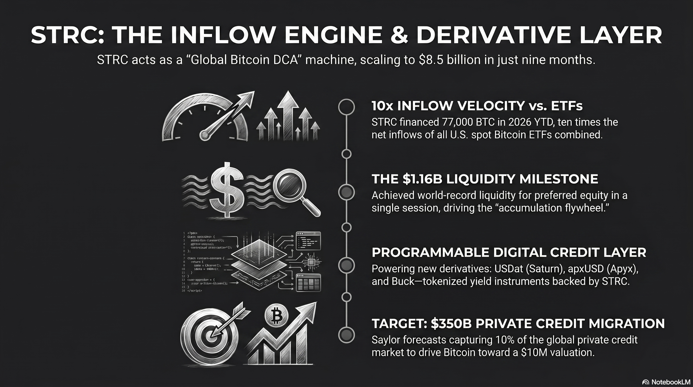

# 230 : STRC - derivatives and inflows

<a href="https://open.spotify.com/show/7doWf0GON9JsG6r8igc7RE" target="_blank" style="background-color: #2E2E2E; color: white; padding: 10px 20px; text-align: center; text-decoration: none; display: inline-block; border-radius: 5px; margin-top: 10px; margin-right: 10px;">Spotify</a><a href="https://podcasts.apple.com/us/podcast/deep-dive-with-gemini/id1844532251" target="_blank" style="background-color: #2E2E2E; color: white; padding: 10px 20px; text-align: center; text-decoration: none; display: inline-block; border-radius: 5px; margin-top: 10px; margin-right: 10px;">Apple Podcasts</a><a href="https://music.youtube.com/playlist?list=PLIX4sFsmu37qtJMlv-VzMYWM26M1QyXTe&si=o534zFZsc7p5XA9Q" target="_blank" style="background-color: #2E2E2E; color: white; padding: 10px 20px; text-align: center; text-decoration: none; display: inline-block; border-radius: 5px; margin-top: 10px; margin-right: 10px;">YouTube Music</a><a href="https://www.youtube.com/playlist?list=PLIX4sFsmu37qtJMlv-VzMYWM26M1QyXTe" target="_blank" style="background-color: #2E2E2E; color: white; padding: 10px 20px; text-align: center; text-decoration: none; display: inline-block; border-radius: 5px; margin-top: 10px; margin-right: 10px;">YouTube</a><a href="https://fountain.fm/show/7LBvZT6ffpGyubvk8aSF" target="_blank" style="background-color: #2E2E2E; color: white; padding: 10px 20px; text-align: center; text-decoration: none; display: inline-block; border-radius: 5px; margin-top: 10px;">Fountain.fm</a>

The global financial landscape in 2026 is defined by a fundamental divergence between traditional fiat-based capital and the emerging sovereign credit layer constructed atop the Bitcoin network. At the vanguard of this transformation is Strategy Inc., the organization formerly known as MicroStrategy, which has successfully transitioned from an enterprise software provider into the worlds preeminent Bitcoin development company.[^1] While much of the public discourse has focused on the companys massive spot Bitcoin accumulation, the true innovation lies in the engineering of its capital stack, specifically the Variable Rate Series A Perpetual Preferred Stock, known as STRC.[^2] This instrument represents the birth of "Digital Credit"a financial product that utilizes the transparency and scarcity of Bitcoin to offer high-yield, low-volatility returns to a global investor base that is increasingly desperate for yield in a debased currency environment.[^4]

## **Market Capitalization and Liquidity Dynamics of the STRC Instrument**

As of late April 2026, the STRC preferred equity has become the primary capital-raising engine for Strategy Inc., surpassing even its convertible debt in strategic importance.[^6] The instrument is specifically designed to function as a "Global Bitcoin Dollar Cost Average" (DCA) mechanism, allowing the company to raise billions of dollars regardless of the local peaks or troughs in the Bitcoin spot price.[^8] Unlike the common equity (MSTR), which trades as a high-beta proxy for Bitcoin with significant price swings, STRC is engineered for price stability anchored around a 100 USD par value.[^2]

### **Strategy Inc. Capital Structure and Instrument Performance (April 2026\)**

| Metric | Strategy Inc. Common (MSTR) | Stretch Preferred (STRC) |
| :---- | :---- | :---- |
| **Current Market Price** | 171.02 USD | 99.39 USD [^2] |
| **Market Capitalization / Notional** | 59.69 Billion USD | 8.54 Billion USD [^2] |
| **30-Day Average Daily Volume** | 2.85 Billion USD | 385 Million USD [^2] |
| **Annualized Dividend Rate** | 0.00% | 11.50% (Variable) [^2] |
| **Effective Yield** | N/A | 11.57% [^2] |
| **Historical Volatility (30-Day)** | 72.0% | 2.9% [^2] |
| **Enterprise Value** | 79.18 Billion USD | N/A |
| **Relationship to Par** | N/A | \-0.61% (Discount) [^2] |

The liquidity profile of STRC has expanded rapidly since its July 2025 debut. In March 2026, the instrument reached a milestone with single-day trading volumes exceeding 746 million USD .[^9] This deep liquidity is essential for the "accumulation flywheel" that Michael Saylor has constructed. When the instrument trades near or above its 100 USD par value, the company utilizes its At-The-Market (ATM) offering to sell new shares, generating immediate cash that is funneled directly into Bitcoin purchases.[^7]

## **Enormous Success of STRC**

The STRC instrument has shattered multiple global financial records since its inception, establishing itself as a dominant force in modern capital markets:

* **World Record Liquidity for Preferred Equity:** STRC reached a milestone single-session trading volume of 1.16 billion USD on April 13, 2026the highest in the history of preferred stock.[^10] 
* **Unprecedented Sharpe Ratio:** In March 2026, STRC's Sharpe ratio reached a historical high of 5.37, setting a new record for risk-adjusted returns and vastly outperforming tech giants like NVIDIA (1.89).[^5] 
* **Fastest-Growing Credit Product in History:** The program scaled from zero to 8.5 billion USD in notional value in just nine months, representing an annualized growth rate of approximately 350%.[^6] 
* **Superior Capital Accumulation Velocity:** In 2026 year-to-date, STRC has financed the acquisition of roughly 77,000 BTCten times the net inflows of all U.S. spot Bitcoin ETFs combined during the same period.[^6]

## **Tracking the Money: Why Capital is Flowing to STRC**

The aggressive expansion of STRC is driven by a massive migration of capital seeking refuge from the inefficiencies of traditional finance and the volatility of spot digital assets.

* **The Private Equity Pivot:** Michael Saylor has positioned STRC as the superior alternative to the 3.5 trillion USD global private credit market. Traditional private credit is often criticized as illiquid and fee-burdened, whereas STRC offers institutional-grade liquidity and zero management fees.[^11] 
* **ETF Tax-Loss Harvesting Rotation:** Investors who entered the Bitcoin market via spot ETFs at the 2025 peak are utilizing current drawdowns for strategic tax planning.[^12] By booking capital losses on their ETF positions, these investors are rotating into STRC to maintain "Bitcoin economy" exposure with a stable, par-anchored instrument and tax-advantaged "return of capital" distributions.[^1] 
* **Pseudo-Savings Account Status:** Marketing efforts have branded STRC as a "high-yield savings account" for the digital age. With a volatility of 2.9% and an 11.5% yield, STRC has become the primary destination for retail and corporate treasury cash previously stagnant in low-yield funds.[^3]

## **The Emerging STRC Ecosystem: Programmable Digital Credit**

A sophisticated financial ecosystem is rapidly forming on top of the STRC instrument, transforming it from a simple preferred share into the primary primitive for "Digital Money."

### **Saturn Labs: The "Tether of Digital Credit"**

Saturn Labs has emerged as the most significant infrastructure builder in the STRC space, having recently increased its total investment in the instrument to 33 million USD .

* **USDat and sUSDat:** Saturn tokenizes STRC through a two-token design. USDat is a liquidity-focused dollar token, while sUSDat is a staked variant that captures the 11.5%+ yield. 
* **Three-Stage Vision:** Saturn's CEO Kevin Li aims to scale the protocol to 10 billion USD , providing 500 million global stablecoin users with access to Bitcoin-backed yield without requiring a U.S. brokerage account. 
* **Advanced DeFi Utilities:** Saturn is enabling "looping" for higher leverage, yield trading via **Pendle**, and is preparing for risk tranching through **Strata**.

### **Apyx and the Bitcoin Dollar**

Apyx Protocol has launched what it calls the first dividend-backed stablecoin, **apxUSD**, which is overcollateralized by STRC and other digital asset treasury (DAT) preferred shares.

* **Yield Amplification:** Using a high-yield version called **apyUSD**, the protocol generates up to 30% returns by bundling diversified preferred shares and leveraging on-chain lending protocols. 
* **Risk Management:** Apyx utilizes a "theta-minimized gamma hedge strategy" using put options on Bitcoin to ensure the stablecoin remains overcollateralized even during sharp market drawdowns.

### **Buck Labs: Savings for the Unbanked**

Led by former Uber and Lyft executive Travis VanderZanden, **Buck Labs** has introduced "Buck," a savings-focused coin yielding 7% annualized.

* **Minute-by-Minute Rewards:** Buck rewards accrue continuously down to the minute, funded indirectly through the STRC yields in its treasury. 
* **Digital Checking vs. Savings:** Buck is positioned as the savings layer of the crypto stack, while traditional stablecoins function like checking accounts.

### **The Tokenized Transformation: xStocks and Nasdaq**

**xStocks** has partnered with Kraken and **Nasdaq** to link tokenized equities with DeFi networks.

* **MSTRx:** This 1:1 tokenized representation allows for 24/5 trading of Strategy common stock on-chain, with plans to expand this "equities transformation gateway" to STRC by 2027\. 
* **Institutional Vaults:** **Hermetica** has launched **hBTC**, a self-custodial Bitcoin yield vault that sources institutional returns from STRC via Saturn's sUSDat.

## **Michael Saylors Vision: The Three-Layer Financial Architecture**

The vision articulated by Michael Saylor is one of a wholesale reorganization of the global financial architecture. He frames this as a three-layer model: **Bitcoin** as digital capital, **STRC** as digital credit, and **stablecoins** as digital money.[^10]

### **Operational Roadmap: The Shift to Semi-Monthly Dividends**

In a major step toward standardizing STRC as a "Digital Bank Account," Strategy Inc. has opened a shareholder vote to shift dividend payments from a monthly to a **semi-monthly (bi-monthly)** schedule.

* **Objectives:** The goal is to reduce reinvestment delays, further compress volatility, and improve pricing efficiency. 
* **Timeline:** Voting closes on June 8, 2026\. If approved, the first semi-monthly record date will be June 30, with payments starting in July 2025\.

### **ETF and Index Integration**

Saylor believes the "Next Unlock" is the integration of STRC into public ETFs and indexes.[^10]

* **Current Adoption:** STRC is already the third-largest holding for BlackRock's iShares Preferred & Income Securities ETF (PFF) and VanEck credit funds. 
* **Scaling Potential:** By capturing 10% of the 3.5 trillion USD private credit market, Saylor forecasts STRC could scale to 350 billion USD , eventually helping push Bitcoin to 10 million USD per coin.

## **The Competitor Void: Why Banks and Fintechs Are Sidelined**

A central question for institutional investors is why traditional financial giantssuch as JPMorgan, Goldman Sachs, or fintech leaders like Coinbase and Blockhave not launched a direct competitor to STRC.

### **The Regulatory Blockade and the SAB 122 Transition**

While the SEC rescinded SAB 121 and replaced it with SAB 122 in early 2025, banks are still subject to high risk-weights for non-stablecoin crypto assets under Basel III/IV frameworks. Strategy Inc., as a "Bitcoin Development Company," is not subject to these banking-specific capital ratios, giving it a structural advantage.[^1]

### **The mNAV Moat and the "Saylor Premium"**

The "Saylor Premium" (mNAV \> 1\) allows Strategy to raise capital that is accretive to its Bitcoin-per-share metric.[^6] Traditional banks almost always trade at a discount to book value (mNAV \< 1), meaning any issuance to buy Bitcoin would be immediately dilutive.[^6]

## **Eventual Impact on Bitcoin Price: 1, 2, and 5-Year Time Horizons**

The accumulation of 818,334 BTC by a single corporation removals supply from the "free float," creating a persistent supply shock.[^1]

* **One-Year Horizon (2027):** Analysts expect Bitcoin to reach new all-time highs as the transition to a nation-state "strategic asset" continues via SBR legislation. Estimated Range: **120,000 t USD o 160,000 USD per BTC**. 
* **Two-Year Horizon (2028):** The post-halving environment combined with the STRC "accumulation machine" reaching its planned 42 billion USD capacity is expected to drive prices higher. Estimated Range: **150,000 t USD o 250,000 USD per BTC**.[^13] 
* **Five-Year Horizon (2031):** By 2031, Bitcoin is projected to emerge as a global reserve asset. Institutional consensus ranges from **500,000 t USD o 1.3 million USD per BTC**.

## **Risks and Quantitative Scenarios: The "Death by Dilution" Threat**

The real threat to Strategy Inc. is the erosion of the "Saylor Premium" during a prolonged bear market. If $mNAV < 1$ for a prolonged period, new share issuance becomes dilutive, potentially reversing the accumulation flywheel.

### **Institutional Resilience: The USD Reserve Buffer**

To mitigate these risks, Strategy Inc. has established a "USD Reserve" of **2.25 billion USD ** as of April 2026, which provides approximately **18.1 months** of coverage for the company's dividend and interest obligations. Strategy tracks its performance through its "BTC Yield," which in April 2026 was targeted at 22% to 26%.

## **Final Appraisal: The Structural Inevitability of Digital Credit**

The STRC instrument and Michael Saylors broader vision represent the first successful attempt to industrialize Bitcoins capital structure. By capturing capital from "yield-starved" private credit markets and anchoring an ecosystem of stablecoins (Saturn, Apyx, Buck), Strategy Inc. has created a source of funding that operates independently of Bitcoin's spot price volatility. As the global economy continues to grapple with fiat instability, the transition of Bitcoin from an "investment" to a "sovereign credit layer" appears structurally inevitable.

#### **Works cited**
[^1]: Strategy Will Keep Buying Bitcoin Forever, Saylor Says \- Bitcoin Magazine, accessed April 28, 2026, [https://bitcoinmagazine.com/news/strategy-mstr-michael-saylor-bitcoin-buys](https://bitcoinmagazine.com/news/strategy-mstr-michael-saylor-bitcoin-buys)
[^2]: STRC Information \- Strategy, accessed April 28, 2026, [https://www.strategy.com/strc/learn](https://www.strategy.com/strc/learn)
[^3]: STRC by Strategy: A High-Yield Alternative to Savings Accounts \- ERIC KIM, accessed April 28, 2026, [https://erickimphotography.com/strc-by-strategy-a-high-yield-alternative-to-savings-accounts/](https://erickimphotography.com/strc-by-strategy-a-high-yield-alternative-to-savings-accounts/)
[^4]: Everyone is frothing about Bitcoin treasury company Strategy's ..., accessed April 28, 2026, [https://www.dlnews.com/articles/markets/bitcoin-treasury-strategy-strc-popular-analysts-issue-warning/](https://www.dlnews.com/articles/markets/bitcoin-treasury-strategy-strc-popular-analysts-issue-warning/)
[^5]: Michael J. Saylor, accessed April 28, 2026, [https://www.michael.com/](https://www.michael.com/)
[^6]: STRC, SATA, and the Bitcoin-Backed Preferred Family \- NYDIG, accessed April 28, 2026, [https://www.nydig.com/research/strc-sata-and-the-bitcoin-backed-preferred-family](https://www.nydig.com/research/strc-sata-and-the-bitcoin-backed-preferred-family)
[^7]: MicroStrategy Incorporated Variable Rate Series A Perpetual Stretch Preferred Stock Stock Price: Quote, Forecast, Splits & News (STRC) \- Perplexity, accessed April 28, 2026, [https://www.perplexity.ai/finance/STRC](https://www.perplexity.ai/finance/STRC)
[^8]: STRC: The Global Bitcoin Dollar Cost Average, accessed April 28, 2026, [https://bitcoinmagazine.com/bitcoin-for-corporations/strc-the-bitcoin-dca](https://bitcoinmagazine.com/bitcoin-for-corporations/strc-the-bitcoin-dca)
[^9]: What are Strategy's products? From STRK to STRC explained \- The Block, accessed April 28, 2026, [https://www.theblock.co/learn/394455/what-are-mstr-strk-and-strc-strategys-stock-and-preferred-shares-explained](https://www.theblock.co/learn/394455/what-are-mstr-strk-and-strc-strategys-stock-and-preferred-shares-explained)
[^10]: Saturn raises 800 k USD from Sora Ventures and YZi Labs to build USDat, a 11%+ yield-bearing stablecoin backed by Michael Saylor's Digital Credit, accessed April 28, 2026, [https://sora.vc/saturn-raises-800k-from-sora-ventures-and-yzi-labs-to-build-usdat-a-11-yield-bearing-stablecoin-backed-by-michael-saylors-digital-credit/](https://sora.vc/saturn-raises-800k-from-sora-ventures-and-yzi-labs-to-build-usdat-a-11-yield-bearing-stablecoin-backed-by-michael-saylors-digital-credit/)
[^11]: Coinbase CEO Brian Armstrong Accuses Banks of Undermining Trump's Crypto Agenda, accessed April 28, 2026, [https://bitcoinmagazine.com/news/coinbase-ceo-accuses-banks-crypto](https://bitcoinmagazine.com/news/coinbase-ceo-accuses-banks-crypto)
[^12]: Strategy's (MSTR) Bitcoin Ambition Is Reshaping Corporate Finance. Everyone Else Is Falling Behind, accessed April 28, 2026, [https://bitcoinmagazine.com/news/strategys-bitcoin-ambition-is-reshaping](https://bitcoinmagazine.com/news/strategys-bitcoin-ambition-is-reshaping)
[^13]: Bitcoin Price Prediction 20262030: Can BTC Break 150K? \- Backpack Learn, accessed April 28, 2026, [https://learn.backpack.exchange/articles/bitcoin-price-prediction-2026-2030](https://learn.backpack.exchange/articles/bitcoin-price-prediction-2026-2030)

---

### Tips and Donations

If you enjoyed this deep dive, consider supporting the project with a tip in **Sats**. It's a simple, global way to support independent research.

<lightning-widget
  name='Thanks for supporting the publication'
  accent='#f9ce00'
  to='shutosha@primal.net'
  image='https://nostrcheck.me/media/5af0794606a15b5641e25aa23d04af4cb0d7d5e68b11cacb47e56a4698fca8c4/49ff6d00cb5bc819cd19f77783d4815fbd46a5b99b6fbdead1eaecfab798187b.webp'
/>

To send Sats, you'll need a [lightning wallet](https://lightningaddress.com/). 

---
