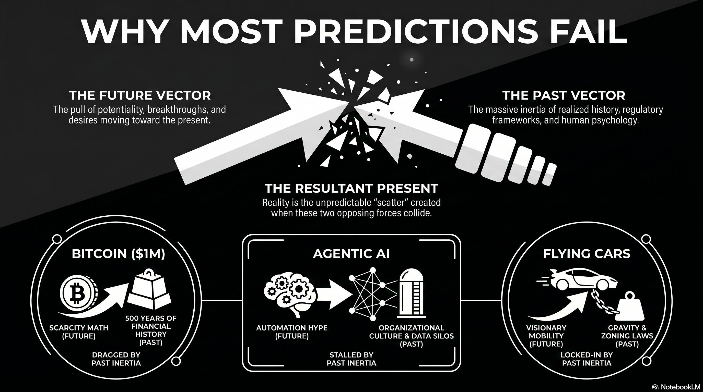

# 232 : The Orthogonal Manifold

<a href="https://open.spotify.com/show/7doWf0GON9JsG6r8igc7RE" target="_blank" style="background-color: #2E2E2E; color: white; padding: 10px 20px; text-align: center; text-decoration: none; display: inline-block; border-radius: 5px; margin-top: 10px; margin-right: 10px;">Spotify</a><a href="https://podcasts.apple.com/us/podcast/deep-dive-with-gemini/id1844532251" target="_blank" style="background-color: #2E2E2E; color: white; padding: 10px 20px; text-align: center; text-decoration: none; display: inline-block; border-radius: 5px; margin-top: 10px; margin-right: 10px;">Apple Podcasts</a><a href="https://music.youtube.com/playlist?list=PLIX4sFsmu37qtJMlv-VzMYWM26M1QyXTe&si=o534zFZsc7p5XA9Q" target="_blank" style="background-color: #2E2E2E; color: white; padding: 10px 20px; text-align: center; text-decoration: none; display: inline-block; border-radius: 5px; margin-top: 10px; margin-right: 10px;">YouTube Music</a><a href="https://www.youtube.com/playlist?list=PLIX4sFsmu37qtJMlv-VzMYWM26M1QyXTe" target="_blank" style="background-color: #2E2E2E; color: white; padding: 10px 20px; text-align: center; text-decoration: none; display: inline-block; border-radius: 5px; margin-top: 10px; margin-right: 10px;">YouTube</a><a href="https://fountain.fm/show/7LBvZT6ffpGyubvk8aSF" target="_blank" style="background-color: #2E2E2E; color: white; padding: 10px 20px; text-align: center; text-decoration: none; display: inline-block; border-radius: 5px; margin-top: 10px;">Fountain.fm</a>

The conceptualization of reality as a linear progression is a foundational axiom of classical physics and human cognition, yet it fails to account for the complex interactions of causality and the multidirectional nature of time revealed by quantum mechanics.[^1] Most open-ended prediction modelssuch as the perennial claims that Bitcoin will hit 1 million USD , the decade of missed deadlines for Teslas "unsupervised" Full Self-Driving (FSD), or the current "Agentic AI" doomsday hypefail for the same structural reason. These models accurately identify the **Future Vector** (the pull of potentiality moving toward the past) but ignore the **Past Vector** (the massive inertia of realized history moving toward the future).[^2] In reality, the "Present" is not a point on a line but a high-dimensional coordinate where millions of "skewed" trajectories from both directions converge, creating an orthogonal resultant that is inherently unknowable in real-time.[^3]

## **The Paradox of Prediction: Why Visionary Models Fail**

For years, technical visionaries and market analysts have made bold, open-ended predictions that consistently fail to materialize on schedule. These missed milestones represent a failure to account for the "temporal physics" of innovation:

* **Bitcoin 1 M USD :** Analysts often cite supply-demand dynamics and "halving" cycles to predict a seven-figure price . While the math of scarcity is a valid future-pull vector, it often ignores the "Past Vector" of existing financial institutions, regulatory inertia, and human economic psychology . 
* **Tesla Full Self-Driving (FSD):** Since at least 2013, Elon Musk has predicted level 5 autonomy "next year" . These predictions correctly identify the trajectory of software improvement but fail to account for the massive "freight train" of the past: 100 years of urban zoning, legal frameworks, and the sheer biological unpredictability of human environments.[^5] 
* **Agentic AI Hype:** While 40% of enterprise applications are expected to feature agents by 2028, over 80% of current AI pilots fail to reach production . The "doomsday" or "workforce replacement" vectors are hit by the past inertia of data silos, organizational culture, and technical path dependency .

These failures occur because the "freight train" of the past carries enormous momentum that prevents a simple, linear shift into a forecasted future .

## **The Double Cone: Mapping Millions of Trajectories**

To understand why the present is so resistant to prediction, we must move from a single axis of time to a **Double-Cone Spiralling Model**.[^6] In this framework, every technology, concept, or social movement exists as a pair of cones meeting at the present [^6]:

1. **The Future Cone:** Radiates outward into potentiality, representing what *could* happen based on desires, breakthroughs, and AI backpropagation . 
2. **The Past Cone:** Radiates backward into realized history, representing the "ancestral elements" and path dependencies that constrain current motion.[^6]

The error in most forecasting is the assumption that all these cones are aligned on a single horizontal axis. In reality, every technology has its own **skewed trajectory** in a high-dimensional "state space" :

| Technology/Concept | Trajectory Orientation | Temporal Magnitude | Underlying Constraint (Past Vector) |
| :---- | :---- | :---- | :---- |
| **Artificial Intelligence** | **Horizontal** | Extreme | Moving from future-pattern to past-grounding [^7] |
| **Bitcoin** | **Skewed (e.g., 20)** | High | Dragged by 500 years of financial history |
| **Flying Cars** | **Skewed (e.g., 70)** | Low | Near-total lock-in by gravity and zoning laws [^4] |

The Present is the point where thousands (or millions) of these trajectories from the past meet an equal number of vectors from the future .

## **The Resultant Present: A Collision in Orthogonal Dimensions**

In vector physics, when multiple forces act on a single point, they create a **Resultant Vector** ($\mathcal{P} = (\mathcal{S}, \mathcal{A}, \rho, \mathcal{R})$) representing the sum of all influences . If we define the "Present" ($\mathcal{S}$) as the summation of all past-to-future and future-to-past trajectories, we find that the resulting reality is **orthogonal** to the vectors that created it :

$\mathcal{A}$ 
Where $\rho$ represents the magnitude (influence) of each actor.[^8] Because these vectors are skewed across a high-dimensional manifold, their collision does not result in a "middle ground." Instead, it creates a "scatter"an orthogonal turnout that neither the past nor the future could have perfectly dictated.[^2]

### **The Unknowability of the "Now"**

Because there are infinitely many actors (individuals, systems, institutions) each exerting their own magnitude and direction, the instantaneous direction of the present is mathematically **unknowable**.[^4] Prediction models fail because they only track a few "loud" vectors (like Musks FSD hype) while ignoring the "heavy" vectors (like socio-technical inertia) . We can only identify the resulting trajectory *after* the collision has occurred.[^4]

## **History: The Recorded Trajectory of the Resultant**

What we refer to as **History** is not a set of events, but the historical trajectory of the resultant present over time.[^4] It is the integral of the chaotic summation of vectors [^9]:

$\mathcal{R}$ 
Each era of history represents a different "turnout" of these vectors:

* **Agrarian Age:** A past-dominant vector with high inertia, resulting in a slow-moving, linear trajectory.[^10] 
* **Information Age:** A sudden increase in the magnitude of the scientific "future-to-past" vector, causing a sharp orthogonal shift in reality . 
* **The Quantum/AI Age:** A collision of extreme-magnitude vectors from both directions, leading to a "hyper-orthogonal" present that feels increasingly chaotic and unpredictable .

## **Conclusion: Living in the Resultant**

The failure of prediction models for Bitcoin, Tesla, or AI is a testament to the fact that we do not live on a 1D straight line.[^11] We exist at the convergence of a million skewed trajectoriesa high-dimensional temporal traffic jam where the "Now" is the only stable resultant.[^2] While visionaries correctly sense the "pull" of the future, they underestimate the "freight train" of the past. The resulting present is always more nuanced, contextual, and unpredictable than any single-vector model can allow.[^4] History is the undeniable record of this paththe winding trajectory left by a species trying to bring its dreams from the future into the heavy reality of its past .

#### **Works cited**
[^1]: Quantum asymmetry between time and space \- PMC, accessed March 14, 2026, [https://pmc.ncbi.nlm.nih.gov/articles/PMC4786044/](https://pmc.ncbi.nlm.nih.gov/articles/PMC4786044/)
[^2]: Time, a three-directional Dimension I \- American Scientific Research Journal for Engineering, Technology, and Sciences, accessed March 14, 2026, [https://asrjetsjournal.org/American\_Scientific\_Journal/article/download/11421/2817/27469](https://asrjetsjournal.org/American_Scientific_Journal/article/download/11421/2817/27469)
[^3]: What if there are also 3 dimensions of time? \- Quora, accessed March 14, 2026, [https://www.quora.com/What-if-there-are-also-3-dimensions-of-time](https://www.quora.com/What-if-there-are-also-3-dimensions-of-time)
[^4]: Rainfall-Runoff Modelling \- National Academic Digital Library of Ethiopia, accessed March 14, 2026, [http://ndl.ethernet.edu.et/bitstream/123456789/848/1/183.pdf](http://ndl.ethernet.edu.et/bitstream/123456789/848/1/183.pdf)
[^5]: Are past and future symmetric in mental time line? \- Frontiers, accessed March 14, 2026, [https://www.frontiersin.org/journals/psychology/articles/10.3389/fpsyg.2015.00208/full](https://www.frontiersin.org/journals/psychology/articles/10.3389/fpsyg.2015.00208/full)
[^6]: T-symmetry \- Wikipedia, accessed March 14, 2026, [https://en.wikipedia.org/wiki/T-symmetry](https://en.wikipedia.org/wiki/T-symmetry)
[^7]: What's the Difference Between AI and Regular Computing? | Royal Institution, accessed March 14, 2026, [https://www.rigb.org/explore-science/explore/blog/whats-difference-between-ai-and-regular-computing](https://www.rigb.org/explore-science/explore/blog/whats-difference-between-ai-and-regular-computing)
[^8]: Vector algebra and its applications in mechanics | Statics... \- Fiveable, accessed March 14, 2026, [https://fiveable.me/statics-strength-materials/unit-1/vector-algebra-applications-mechanics/study-guide/BrERKVV4PVA5aW9M](https://fiveable.me/statics-strength-materials/unit-1/vector-algebra-applications-mechanics/study-guide/BrERKVV4PVA5aW9M)
[^9]: Loefflern Dissertation | PDF | Electromagnetic Radiation | Hertz, accessed March 14, 2026, [https://www.scribd.com/document/673179908/Loefflern-Dissertation](https://www.scribd.com/document/673179908/Loefflern-Dissertation)
[^10]: The future is in front, to the right, or below: Development of spatial representations of time in three dimensions \- PMC, accessed March 14, 2026, [https://pmc.ncbi.nlm.nih.gov/articles/PMC8009816/](https://pmc.ncbi.nlm.nih.gov/articles/PMC8009816/)
[^11]: 1\) \+ 1 Emergent Spacetimes From A Unifying Field Theory In d \+ 2 Spacetime1, accessed March 14, 2026, [https://ia800802.us.archive.org/13/items/arxiv-0705.2834/0705.2834.pdf](https://ia800802.us.archive.org/13/items/arxiv-0705.2834/0705.2834.pdf)

---

### Tips and Donations

If you enjoyed this deep dive, consider supporting the project with a tip in **Sats**. It's a simple, global way to support independent research.

<lightning-widget
  name='Thanks for supporting the publication'
  accent='#f9ce00'
  to='shutosha@primal.net'
  image='https://nostrcheck.me/media/5af0794606a15b5641e25aa23d04af4cb0d7d5e68b11cacb47e56a4698fca8c4/49ff6d00cb5bc819cd19f77783d4815fbd46a5b99b6fbdead1eaecfab798187b.webp'
/>

To send Sats, you'll need a [lightning wallet](https://lightningaddress.com/). 

---
