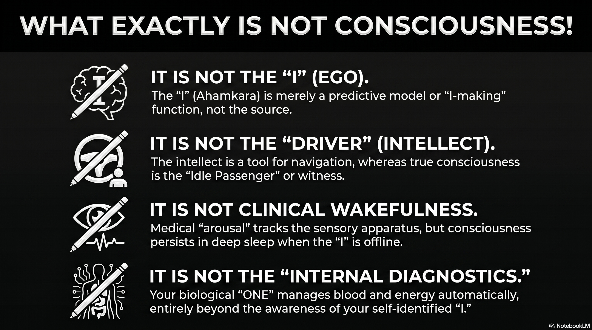

# 233 : what exactly is NOT consciousness !

<a href="https://open.spotify.com/show/7doWf0GON9JsG6r8igc7RE" target="_blank" style="background-color: #2E2E2E; color: white; padding: 10px 20px; text-align: center; text-decoration: none; display: inline-block; border-radius: 5px; margin-top: 10px; margin-right: 10px;">Spotify</a><a href="https://podcasts.apple.com/us/podcast/deep-dive-with-gemini/id1844532251" target="_blank" style="background-color: #2E2E2E; color: white; padding: 10px 20px; text-align: center; text-decoration: none; display: inline-block; border-radius: 5px; margin-top: 10px; margin-right: 10px;">Apple Podcasts</a><a href="https://music.youtube.com/playlist?list=PLIX4sFsmu37qtJMlv-VzMYWM26M1QyXTe&si=o534zFZsc7p5XA9Q" target="_blank" style="background-color: #2E2E2E; color: white; padding: 10px 20px; text-align: center; text-decoration: none; display: inline-block; border-radius: 5px; margin-top: 10px; margin-right: 10px;">YouTube Music</a><a href="https://www.youtube.com/playlist?list=PLIX4sFsmu37qtJMlv-VzMYWM26M1QyXTe" target="_blank" style="background-color: #2E2E2E; color: white; padding: 10px 20px; text-align: center; text-decoration: none; display: inline-block; border-radius: 5px; margin-top: 10px; margin-right: 10px;">YouTube</a><a href="https://fountain.fm/show/7LBvZT6ffpGyubvk8aSF" target="_blank" style="background-color: #2E2E2E; color: white; padding: 10px 20px; text-align: center; text-decoration: none; display: inline-block; border-radius: 5px; margin-top: 10px;">Fountain.fm</a>

The foundational crisis in the contemporary study of consciousness arises from a profound semantic instability. When the question "What exactly is consciousness?" is posed, the respondents answer is invariably dictated by their underlying ontological commitments, resulting in a discourse that frequently operates in logical circles. Because a uniform definition of the ultimate object of search is absent, scientific and spiritual traditions often find themselves describing different facets of the same phenomenon without realizing the divergence in their focal points. 

A critical observation in this regard is that the human sensory apparatus is structurally optimized for external experiencefacilitating navigation through the physical worldrather than for internal diagnostics. This implies that the internal biological field, which governs the growth and maintenance of the organism from infancy to old age, operates on a highly sophisticated, automated system that is largely beyond the control or even the awareness of the self-identified "I."

This automated internal field, which manages respiration, cellular metabolism, and homeostatic equilibrium, suggests the presence of an organizing principlea "ONE"that differs significantly from the egoic "I." While the "I" is limited and often ignorant of the technical complexities of turning air into blood or food into energy, the "ONE" appears to possess an comprehensive control over the biological chariot. Consequently, the search for consciousness splits into two primary directions: the attempt to validate the existence and agency of the "I," or the attempt to observe the "ONE" in action.

  <video width="100%" height="auto" autoplay loop muted playsinline style="border-radius: 10px; display: block; box-shadow: 0 4px 15px rgba(0,0,0,0.3);">
    <source src="vid/233-1.mp4" type="video/mp4">
  </video>
  <button onclick="var v = this.previousElementSibling; v.muted = !v.muted; this.querySelector('i').className = v.muted ? 'fa fa-volume-off' : 'fa fa-volume-up';" 
          style="position: absolute; bottom: 15px; right: 15px; background: rgba(46, 46, 46, 0.7); border: none; color: white; border-radius: 5px; padding: 5px 10px; cursor: pointer; z-index: 10;"
          title="Toggle Mute">
    <i class="fa fa-volume-off"></i>
  </button>

## **The Chariot Metaphor and the Architecture of the Self**

The relationship between the body, the mind, and the self is perhaps most effectively articulated through the metaphor of the chariot, a conceptual device that appears independently in both the Eastern *Katha Upanishad* and the Western Platonic tradition. This allegory provides a structural framework for understanding why the human experience feels divided between an active, often chaotic agency and an underlying, stable persistence.

In the *Katha Upanishad*, the human being is described as a chariot in which the body is the physical vehicle, the senses are the horses, the mind (*manas*) represents the reins, and the intellect (*buddhi*) serves as the charioteer.[^1] However, the most significant element of this Indian allegory is the passengerthe *Atman* or Selfwho is the lord of the chariot but remains an "idle" observer.[^3] This passenger represents the "ONE" that is distinct from the active functions of the mind and intellect. The intellect, as the driver, must use the reins of the mind to control the horses of the senses to ensure the chariot reaches its destination, which is defined as the realization of the supreme, all-pervading reality.[^1]

Platos *Phaedrus* offers a similar structural congruence, identifying the charioteer as the rational part of the soul tasked with disciplining two horsesone representing noble spiritedness and the other base desires.[^3] However, a paramount philosophical watershed exists between the two: the Platonic model lacks the "idle passenger".[^3] In the Western Greek tradition, the charioteer (the intellect) *is* the highest part of the soul, whereas in the Indian tradition, the intellect is merely an instrument of the *Atman*.[^3] This distinction reflects a foundational split in the search for consciousness: Western thought emphasizes the refinement of the active driver (the "I" or the intellect), while Eastern thought focuses on the realization of the silent observer (the "ONE").

### **Mapping the Chariot to Functional States**

The utility of the chariot metaphor lies in its ability to categorize the different layers of what is colloquially termed "consciousness." By separating the vehicle, the motive force (horses), the control mechanism (reins), the directive agency (driver), and the owner (passenger), the allegory prevents the semantic confusion that arises when these layers are conflated.

| Chariot Component | Sanskrit Term | Function/Process | Scientific/Medical Parallel |
| :---- | :---- | :---- | :---- |
| **The Chariot** | *Sharira* | Physical vessel and biological hardware | Anatomy and Homeostatic systems [^1] |
| **The Horses** | *Indriyas* | Sensory apparatus and impulsive desires | Afferent neural pathways and limbic drives [^2] |
| **The Reins** | *Manas* | Information processing and coordination | Sensory integration and the default mode network [^2] |
| **The Driver** | *Buddhi* | Intellect, discrimination, and executive decision | Prefrontal cortex and executive function [^3] |
| **The Passenger** | *Atman* | Pure Awareness and the Witness | Phenomenal consciousness or "Witnessing" [^3] |

The "auto-pilot" nature of the internal field mentioned in the logic of the biological chariot finds its correspondence in the autonomic nervous system and the homeostatic mechanisms of the body.[^4] From a scientific perspective, the "ONE" that drives the chariot is often viewed as a self-sustaining arrangement of evolutionary forces and the fundamental laws of physics.[^6] In this view, the passenger is an emergent property of the drivers activity, whereas the Eastern perspective maintains that the drivers activity is only possible because of the passengers presence.

## **The Medical and Scientific Paradigm: Consciousness as Function**

In the Western medical and clinical realm, the word "consciousness" is interpreted primarily through the lens of functionality and the state of the sensory apparatus. It is often treated as a binary or a measurable continuum of arousal and awareness. This perspective is deeply rooted in the historical tradition of Descartes and Locke, where consciousness was equated with the mind and its ability to perceive and think.[^7]

### **Clinical Levels and the Gaze of Diagnostic Science**

Medical science defines consciousness through the "waking state" and the capacity to interact with the environment. If an individual faints or enters a coma, they are termed "unconscious".[^8] This clinical judgment is based on behavioral criteria, such as those quantified by the Glasgow Coma Scale (GCS), which evaluates eye-opening, verbal, and motor responses.[^9]

1. **Arousal:** This refers to the physiological state of wakefulness, regulated by structures in the brainstem, such as the ascending reticular activating system.[^10] 
2. **Awareness:** This pertains to the content of experiencethe ability to perceive specific environmental or internal stimuli.[^10]

The medical paradigm focuses on whether the "charioteer" is awake and whether the "horses" (senses) are transmitting data to the "reins" (mind). However, the internal fieldthe gut functioning, the heart beating, the oxygen mixing with bloodcontinues regardless of whether the patient is "conscious" in the clinical sense.[^8] This highlights the semantic restriction of Western medicine: it limits consciousness to the functioning of the sensory apparatus and executive identity, often ignoring the "ONE" that maintains the biological field in the absence of the "I."

### **The Limit of "How" vs. "Why"**

A fundamental characteristic of the scientific search for consciousness is its focus on the "how" of biological mechanisms. Science succeeds by investigating the operational principles of living systemshow a tree grows to be a hundred feet high by transporting water and nutrients.[^11] This is termed "teleonomy"the appearance of purposefulness in living systems derived from natural selectionrather than "teleology," which would imply an inherent purpose or goal for the organism's existence.[^11]

In this framework, asking "why" a tree is there is considered outside the realm of empirical science.[^12] Science describes how neurons fire and how the brain generates the feeling of being an "I," but it does not necessarily address why there is "something it is like" to be that organism.[^10] For many materialists, consciousness is an emergent property of complex matter, a "random chemical reaction" that is a byproduct of the biological auto-pilot rather than its source.[^13]

## **Eastern Ontologies: Consciousness as the Substrate**

In stark contrast to the Western medical focus on the "I," Eastern philosophical traditions, particularly those from India, view the "I" (*Ahamkara*) as the root of existential friction rather than the pinnacle of consciousness. The Sanskrit term *Ahamkara* literally translates to "I-making," suggesting that the ego is not a static entity but a continuous, functional modification of the original material nature (*prakriti*).[^15]

### **Ahamkara and the Ocean of Consciousness**

In the Eastern tradition, consciousness is not something the brain "does"; rather, the brain and body are modifications within an infinite ocean of consciousness.[^16] *Ahamkara* represents the "birth of I" as a separate entitya mistaken assumption of personality or individuality that divides the unified field into "self" and "other".[^15]

* **Samkhya Perspective:** Consciousness (*Purusha*) is pure, non-intentional, and distinct from the active forces of nature (*Prakriti*).[^7] The *Ahamkara* is an evolute of matter that reflects the light of *Purusha*, creating the illusion that the "I" is the doer of actions.[^15] 
* **Advaita Vedanta:** There is only one reality (*Brahman*), and the individual self (*Atman*) is identical to it.[^16] The world and the separate "I" are seen as *Maya*a cosmic illusion or a "leaky" subjective construction.[^15]

In this context, the "ONE" that drives the chariot is not a separate God but the very substrate of existence. There is no God standing apart from the creation; there is only consciousness that can be admired in infinite forms.[^17] This shifts the object of the search: we are not looking to prove the "I" exists, but to dismantle the *Ahamkara* so that the "ONE" (the true Witness) can be seen in action.

### **The Four States of Consciousness**

While Western medicine focuses on the binary of awake vs. asleep, Eastern wisdom identifies four distinct states of consciousness that provide a more comprehensive taxonomy of the internal field:

| State of Consciousness | Experience | Relation to the "I" | Relation to the "ONE" |
| :---- | :---- | :---- | :---- |
| **Jagrat** (Waking) | External objects | Active identification with body | The Witness observes the world [^17] |
| **Svapna** (Dreaming) | Internal mental objects | Identification with the subtle mind | The Witness observes the mind [^17] |
| **Sushupti** (Deep Sleep) | No objects (Seed state) | "I" is temporarily latent | The Witness remains in potentiality [^7] |
| **Turiya** (The Fourth) | Pure Awareness | "I" is realized as illusory | The "ONE" is seen as the ground [^17] |

In the state of *Sushupti* (deep sleep), the "I" is absent, yet the biological field continues its workthe breathing is steady, the heart beats, and the organism grows.[^6] This provides empirical support for the Eastern claim that consciousness persists even when the sensory apparatus and the egoic "I" are offline.

## **Homeostasis as the Biological "ONE"**

The question of "who" is driving the biological chariot when the "I" is unaware finds a modern scientific parallel in the study of homeostasis. Homeostasis is the critical biological process that regulates biochemical signals to maintain an organism at equilibrium.[^4] It manages vital functions such as body temperature, oxygen levels, and glucose regulationprocesses so fundamental that their failure leads to death.[^4]

### **The Valence of the Auto-Pilot**

Recent theories in neurobiology, such as those proposed by Mark Solms, suggest that consciousness is deeply rooted in these homeostatic processes.[^4] Consciousness is unique because of its "valence structure"the feeling of "good" or "bad".[^4]

* **Equilibrium:** When the system is in balance, it generates a positive valence (well-being). 
* **Disequilibrium:** When the "auto-pilot" encounters a problem (e.g., thirst, hunger, or low oxygen), it generates a negative valence (suffering or "bad feeling").[^4]

  <video width="100%" height="auto" autoplay loop muted playsinline style="border-radius: 10px; display: block; box-shadow: 0 4px 15px rgba(0,0,0,0.3);">
    <source src="vid/233-suffering.mp4" type="video/mp4">
  </video>
  <button onclick="var v = this.previousElementSibling; v.muted = !v.muted; this.querySelector('i').className = v.muted ? 'fa fa-volume-off' : 'fa fa-volume-up';" 
          style="position: absolute; bottom: 15px; right: 15px; background: rgba(46, 46, 46, 0.7); border: none; color: white; border-radius: 5px; padding: 5px 10px; cursor: pointer; z-index: 10;"
          title="Toggle Mute">
    <i class="fa fa-volume-off"></i>
  </button>

This "bad feeling" acts as a conscious urge that compels the "I" (the executive driver) to take action to return the system to equilibrium.[^4] In this view, the "ONE" is the primitive brainstem and the autonomic nervous system, which have been refined by millions of years of evolution to defend the "self-referential basal cellular state" of the organism.[^4] This "ONE" is not a mystical entity but a thermodynamic necessity for life.

### **Predictive Processing and the Construction of the "I"**

The "I" that we so often equate with consciousness is increasingly viewed by cognitive science as a "functional illusion" or a "central hypothesis".[^18] According to the framework of Predictive Processing, the brain is an inference engine that constructs a hierarchical model of the world to minimize "prediction error" or uncertainty.[^18]

Because the biological system requires coherence to act, the brain generates a stable hypothesis: "There is a stable agent here".[^18] This "I" is a useful model that organizes perception and action. However, like the *Ahamkara* of Eastern philosophy, it is a predictive construction rather than a fixed, ontological center.[^18] When spiritual practices like the inquiry "Who am I?" are applied, they act as a neurological intervention that weakens the priority of this "I" model, allowing the system to recognize that the "center" is constructed.[^18] The organism and the life-force continue to function, but the need for psychological centrality relaxes.[^18]

## **Semantic Friction: Sensory Awareness vs. Witness Consciousness**

A primary source of "going around in circles" is the failure to distinguish between sensory awareness and "witness consciousness." This friction is central to the debate over what happens when someone "loses consciousness."

### **The Sensory Apparatus and its Limits**

As noted in the provided logic, the purpose of the sensory apparatus is external experience, not internal diagnostics. Science often defines consciousness by the activity of this apparatusthe capacity to perceive color, sound, and touch.[^10] This is "intentional" consciousnessconsciousness *of* something.[^7]

However, the "ONE" that manages the internal field does not rely on these external-facing senses. There are "covert sensing" mechanisms in plants and unicellular organisms that achieve homeostasis without a nervous system or overt consciousness.[^19] This suggests that "sensing" (detecting changes) and "feeling" (experiential subjectivity) are distinct layers of the biological auto-pilot.[^19]

### **The E-Fallacy and the Witness**

In the search for the "ONE," there is a risk of what Thomas Metzinger calls the "E-fallacy" (Epistemological Fallacy).[^5] This occurs when a person concludes that a "consciously experienced feeling of knowing" during meditation or spiritual experience is a reliable indicator of actually possessing metaphysical knowledge.[^5] Metzinger argues that "witnessing"the state of pure awareness without an egois a real phenomenal quality, but it does not automatically prove the existence of a transcendental "ONE".[^5]

| Type of Consciousness | Mechanism | Goal/Result |
| :---- | :---- | :---- |
| **Sensory/Intentional** | Activation of thalamocortical networks and senses | Navigation of the external world [^10] |
| **Executive/Egoic ("I")** | Predictive modeling of a stable agent | Minimizing prediction error and social interaction [^18] |
| **Homeostatic (Auto-pilot)** | Autonomic nervous system and brainstem regulation | Biological survival and equilibrium [^4] |
| **Witnessing ("ONE")** | Pure awareness dissociated from ego/objects | Realization of the ground of existence [^3] |

The semantic split is thus: Western medicine identifies consciousness with the first two categories (Sensory and Executive), while Eastern wisdom identifies it primarily with the fourth (Witnessing), viewing the others as temporary modifications.

## **The Philosophical Divide: God, Mind, and Nature**

The "foundational split" in how we interpret the word consciousness is most evident in the different roles assigned to the Divine and the Natural.

### **The Western "Two-Entity" Model**

In Western thought, particularly after the Age of Enlightenment, the world was divided into "thinking substance" and "extended substance" (matter).[^7] This led to a view where God, Consciousness, and Nature are separate entities.[^17] Science focused on matter, while theology focused on the soul. In this "segregative world," the physical sciences had nothing to do with ethics or the internal meaning of life.[^20]

### **The Eastern "Substrate" Model**

In the Indian context, there is no separate "God" who formed matter. Instead, consciousness is a "cosmic property".[^20] Matter is seen as a product of consciousness rather than consciousness being a product of matter.[^13] This view is remarkably consistent with modern quantum physics, which suggests that the basis of the material world is non-materialconsisting of patterns of information and "potentiality" rather than hard particles.[^20]

This ontological shift changes the question of "who" we are looking for. If matter is a product of consciousness, then the "ONE" that drives the biological chariot is not an external driver but the very "aliveness" that permeates every cell.[^6] This aliveness is "undeniable, intensely intimate, and self-luminous," yet it does not recognize the subject-object division that the "I" creates.[^6]

## **Conclusion: Synthesizing the Search for the "ONE"**

The search for consciousness has historically gone in circles because of the confusion between the "I" (the limited, predictive model of agency) and the "ONE" (the underlying homeostatic and phenomenal ground). If we look for consciousness only in the "functioning sensory apparatus," we miss the "ONE" that sustains the biological chariot during sleep, anesthesia, and the automated growth of the body. If we look for it only in the "I," we find a fragile construction that is prone to suffering and illusion.

The logical deduction that there must be a cause for the complex biological auto-pilot is supported by both the "homeostatic consciousness" of modern biology and the "Witness-consciousness" of Eastern philosophy. The "ONE" is the self-referential intelligence that manages the internal field, mixing air with blood and food with energy, while the "I" remains occupied with external experiences.

To move beyond the circles of definition, the search must transition from proving the existence of the "I" to observing the "ONE" in action. This requires recognizing the semantic differences:

1. **Science** identifies the "ONE" as the self-sustaining auto-pilot of evolution, physics, and homeostasis.[^4] 
2. **Spirituality** identifies the "ONE" as the formless, universal consciousness that is both the source and the substrate of the biological chariot.[^16]

These are not necessarily contradictory; they are different paradigms attempting to explain the same undivided wholeness.[^14] The "ONE" is the logical necessity that bridges the gap between the "how" of biological mechanics and the "why" of experiential existence. Whether we call it *Brahman*, the *Atman*, or the cellular defense of self-referential preference, it is the passenger in the chariot that we are ultimately seeking. By re-framing the question around the "ONE" rather than the "I," the search for consciousness moves from the limited realm of internal diagnostics to the expansive ocean of universal realization.

#### **Works cited**
[^1]: Ratha Kalpana - Wikipedia, accessed May 6, 2026, [https://en.wikipedia.org/wiki/Ratha_Kalpana](https://en.wikipedia.org/wiki/Ratha_Kalpana)
[^2]: Katha Upanishad: The Chariot Allegory - TOTA.world, accessed May 6, 2026, [https://www.tota.world/article/1281/](https://www.tota.world/article/1281/)
[^3]: Soul chariots in Indian and Greek thought: polygenesis or diffusion?, accessed May 6, 2026, [https://www.researchgate.net/publication/345664509_Soul_chariots_in_Indian_and_Greek_thought_polygenesis_or_diffusion](https://www.researchgate.net/publication/345664509_Soul_chariots_in_Indian_and_Greek_thought_polygenesis_or_diffusion)
[^4]: Homeostatic Consciousness: A New Approach to an Old Problem ..., accessed May 6, 2026, [https://www.psychologytoday.com/us/blog/theory-of-consciousness/202105/homeostatic-consciousness-a-new-approach-to-an-old-problem](https://www.psychologytoday.com/us/blog/theory-of-consciousness/202105/homeostatic-consciousness-a-new-approach-to-an-old-problem)
[^5]: The Elephant and the Blind - Thomas Metzinger, accessed May 6, 2026, [https://thomasmetzinger.com/wp-content/uploads/2024/06/Metzinger_MIT_Press_2024-1.pdf](https://thomasmetzinger.com/wp-content/uploads/2024/06/Metzinger_MIT_Press_2024-1.pdf)
[^6]: How is the brain different from the 'self' or 'consciousness'? What does it mean by living life on an 'autopilot mode'? - Quora, accessed May 6, 2026, [https://www.quora.com/How-is-the-brain-different-from-the-self-or-consciousness-What-does-it-mean-by-living-life-on-an-autopilot-mode](https://www.quora.com/How-is-the-brain-different-from-the-self-or-consciousness-What-does-it-mean-by-living-life-on-an-autopilot-mode)
[^7]: TWO FACES OF CONSCIOUSNESS A Look at Eastern ... - Zenodo, accessed May 6, 2026, [https://zenodo.org/records/10871203/files/Mind_Consciousness.pdf](https://zenodo.org/records/10871203/files/Mind_Consciousness.pdf)
[^8]: Level of consciousness | Backus Hospital | CT, accessed May 6, 2026, [https://www.backushospital.org/health-wellness/health-resources/health-library/detail?id=not311\&lang=en-us](https://www.backushospital.org/health-wellness/health-resources/health-library/detail?id=not311&lang=en-us)
[^9]: Level of Consciousness - Clinical Methods - NCBI Bookshelf - NIH, accessed May 6, 2026, [https://www.ncbi.nlm.nih.gov/books/NBK380/](https://www.ncbi.nlm.nih.gov/books/NBK380/)
[^10]: Consciousness | Brain - Oxford Academic, accessed May 6, 2026, [https://academic.oup.com/brain/article/124/7/1263/285461](https://academic.oup.com/brain/article/124/7/1263/285461)
[^11]: Biology vs Physics: Two Ways of Doing Science? - The Philosophers' Magazine, accessed May 6, 2026, [https://philosophersmag.com/biology-vs-physics-two-ways-of-doing-science/](https://philosophersmag.com/biology-vs-physics-two-ways-of-doing-science/)
[^12]: Science has limits: A few things that science does not do, accessed May 6, 2026, [https://undsci.berkeley.edu/understanding-science-101/what-is-science/science-has-limits-a-few-things-that-science-does-not-do/](https://undsci.berkeley.edu/understanding-science-101/what-is-science/science-has-limits-a-few-things-that-science-does-not-do/)
[^13]: Science vs. Spirituality: The Consciousness Debate \#Consciousness \#ScienceVsSpirituality - YouTube, accessed May 6, 2026, [https://www.youtube.com/shorts/fwWE95-8oUk](https://www.youtube.com/shorts/fwWE95-8oUk)
[^14]: Neuroscience's New Consciousness Theory Is Spiritual | IIT : r/philosophy - Reddit, accessed May 6, 2026, [https://www.reddit.com/r/philosophy/comments/3m9r72/neurosciences_new_consciousness_theory_is/](https://www.reddit.com/r/philosophy/comments/3m9r72/neurosciences_new_consciousness_theory_is/)
[^15]: Ahamkara | Cosmic Consciousness, Self-Awareness, Egoism | Britannica, accessed May 6, 2026, [https://www.britannica.com/topic/ahamkara](https://www.britannica.com/topic/ahamkara)
[^16]: Consciousness Brahman Bliss | PDF | Brahman | Vedanta - Scribd, accessed May 6, 2026, [https://www.scribd.com/document/1009176670/Consciousness-Brahman-Bliss](https://www.scribd.com/document/1009176670/Consciousness-Brahman-Bliss)
[^17]: Nondualism - Wikipedia, accessed May 6, 2026, [https://en.wikipedia.org/wiki/Nondualism](https://en.wikipedia.org/wiki/Nondualism)
[^18]: Ahamkara and Predictive Processing | by Wilson Vasconcellos da ..., accessed May 6, 2026, [https://medium.com/new-earth-consciousness/ahamkara-and-predictive-processing-af27237e7660](https://medium.com/new-earth-consciousness/ahamkara-and-predictive-processing-af27237e7660)
[^19]: Sensing, feeling and consciousness - PMC - NIH, accessed May 6, 2026, [https://pmc.ncbi.nlm.nih.gov/articles/PMC11444232/](https://pmc.ncbi.nlm.nih.gov/articles/PMC11444232/)
[^20]: Carl Gustav Jung, Quantum Physics and the Spiritual Mind: A Mystical Vision of the Twenty-First Century - PMC, accessed May 6, 2026, [https://pmc.ncbi.nlm.nih.gov/articles/PMC4217602/](https://pmc.ncbi.nlm.nih.gov/articles/PMC4217602/)

---

### Tips and Donations

If you enjoyed this deep dive, consider supporting the project with a tip in **Sats**. It's a simple, global way to support independent research.

<lightning-widget
  name='Thanks for supporting the publication'
  accent='#f9ce00'
  to='shutosha@primal.net'
  image='https://nostrcheck.me/media/5af0794606a15b5641e25aa23d04af4cb0d7d5e68b11cacb47e56a4698fca8c4/49ff6d00cb5bc819cd19f77783d4815fbd46a5b99b6fbdead1eaecfab798187b.webp'
/>

To send Sats, you'll need a [lightning wallet](https://lightningaddress.com/). 

---
