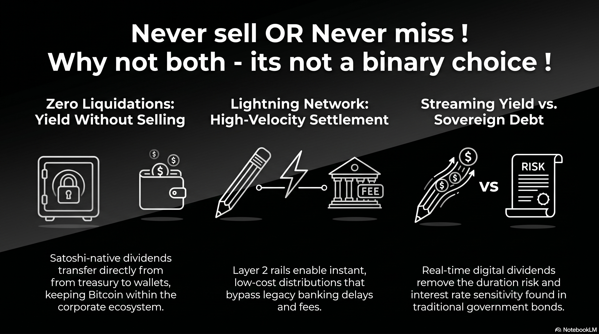

# 234 : Satoshi Dividends via Lightning Network

<a href="https://open.spotify.com/show/7doWf0GON9JsG6r8igc7RE" target="_blank" style="background-color: #2E2E2E; color: white; padding: 10px 20px; text-align: center; text-decoration: none; display: inline-block; border-radius: 5px; margin-top: 10px; margin-right: 10px;">Spotify</a><a href="https://podcasts.apple.com/us/podcast/deep-dive-with-gemini/id1844532251" target="_blank" style="background-color: #2E2E2E; color: white; padding: 10px 20px; text-align: center; text-decoration: none; display: inline-block; border-radius: 5px; margin-top: 10px; margin-right: 10px;">Apple Podcasts</a><a href="https://music.youtube.com/playlist?list=PLIX4sFsmu37qtJMlv-VzMYWM26M1QyXTe&si=o534zFZsc7p5XA9Q" target="_blank" style="background-color: #2E2E2E; color: white; padding: 10px 20px; text-align: center; text-decoration: none; display: inline-block; border-radius: 5px; margin-top: 10px; margin-right: 10px;">YouTube Music</a><a href="https://www.youtube.com/playlist?list=PLIX4sFsmu37qtJMlv-VzMYWM26M1QyXTe" target="_blank" style="background-color: #2E2E2E; color: white; padding: 10px 20px; text-align: center; text-decoration: none; display: inline-block; border-radius: 5px; margin-top: 10px; margin-right: 10px;">YouTube</a><a href="https://fountain.fm/show/7LBvZT6ffpGyubvk8aSF" target="_blank" style="background-color: #2E2E2E; color: white; padding: 10px 20px; text-align: center; text-decoration: none; display: inline-block; border-radius: 5px; margin-top: 10px;">Fountain.fm</a>

  <video width="100%" height="auto" autoplay loop muted playsinline style="border-radius: 10px; display: block; box-shadow: 0 4px 15px rgba(0,0,0,0.3);">
    <source src="vid/234-intro.mp4" type="video/mp4">
  </video>
  <button onclick="var v = this.previousElementSibling; v.muted = !v.muted; this.querySelector('i').className = v.muted ? 'fa fa-volume-off' : 'fa fa-volume-up';" 
          style="position: absolute; bottom: 15px; right: 15px; background: rgba(46, 46, 46, 0.7); border: none; color: white; border-radius: 5px; padding: 5px 10px; cursor: pointer; z-index: 10;"
          title="Toggle Mute">
    <i class="fa fa-volume-off"></i>
  </button>

**Disclaimer:** *The model presented in this report regarding Lightning-native Satoshi distributions is a strategic proposal and does not reflect internal insights into the official roadmap of Strategy Inc. We have no knowledge of whether the company is currently considering these specific lines of operation. This framework is intended as a structural pathway to reconcile the ideological commitment to "Never Sell Bitcoin" with the operational mandate to "Never Miss an STRC Dividend."*

The strategic evolution of Strategy Inc. has reached a terminal ideological conflict: the tension between the original "Never Sell Bitcoin" mantra and the new "Never Miss an STRC Dividend" mandate. While tactical financial engineering—such as tax-loss harvesting or ADSO optimization—offers temporary relief, the structural solution lies in a pivot to **Lightning-native Satoshi (Sats) dividends**. By utilizing its proprietary enterprise infrastructure to distribute yield directly in Satoshis, Strategy Inc. can fulfill its obligations to preferred shareholders without liquidating a single sat from the corporate treasury.

## **1. The Infrastructure: Enterprise Lightning and 'Strategy Orange'**

The technical foundation for this shift already exists within the company’s internal product suite. Strategy Inc. has transitioned from a passive holder to a Bitcoin development company, specifically engineering tools that bridge the gap between institutional finance and Layer 2 rails.

* **MicroStrategy Orange:** This decentralized identity (DID) platform allows the company to anchor "trustless, tamper-proof" identifiers directly into the Bitcoin blockchain. By issuing DIDs to all STRC holders, the company can verify shareholder status on-chain without relying on legacy brokerage reporting. 
* **The Enterprise Wallet:** The company is developing a product to deliver a Bitcoin wallet and a static Lightning address to every corporate account holder. Expanding this to shareholders allows for the seamless, direct-to-custody distribution of dividends. 
* **Internet Identifiers:** By converting corporate or shareholder email addresses into Lightning addresses (e.g., shareholder@strategy.com), the company enables a payment endpoint that is as simple to use as an email inbox.

## **2. Reconciling the Ethos: 'Never Sell' and 'Never Miss'**

The "Sats-native" distribution model resolves the fundamental contradiction of the 2026 strategic pivot. Under the current USD-dividend model, the company must occasionally sell tiny amounts of Bitcoin to "inoculate the market" and prove liquidity.

By paying in Satoshis, Strategy Inc. achieves a superior outcome:

1. **Zero Liquidations:** Dividends are transferred directly from the treasury to the shareholder's Lightning wallet, keeping the Bitcoin within the ecosystem and upholding the "Never Sell" promise. 
2. **Absolute Certainty:** The "Never Miss" mandate is automated via smart-contract-like distribution on Layer [^2], removing the "opaque working of closed-door meetings" or banking delays. 
3. **Community Sovereignty:** The Bitcoin community, which has historically viewed any sale as a betrayal, is transformed into a loyal base of yield-earning HODLers.

## **3. The Dogfooding Advantage: Mainstreaming Lightning**

Paying STRC dividends in Satoshis is the first "mainstream" financial application for the Lightning Network. While Nostr has successfully deployed "zaps" for social interactions, a Nasdaq-listed security using Lightning for regulated dividend distributions provides a level of legitimacy and "industrial suction" that the network currently lacks.

* **Bridging the Gap:** This initiative creates a natural synergy between Michael Saylor’s treasury model and Jack Dorsey’s vision for a Bitcoin-native financial system. Future integrations could see Cash App serving as the primary distribution and off-ramp partner for STRC dividends. 
* **Legislative Leadership:** Just as the company was instrumental in evolving FASB fair-value accounting rules for Bitcoin, it can now lead the way in establishing the legal and tax framework for Satoshi-native distributions in the "grey area" of current securities law.

## **4. Superior Technology: From Monthly to Streaming Yield**

The Lightning Network represents a generational leap in settlement speed and cost-effectiveness compared to the legacy ACH or wire systems used for preferred dividends.

* **Velocity of Capital:** Management has already proposed moving STRC dividends to a semi-monthly (bi-weekly) schedule to enhance liquidity.[^1] Lightning removes the limits of traditional settlement cycles, making daily—or even minute-by-minute—**streaming dividends** technically feasible. 
* **The 'Buck' Precedent:** While previous industry attempts at streaming payments, such as the stalled "Buck" project, failed to achieve scale, Strategy Inc. possesses the corporate moat and Bitcoin reserves to succeed where others faltered. 
* **Support Engagement:** By moving distributions to an internal wallet ecosystem, Strategy Inc. gains a direct relationship with its STRC supporters, allowing for a level of transparency and data-driven feedback that is impossible through anonymous brokerage accounts.

## **5. Future Impact: Challenging the Monopoly of Sovereign Credit**

The integration of Lightning-native dividends positions STRC as a structural competitor to the 300 trillion USD sovereign credit market.[^3] Sovereign credit is the ultimate financial instrument, historically backed by a nation's coercive power to tax and its underlying military strength. However, as a financial mechanism, sovereign debt relies on an aging "discount-pricing" architecture that digital credit can now disrupt.

### **The Upfront Yield Efficiency**

Traditional sovereign instruments, such as U.S. Treasury bills (T-bills), operate by selling debt at a discount to its face (par) value. For example, if a $100 T-bill is issued at a $4 discount, the investor pays only $96. While the $100 is a promise of a future payout at maturity, the pricing method ensures the investor effectively receives their interest or "dividend" upfront by retaining the 4 USD in capital. The relationship between price and discount is governed by:

$P = F \left(1 - \frac{d \cdot t}{360}\right)$

### **Removing Duration Risk via Digital Networks**

While sovereign debt is efficient at distributing upfront value, it remains burdened by **duration risk**— the sensitivity of the security's price to interest rate changes during the time it is held before maturity. To compete with the scale and efficiency of sovereign yield, a faster settlement rail is required.

A digital network like Lightning provides a more reliable and rational solution. By transitioning from the fixed terms of legacy debt to the real-time, **streaming Satoshi dividends** proposed in this model, the "duration" of each dividend distribution is effectively reduced to zero. Because Lightning settles in milliseconds and can handle up to 1 million transactions per second for as little as 1 Satoshi, Strategy Inc. can distribute yield continuously. This constant settlement removes the interest rate sensitivity associated with waiting for a maturity date, allowing digital credit to offer a "risk-free" rate for the Bitcoin standard that is technologically superior to the debt of nation-states.

## **Conclusion: Good Karma and the Digital Risk-Free Rate**

The transition to Lightning-native Satoshi dividends is more than financial engineering; it is a structural commitment to the Bitcoin standard. It positions STRC as a true contender to compete with sovereign credit instruments by offering a **transparent, variable-rate yield** that is settled instantly on the world’s hardest money rails.

By choosing this path, Strategy Inc. ceases to be a company that simply "buys and holds" and becomes a global "Satoshi Refinery." It leverages its 8.5 billion USD digital credit engine to power a multi-generational wealth transfer, proving that the best technology for the global credit market is not the opaque Fed, but the transparent, open-source architecture of the Bitcoin Lightning Network.

#### **Works cited**
[^1]: Strategy (MSTR) Q1 2026 Earnings Transcript | The Motley Fool, accessed May 5, 2026, [https://www.fool.com/earnings/call-transcripts/2026/05/05/strategy-mstr-q1-2026-earnings-transcript/](https://www.fool.com/earnings/call-transcripts/2026/05/05/strategy-mstr-q1-2026-earnings-transcript/)
[^2]: Strategy Dividend Shift Tests Sustainability of Bitcoin-Backed Yield Model, accessed May 5, 2026, [https://www.investing.com/analysis/strategy-dividend-shift-tests-sustainability-of-bitcoinbacked-yield-model-200678810](https://www.investing.com/analysis/strategy-dividend-shift-tests-sustainability-of-bitcoinbacked-yield-model-200678810)
[^3]: Strategy's (MSTR) Michael Saylor Says STRC Is 'Going Viral' After 8.5 Billion USD Run‑Up, accessed May 5, 2026, [https://bitcoinmagazine.com/news/strategys-mstr-michael-saylor-says-strc](https://bitcoinmagazine.com/news/strategys-mstr-michael-saylor-says-strc)

---

### Tips and Donations

If you enjoyed this deep dive, consider supporting the project with a tip in **Sats**. It's a simple, global way to support independent research.

<lightning-widget
  name='Thanks for supporting the publication'
  accent='#f9ce00'
  to='shutosha@primal.net'
  image='https://nostrcheck.me/media/5af0794606a15b5641e25aa23d04af4cb0d7d5e68b11cacb47e56a4698fca8c4/49ff6d00cb5bc819cd19f77783d4815fbd46a5b99b6fbdead1eaecfab798187b.webp'
/>

To send Sats, you'll need a [lightning wallet](https://lightningaddress.com/). 

---
