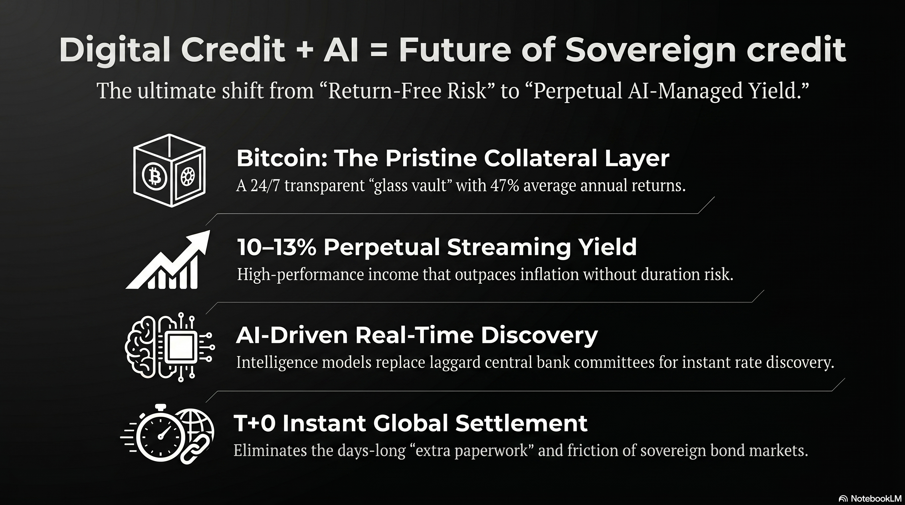

# 235 : Future of Sovereign Credit

<a href="https://open.spotify.com/show/7doWf0GON9JsG6r8igc7RE" target="_blank" style="background-color: #2E2E2E; color: white; padding: 10px 20px; text-align: center; text-decoration: none; display: inline-block; border-radius: 5px; margin-top: 10px; margin-right: 10px;">Spotify</a><a href="https://podcasts.apple.com/us/podcast/deep-dive-with-gemini/id1844532251" target="_blank" style="background-color: #2E2E2E; color: white; padding: 10px 20px; text-align: center; text-decoration: none; display: inline-block; border-radius: 5px; margin-top: 10px; margin-right: 10px;">Apple Podcasts</a><a href="https://music.youtube.com/playlist?list=PLIX4sFsmu37qtJMlv-VzMYWM26M1QyXTe&si=o534zFZsc7p5XA9Q" target="_blank" style="background-color: #2E2E2E; color: white; padding: 10px 20px; text-align: center; text-decoration: none; display: inline-block; border-radius: 5px; margin-top: 10px; margin-right: 10px;">YouTube Music</a><a href="https://www.youtube.com/playlist?list=PLIX4sFsmu37qtJMlv-VzMYWM26M1QyXTe" target="_blank" style="background-color: #2E2E2E; color: white; padding: 10px 20px; text-align: center; text-decoration: none; display: inline-block; border-radius: 5px; margin-top: 10px; margin-right: 10px;">YouTube</a><a href="https://fountain.fm/show/7LBvZT6ffpGyubvk8aSF" target="_blank" style="background-color: #2E2E2E; color: white; padding: 10px 20px; text-align: center; text-decoration: none; display: inline-block; border-radius: 5px; margin-top: 10px;">Fountain.fm</a>

The global financial landscape is currently navigating a period of profound structural realignment, characterized by the emergence of digital credit as a sophisticated alternative to the legacy sovereign debt market. This transition, often conceptualized through the lens of the Satoshi Refinery, represents more than a mere technological upgrade; it is a fundamental reconfiguration of how capital is refined, how interest rates are discovered, and how yield is distributed across the global economy. At the core of this shift is the decoupling of credit from the constraints of duration and centralized administrative fiat, moving instead toward a model of yield streaming anchored by decentralized digital capital. The distinction between sovereign credit and digital credit is not merely a matter of medium—analog versus digital—but a foundational divergence in risk management, market efficiency, and financial democratization.

## **The Satoshi Refinery and the Distillation of Digital Capital**

The concept of the Satoshi Refinery serves as the central metaphor and technical framework for the production of digital credit. In this ecosystem, raw digital capital—primarily Bitcoin—is subjected to a refinement process analogous to the distillation of crude oil into high-value fuels. While Bitcoin itself is a volatile, long-term store of value, the Satoshi Refinery utilizes algorithmic signal processing to "strip" the volatility and extract a consistent stream of yield.[^1] This process is facilitated by a suite of AI-driven models, such as the Spirit of Satoshi and Code-Satoshi, which provide the computational intelligence necessary to manage the underlying assets and ensure the security of the credit contracts.[^3]

Unlike sovereign credit, which relies on the taxing authority of a nation-state to guarantee repayment, digital credit is "asset-backed credit" where the underlying asset (Bitcoin) has historically demonstrated significantly higher annual returns than any other asset class. Over the past five years, Bitcoin has achieved an average annual return of approximately 47%.[^4] This high rate of capital appreciation allows the Satoshi Refinery to offer credit instruments that provide substantial yields to investors while maintaining a protective buffer for the principal.[^1] The "yield streaming" model effectively converts the capital gains of the underlying asset into a periodic payout, creating a smoother financial journey for the investor compared to the volatile price action of the raw asset.[^1]

| Refined Credit Instrument | Yield Profile | Risk/Protection Layer | Primary Function |
| :---- | :---- | :---- | :---- |
| **STRIKE** | Blended Upside \+ Yield | Variable depending on BTC performance | Balanced growth and income |
| **STRIDE** | High-Yield (\~12.9%) | Long-duration digital credit | Maximize income for long-term holders |
| **STRIFE** | Senior Protected (\~9%) | High principal protection | Conservative yield-seeking capital |
| **STRETCH (STRC)** | Variable Rate (\~10%) | Liquidity-driven volatility dampening | "Global 10% Bank Account" |
| **STREAM** | EUR-Denominated Yield | Currency-hedged credit | European market integration |

The Satoshi Refinery's ability to produce these varied instruments is dependent on the distinction between "digital capital" and "digital credit." Digital capital, represented by Bitcoin, focuses on long-term value preservation and durability; it is the "base layer" of the new economy.[^2] Digital credit, however, requires an execution layer characterized by high speed, low transaction costs, and programmable smart contracts—functions increasingly delegated to networks like Solana.[^2] This layered approach allows for the separation of capital preservation (Bitcoin) from financial execution and yield generation (Solana-based credit issuance), a structure that traditional sovereign credit cannot replicate due to its monolithic and centralized nature.[^2]

## **The Fundamental Divergence in Duration and Interest Rate Risk**

A primary argument for the superiority of digital credit lies in its removal of duration risk, a systemic vulnerability inherent in the 300 trillion USD traditional credit market.[^4] Sovereign credit is fundamentally defined by its duration—the length of time until the principal is repaid. Whether in the form of 10-year Treasury notes or 30-year bonds, this fixed duration exposes the investor to significant interest rate risk.[^6] When a central bank, such as the Federal Reserve, adjusts the "risk-free" rate, the market value of existing fixed-rate bonds fluctuates inversely, often leading to massive capital losses for holders of long-duration debt.[^6]

### **Neutralizing Centralized Interest Rate Manipulation**

The traditional bond market is subject to the administrative fiat of a handful of central bank governors who determine interest rates based on laggard economic indicators.[^4] This centralized control often results in "return-free risk," where the yields on sovereign debt fail to compensate for the inflationary debasement of the currency.[^5] Digital credit, refined through the Satoshi Refinery, operates on a perpetual, floating-rate basis, effectively removing the Federal Reserve's influence from the credit equation.[^4]

By utilizing a "perpetual" structure, digital credit eliminates the need for repayment dates and the associated "rollover risk" that plagues sovereign issuers. In the traditional system, a government must continuously issue new debt to pay off old maturing debt, a process that becomes increasingly expensive and risky if interest rates are rising or if market trust in the sovereign entity wavers.[^6] Digital credit, being a continuous claim on the yield of an appreciating asset, does not "mature" in the traditional sense, allowing capital to remain deployed indefinitely without the friction of refinancing or settlement paperwork.[^1]

### **The Mathematical Advantage of Perpetual Yield**

The mathematical framework of digital credit allows for a more efficient allocation of returns between credit investors and equity holders. If we define the total return of digital capital as $\mathcal{P} = (\mathcal{S}, \mathcal{A}, \rho, \mathcal{R})$ and the target yield for the credit layer as $\mathcal{S}$, the remaining return $\mathcal{A}$ (equity gains) is expressed as:

$\rho$ 
Given that Bitcoin’s five-year average return is \~38-47%, a digital credit instrument can comfortably stream a 10-13% yield ($\mathcal{S}$) while still providing a massive surplus for common equity investors.[^1] In contrast, sovereign credit yields are capped by the government's ability to tax or print money, which historically results in yields near or below the rate of inflation, effectively destroying real wealth over the long duration.[^4]

## **Interest Rate Discovery: Efficient Markets vs. Laggard Indicators**

A core pillar of the digital credit thesis is the shift in interest rate discovery from the inefficient bond market to the efficient, future-driven stock market model. Interest rate discovery in the traditional sense is the process of "finding" the price of debt through the actions of buyers and sellers, yet this process is frequently hindered by structural opacity and relationship-driven trading.[^6]

### **The Inefficiency of the Bond Market**

The bond market primarily operates on laggard indicators—data that reflects what has already happened in the economy (inflation, employment, GDP growth).[^6] Furthermore, bond trading is often conducted in over-the-counter (OTC) markets that are not legislated or formalized in the same way as public exchanges, leading to information asymmetries and limited accessibility for the general populace.[^8] In the bond market, the "price discovered" of a debt security is strictly tied to its fixed maturity value and cash flows; when an interest rate is discovered, its exact price is mathematically derived from these fixed future points.[^8]

This rigid structure makes the bond market slow to react to real-time changes in capital efficiency. For example, Variable Repo Rates (VRR) are used by central banks to manage liquidity through auctions, but these rates are still heavily anchored to a fixed policy rate decided by a committee rather than pure market demand.[^6] This creates a "monetary policy transmission" delay, where it takes months for changes in the central bank rate to influence retail borrowing costs or corporate credit availability.[^6]

### **The Efficiency of Stock Market Discovery for Credit**

Digital credit adopts the discovery mechanism of the stock market, which is fundamentally future-driven and sentiment-responsive.[^1] In the stock market, the price of an asset is the outcome of all participants' market sentiments and expectations of future growth at a point in time.[^8] By treating credit as a refined derivative of digital equity, the Satoshi Refinery allows interest rates to be discovered through transparent, real-time bidding on liquid exchanges.[^1]

This "equity-style" discovery means that digital credit rates can adjust instantly to changes in the productivity of the underlying digital capital. Because digital credit is programmatic and liquid—trading 24/7 on global blockchains—it provides a more accurate and immediate signal of the true cost of capital than the 9-to-5, trust-based bond market.[^4] This shift essentially moves credit from a "fixed-income" category to a "performance-income" category, where the yield is a transparent reflection of actual asset performance rather than a political mandate.[^1]

| Metric | Bond Market (Sovereign) | Stock/Digital Credit Market |
| :---- | :---- | :---- |
| **Discovery Type** | Laggard / Historical Data | Leading / Future Expectations |
| **Mechanism** | Central Bank Policy / OTC Bidding | Transparent / Exchange-Traded |
| **Participant Base** | Concentrated / Institutional | Broad / Decentralized |
| **Speed of Discovery** | Slow (Days/Weeks) | Real-Time (Seconds) |
| **Rate Basis** | Administered "Risk-Free" Rate | Market Demand for Liquidity |

## **The Democratization of the Credit Market**

The sovereign credit and corporate bond markets have historically been the exclusive domain of "accredited investors" and large institutional players.[^1] This concentration of wealth has effectively pushed the general populace out of the fixed-income market and into the stock market to chase returns, often exposing retail investors to higher levels of volatility than their risk profiles allow.[^4]

### **Financial Exclusion and the "Accredited" Barrier**

In the legacy system, participating in the [^3].5 trillion USD private credit market requires significant capital and specific regulatory status.[^1] Corporate bonds and Treasury bills, while theoretically accessible, are often bundled into opaque mutual funds or ETFs that charge high fees and offer limited transparency.[^1] In many emerging market and developing economies (EMDEs), the barrier is even higher; a lack of bank branches and concentrated banking industries prevent households and small enterprises from accessing even basic credit or yield-bearing savings accounts.[^10]

### **Digital Credit as a Universal Financial Instrument**

Digital credit democratizes this market by lowering the barrier to entry to zero. Through the use of blockchain execution layers and stablecoin integration, any individual with a smartphone can access high-yield credit instruments previously reserved for the ultra-wealthy.[^4] This is particularly impactful in regions like sub-Saharan Africa, India, and Southeast Asia, where digital payment innovations are already being used to bridge the gap between payment systems and credit intermediation.[^10]

By leveraging data generated through e-payments, digital credit platforms can create "digital collateral" to reduce information asymmetries. This allows for the extension of credit to informality-prone sectors without the need for traditional banking infrastructure or physical branches.[^10] For example, in South Africa and Zambia, digital payments are being used to assess the creditworthiness of small vendors, providing them with access to financing that sovereign-linked banks would otherwise deny.[^10] The "STRETCH" (STRC) instrument, designed as a "[^9]% bank account for the world," exemplifies this democratization, providing a stable, tax-deferred yield to anyone, regardless of their location or accreditation status.[^4]

## **Perpetuity, Liquidity, and the Removal of Settlement Friction**

The traditional sovereign credit market is burdened by centuries of "extra paperwork" and trust-driven settlement functions. Trading a Treasury bill is not merely a transfer of digital bits; it is a complex social and legal contract that relies on a network of clearing houses, custodians, and central banks to ensure that the "trust" is maintained.[^8]

### **The Problem of T+3 and T+5 Settlement**

In the money market, a spot deal typically settles on T+0 or T+1, but in the bond and share markets, settlement can take between three and five working days (T+3 to T+5).[^8] This delay is a function of convenience and the physical reality of traditional securities, which often requires significant time for individual identities to be verified and for securities to be "posted" to an exchange.[^8] This latency creates settlement risk—the danger that one party will fail to deliver the asset after the payment has been made—necessitating the presence of expensive and slow intermediaries.[^8]

### **Programmatic Liquidity and T+0 Settlement**

Digital credit removes this friction entirely through the use of blockchain technology. Liquidating digital credit is as simple as "selling a stock" on a 24/7 liquid market or transferring the assets directly on a blockchain with near-instantaneous settlement (T+0).[^2] Because the credit is "programmatic," the settlement is enforced by the code of the smart contract rather than the manual labor of a back-office accounting department.[^2]

Furthermore, digital credit is perpetual in nature. Sovereign credit is bounded by its fixed duration (30 years, 10 years, etc.), which requires frequent settlement and re-issuance cycles.[^4] Digital credit, refined from a perpetual digital asset (Bitcoin), has no maturity date and no "settlement" in the traditional sense of closing a loan.[^1] It is a continuous, streaming relationship between the capital and the investor, eliminating the tax and accounting burdens associated with bond ladders and maturing obligations.[^4]

## **The AI Angle: Managing Yield and Mitigating Risk**

A critical distinction between sovereign and digital credit is the utility of Artificial Intelligence (AI) in managing the instruments. In the sovereign credit market, the benefits of AI are almost negligible, largely confined to automating seismic data for upstream operations or enhancing predictive maintenance in pipelines—functions that do not directly improve the yield or risk profile of the government debt itself.[^11]

### **AI-Driven Yield Management in the Satoshi Refinery**

In the realm of digital credit, AI is an essential operator. The Satoshi Refinery uses specialized AI models to manage yield and protect principal in ways that are impossible in the analog bond market.[^3] For instance, the Code-Satoshi model is trained on Bitcoin-related languages and protocols (Script, Miniscript, Lightning, Nostr) to produce and correct the code that governs credit issuance.[^3] This ensures that the programmatic "execution" of digital credit remains secure and efficient.

AI can be used to perform "signal processing" on financial signals, identifying the optimal moments to capture capital gains from the underlying Bitcoin to pay out the credit yield.[^1] By monitoring the "Bitcoin Pulse," an AI-driven refinery can dynamically adjust the distribution of returns between credit investors and equity holders, ensuring that the 10-13% yield remains stable even during periods of high market volatility.[^1] This level of real-time, automated yield management is what allows digital credit to achieve "100x" better performance than traditional bank deposits.[^4]

### **The Limitations of AI in Sovereign Credit**

In contrast, sovereign credit is a static instrument. Once a 30-year bond is issued, its terms are fixed. AI cannot "manage" the yield of a Treasury bill to improve its performance for the investor, as the yield is determined by the fixed coupon and the market-driven price.[^6] While AI might help a hedge fund speculate on interest rate changes, it does nothing to improve the fundamental structure of the sovereign debt itself.[^7] The lack of transparency and programmability in sovereign debt makes it a "dead" asset compared to the "living," AI-managed digital credit refined from Bitcoin.[^3]

## **The Impact on the Bullion Market: Gold as a "Bridge"**

The mainstream adoption of digital credit poses a significant threat to the traditional bullion market, particularly gold. Historically, gold has been the primary form of "digital capital" (in the sense of being sovereign-neutral), but it lacks the refining capability and yield-streaming potential of Bitcoin.[^4]

### **The Re-pricing of Gold in the Satoshi Era**

If digital credit becomes the standard for high-yield, stable income, the demand for gold as a store of value is likely to be re-priced. Investors who traditionally held gold for preservation might shift their capital into digital credit instruments that offer both preservation and a 10% tax-deferred yield.[^4] As Michael Saylor has noted, gold-backed credit theoretically caps its yield at a much lower level (\~16% maximum) compared to Bitcoin-backed credit (\~38-47% maximum) because gold's underlying growth rate is significantly lower.[^1]

| Feature | Gold-Backed Credit | Bitcoin-Backed (Digital) Credit |
| :---- | :---- | :---- |
| **Underlying Asset Growth** | \~16% (Theoretical Cap) | \~38-47% (5-Year Average) |
| **Refinement Potential** | Low (Difficult to stream) | High (Programmable execution) |
| **Yield Capacity** | 2–4% | 10–13% |
| **Market Role** | "Bridge" for settlements | Primary Digital Capital |
| **Liquidity** | High (but physical friction) | High (T+0 on-chain) |

### **Gold as a Bridge and the Rise of CIPS**

In the evolving global settlement landscape, gold is being redefined as a "bridge" between currencies and systems, particularly as the US dollar's dominance is challenged by the expansion of the Cross-Border Interbank Payment System (CIPS) and the internationalization of the Renminbi (RMB).[^12] However, this "bridge" role is increasingly precarious. While gold can facilitate large-scale sovereign settlements, it cannot be easily "refined" into the type of democratized, retail-accessible credit instruments that the Satoshi Refinery produces.[^1] Digital credit effectively captures the "safe haven" utility of gold and adds a high-yield, liquid, and programmable layer on top of it, making it a superior financial technology for the 21st century.[^4]

## **The Institutional Pivot and the Future of the Global Cost of Capital**

The shift from sovereign credit to digital credit is no longer a fringe movement; it is being driven by a "180-degree reversal" in the behavior of the world's largest financial institutions.[^4] Within a single year, major US banks including BNY Mellon, PNC Bank, Citigroup, Wells Fargo, Bank of America, and J.P. Morgan have flipped from anti-crypto to pro-Bitcoin positions.[^4] This institutionalization is a critical signal that the "traditional moats" of banking—infrastructure and regulation—are being bypassed by the efficiency of digital credit.[^12]

### **Resetting the Global Cost of Capital**

Digital credit is "attacking" the 300 trillion USD credit market by offering a lower cost of capital for borrowers and a higher yield for lenders.[^5] By bypassing the intermediaries of the sovereign system, digital credit can offer "tax-equivalent" yields of 17-22% in environments where bank deposits yield nearly zero.[^4] This reset of the global cost of capital will force traditional money markets, corporate credit structures, and banking systems to either integrate with digital capital or face terminal obsolescence.[^4]

The predicted penetration of digital credit into low-interest environments like Japan, Europe, and South Korea will likely spark a massive migration of capital out of "return-free risk" sovereign debt and into the "refined" digital yield of the Satoshi Refinery.[^4] In this new landscape, Bitcoin serves as the foundation for digital capital and long-term value preservation, while execution networks like Solana power the programmable credit that drives the daily economy.[^2]

## **Conclusion: Synthesizing the New Credit Paradigm**

The deliberative comparison between sovereign credit and digital credit identifies a fundamental decoupling of financial instruments from the legacy of the nation-state. Digital credit, refined through the Satoshi Refinery, offers a structural superiority across every meaningful financial metric: duration risk is removed, interest rate discovery is made efficient through stock-market mechanisms, the market is democratized for the general populace, and settlement friction is eliminated through programmatic T+0 liquidity.

The integration of AI into this process ensures that yield management is no longer a static, laggard function of central bank policy but a dynamic, real-time optimization of digital capital. As digital credit becomes mainstream, the bullion market will likely see gold relegated to a transitional "bridge" asset, unable to compete with the high-yield, programmable nature of Bitcoin-backed credit. The ultimate outcome of this transformation is a global financial system that is more resilient, more inclusive, and significantly more efficient—a system where the cost of capital is determined by the market rather than a committee, and where yield is a universal stream accessible to all. The Satoshi Refinery is not merely an alternative to the Federal Reserve; it is the technological successor to the sovereign debt model, marking the beginning of the era of perpetual digital credit.

#### **Works cited**
[^1]: Strategy CEO: Digital lending is the killer application driving the global adoption of Bitcoin., accessed May 9, 2026, [https://news.futunn.com/en/post/72255120/strategy-ceo-digital-lending-is-the-killer-application-driving-the](https://news.futunn.com/en/post/72255120/strategy-ceo-digital-lending-is-the-killer-application-driving-the)
[^2]: Michael Saylor Says Solana Will Power the Future of Digital Credit | MEXC News, accessed May 9, 2026, [https://www.mexc.com/news/802381](https://www.mexc.com/news/802381)
[^3]: Spirit of Satoshi, accessed May 9, 2026, [https://www.spiritofsatoshi.ai/](https://www.spiritofsatoshi.ai/)
[^4]: Michael Saylor: “Digital Credit Will Redefine Global Finance ..., accessed May 9, 2026, [https://www.binance.com/en/square/post/12-03-2025-michael-saylor-digital-credit-will-redefine-global-finance-bitcoin-accepted-by-wall-street-us-government-at-binance-blockchain-week-dubai-33205526564178](https://www.binance.com/en/square/post/12-03-2025-michael-saylor-digital-credit-will-redefine-global-finance-bitcoin-accepted-by-wall-street-us-government-at-binance-blockchain-week-dubai-33205526564178)
[^5]: Michael Saylor Criticizes Traditional Credit Market at Consensus 2026 - Phemex, accessed May 9, 2026, [https://phemex.com/news/article/michael-saylor-criticizes-traditional-credit-market-at-consensus-2026-79325](https://phemex.com/news/article/michael-saylor-criticizes-traditional-credit-market-at-consensus-2026-79325)
[^6]: What Is Variable Repo Rate? Meaning & How It Works - Jiraaf, accessed May 9, 2026, [https://www.jiraaf.com/blogs/general/variable-repo-rate](https://www.jiraaf.com/blogs/general/variable-repo-rate)
[^7]: The Impact of Interest Rate Changes on Financial Markets: A Mathematical Study, accessed May 9, 2026, [https://www.researchgate.net/publication/384337898_The_Impact_of_Interest_Rate_Changes_on_Financial_Markets_A_Mathematical_Study](https://www.researchgate.net/publication/384337898_The_Impact_of_Interest_Rate_Changes_on_Financial_Markets_A_Mathematical_Study)
[^8]: 4 Interest rate discovery, accessed May 9, 2026, [https://nscpolteksby.ac.id/ebook/files/Ebook/Accounting/Interest%20Rates-An%20Introduction%20(2015)/4%20-%20Interest%20rate%20discovery.pdf](https://nscpolteksby.ac.id/ebook/files/Ebook/Accounting/Interest%20Rates-An%20Introduction%20\(2015\)/4%20-%20Interest%20rate%20discovery.pdf)
[^9]: (PDF) Interest Rates 4: Interest Rate Discovery - Academia.edu, accessed May 9, 2026, [https://www.academia.edu/9691162/Interest_Rates_4_Interest_Rate_Discovery](https://www.academia.edu/9691162/Interest_Rates_4_Interest_Rate_Discovery)
[^10]: Digital Payment Innovations in Sub-Saharan Africa in: Departmental Papers Volume 2025 Issue 004 (2025) - IMF eLibrary, accessed May 9, 2026, [https://www.elibrary.imf.org/view/journals/087/2025/004/article-A001-en.xml](https://www.elibrary.imf.org/view/journals/087/2025/004/article-A001-en.xml)
[^11]: Oil and gas in the AI era | IBM, accessed May 9, 2026, [https://www.ibm.com/thought-leadership/institute-business-value/en-us/report/oil-and-gas-in-ai-era](https://www.ibm.com/thought-leadership/institute-business-value/en-us/report/oil-and-gas-in-ai-era)
[^12]: Michael Saylor: Strategy is transforming Bitcoin into digital credit and digital equity - WEEX, accessed May 9, 2026, [https://www.weex.com/news/detail/michael-saylor-strategy-is-transforming-bitcoin-into-digital-credit-and-digital-equity-726728](https://www.weex.com/news/detail/michael-saylor-strategy-is-transforming-bitcoin-into-digital-credit-and-digital-equity-726728)

---

### Tips and Donations

If you enjoyed this deep dive, consider supporting the project with a tip in **Sats**. It's a simple, global way to support independent research.

<lightning-widget
  name='Thanks for supporting the publication'
  accent='#f9ce00'
  to='shutosha@primal.net'
  image='https://nostrcheck.me/media/5af0794606a15b5641e25aa23d04af4cb0d7d5e68b11cacb47e56a4698fca8c4/49ff6d00cb5bc819cd19f77783d4815fbd46a5b99b6fbdead1eaecfab798187b.webp'
/>

To send Sats, you'll need a [lightning wallet](https://lightningaddress.com/). 

---
