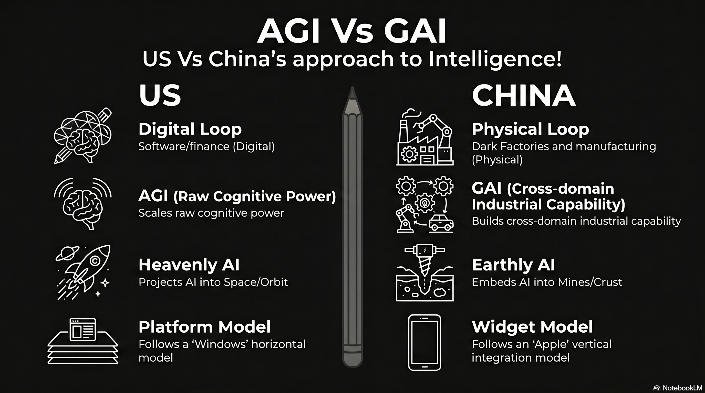

# 236 : AGI Vs GAI

<a href="https://open.spotify.com/show/7doWf0GON9JsG6r8igc7RE" target="_blank" style="background-color: #2E2E2E; color: white; padding: 10px 20px; text-align: center; text-decoration: none; display: inline-block; border-radius: 5px; margin-top: 10px; margin-right: 10px;">Spotify</a><a href="https://podcasts.apple.com/us/podcast/deep-dive-with-gemini/id1844532251" target="_blank" style="background-color: #2E2E2E; color: white; padding: 10px 20px; text-align: center; text-decoration: none; display: inline-block; border-radius: 5px; margin-top: 10px; margin-right: 10px;">Apple Podcasts</a><a href="https://music.youtube.com/playlist?list=PLIX4sFsmu37qtJMlv-VzMYWM26M1QyXTe&si=o534zFZsc7p5XA9Q" target="_blank" style="background-color: #2E2E2E; color: white; padding: 10px 20px; text-align: center; text-decoration: none; display: inline-block; border-radius: 5px; margin-top: 10px; margin-right: 10px;">YouTube Music</a><a href="https://www.youtube.com/playlist?list=PLIX4sFsmu37qtJMlv-VzMYWM26M1QyXTe" target="_blank" style="background-color: #2E2E2E; color: white; padding: 10px 20px; text-align: center; text-decoration: none; display: inline-block; border-radius: 5px; margin-top: 10px; margin-right: 10px;">YouTube</a><a href="https://fountain.fm/show/7LBvZT6ffpGyubvk8aSF" target="_blank" style="background-color: #2E2E2E; color: white; padding: 10px 20px; text-align: center; text-decoration: none; display: inline-block; border-radius: 5px; margin-top: 10px;">Fountain.fm</a>

  <video width="100%" height="auto" autoplay loop muted playsinline style="border-radius: 10px; display: block; box-shadow: 0 4px 15px rgba(0,0,0,0.3);">
    <source src="vid/236-intro.mp4" type="video/mp4">
  </video>
  <button onclick="var v = this.previousElementSibling; v.muted = !v.muted; this.querySelector('i').className = v.muted ? 'fa fa-volume-off' : 'fa fa-volume-up';" 
          style="position: absolute; bottom: 15px; right: 15px; background: rgba(46, 46, 46, 0.7); border: none; color: white; border-radius: 5px; padding: 5px 10px; cursor: pointer; z-index: 10;"
          title="Toggle Mute">
    <i class="fa fa-volume-off"></i>
  </button>

The global proliferation of artificial intelligence has reached a critical inflection point. It is manifesting not as a singular race toward a uniform technological end-state, but as a structural divergence between two fundamentally different civilizational models.

This bifurcation is most clearly articulated in the contrasting trajectories of the United States and China. The American model represents the apotheosis of a digital-first economy, prioritizing the aggregation of finance, technology, and content into centralized, super-large frontier models that scale intelligence through massive computational power. 

Conversely, the Chinese model is a natural evolution of its status as a global manufacturing hegemon. It focuses on physical AI systems—smaller, efficient models embedded directly into industrial hardware to solve granular, real-world problems. 

This analysis argues that these divergent paths are not merely strategic choices but are the inevitable result of national path dependencies. Existing economic competencies, labor market structures, and capital allocation mechanisms dictate the architecture of the resulting intelligence.

The United States has oriented its artificial intelligence strategy around the pursuit of raw cognitive capability, centralizing resources in massive, hyper-scale data centers to drive the development of frontier models. This rollout is a direct extension of the American economic core, which is heavily weighted toward digital information services, finance, and software as a service (SaaS) [^1].

In this paradigm, the American model functions like **"Windows"**: it is a horizontal software play where intelligence is the centralized product itself. Microsoft and OpenAI are essentially building the "Operating System of Intelligence," a standalone code layer that acts as a platform for an entire ecosystem of B2B SaaS and digital agents. This strategy operates on the "scaling law" hypothesis: the belief that increasing parameters, data volume, and compute capacity will lead to emergent properties that eventually culminate in artificial general intelligence (AGI).[^3]

### **The Digital Loop: Finance, Law, and Content Creation**

In the United States, AI adoption has concentrated in white-collar industries where the primary "product" is information. The American model excels in what can be termed the "Digital Loop," where AI acts as a virtual employee performing high-level cognitive tasks.[^4] This "money and code" strategy is evidenced by the sheer scale of investment. In 2024, the United States accounted for over 70% of global AI financing, with corporate investments reaching 109 billion USD .

| Metric | US Digital AI Adoption and Investment (2024-2025) | Source |
| :---- | :---- | :---- |
| Share of Global AI Financing | \> 70% | |
| Total Corporate AI Investment (2024) | 109 Billion USD | |
| Realized ROI for Midsize U.S. CFOs | 35% | |
| PE Firms with AI-Active Portfolios | 23% (up from 8% in 2024\) | |
| Digital Content Creation Market Size (2025) | 37.05 Billion USD | |

The American rollout is characterized by "agentic AI"—autonomous systems that handle complex, digital workflows. In the B2B SaaS sector, the focus has shifted from simple chatbots to "AI organizations" where intelligent agents manage departments like procurement and compliance. This strategy leverages America's dominance in software architecture to create proprietary, rent-based ecosystems that charge users for access to centralized intelligence.[^5]

## **The Chinese Paradigm: Physical AI as a Vertical Industrial Widget**

While the United States builds "brains" in the cloud, China is building "nervous systems" for its industrial base. This rollout mirrors the **"Apple"** philosophy of vertical integration, but applied to the material world: manufacturing plants, power grids, ports, and hospitals. In this model, intelligence is not a standalone subscription service; it is a packaged feature of the physical "industrial widget."

China's "AI Plus" (AI+) initiative is the centerpiece of this effort, aiming to achieve 70% AI adoption in key industrial sectors by 2027.[^7] Unlike the American pursuit of AGI, Chinese policymakers emphasize "General AI" (GAI), which focuses on cross-domain capabilities tailored toward increasing manufacturing productivity and industry-specific use cases.[^2]

### **The Physical Loop: Dark Factories and Infrastructure Integration**

The Chinese advantage lies in its ability to deploy AI at scale across the everyday machinery of the economy. This "Physical Loop" is characterized by the deep integration of design and production, often coordinated by "engineers" rather than the "lawyers" who dominate American corporate structures.[^6] A prime example is the emergence of "Dark Factories" or "lights-out" manufacturing. Xiaomi’s smartphone factory in Changping utilizes a central "AI brain" to control over 700 robots and 181 autonomous mobile robots (AMRs), producing one smartphone every three seconds.

  <video width="100%" height="auto" autoplay loop muted playsinline style="border-radius: 10px; display: block; box-shadow: 0 4px 15px rgba(0,0,0,0.3);">
    <source src="vid/236-physical-AI.mp4" type="video/mp4">
  </video>
  <button onclick="var v = this.previousElementSibling; v.muted = !v.muted; this.querySelector('i').className = v.muted ? 'fa fa-volume-off' : 'fa fa-volume-up';" 
          style="position: absolute; bottom: 15px; right: 15px; background: rgba(46, 46, 46, 0.7); border: none; color: white; border-radius: 5px; padding: 5px 10px; cursor: pointer; z-index: 10;"
          title="Toggle Mute">
    <i class="fa fa-volume-off"></i>
  </button>

| Sector | Chinese Physical AI Integration Metrics (2025-2026) | Source |
| :---- | :---- | :---- |
| Basic-Level Smart Factories established | 35,000+ | |
| Advanced-Level Smart Factories established | 7,000+ | |
| Fully Automated Port Terminals | 18 operational; 27 under construction | |
| Power Outage Duration (AI-managed) | Reduced from 10 hours to 3 seconds | |
| Industrial Robot Density | More than the rest of the world combined | |

In the appliance sector, Haier’s Tianjin factory churns out 17 washing machines per minute, utilizing self-developed smart equipment to achieve an automation rate above 80%. These physical AI systems are "point and shoot"—they are highly specialized, decentralized, and designed to run on the edge.[^8] This enables real-time decision-making for quality control without high-latency cloud processing.[^9]

## **Hardware Strategy: ASIC Centralization vs. The Decentralized CUDA-Compatible Flood**

A critical technical divergence has emerged in the hardware substrate of these two rollouts. While the United States is double-downing on massive data center centralization, its hardware is increasingly standardizing into Application-Specific Integrated Circuits (ASICs). Conversely, China is leveraging a smaller hardware footprint designed to run full models on standalone machines, maintaining compatibility with established software ecosystems to flood the global market.

### **The American ASIC "Silicon Secession"**

The U.S. model is currently undergoing a shift where the world's largest AI operators are abandoning general-purpose GPUs in favor of custom-designed silicon to reclaim margins and increase energy efficiency.

* **Specialized Monoculture:** Google’s eighth-generation TPU 8t and 8i, announced in April 2026, mark a shift toward ground-up distinct architectures for different agentic workloads. 
* **Standardized Efficiency:** AWS Trainium 3 is delivering up to 4x the performance of previous versions at 50% lower cost than general-purpose GPUs, targeting high-volume inference tasks. 
* **Infrastructure Economics:** By "hard-wiring" specific architectures like the Transformer into the silicon, U.S. hyperscalers achieve up to 5x better power efficiency, creating a high-margin, centralized infrastructure that supports the "Windows-style" horizontal platform.

### **The Chinese Standalone "CUDA-Compatible" Flood**

In contrast, China is pursuing a "point and shoot" hardware strategy. Denied access to the most advanced U.S. chips, the Chinese computing industry is focused on producing high-efficiency, small-footprint hardware that can run full models locally for specific industrial uses.

* **Ecosystem Erosion:** Chinese firms like Moore Threads and Huawei are developing CUDA-compatible architectures. This allows developers to port projects with minimal changes, eroding Nvidia's historical ecosystem advantage. 
* **Sub-$3000 Standalone Machines:** China is preparing to flood the market with affordable, specialized AI hardware. AMD's Ryzen AI Max+ 395 ("Strix Halo") is being showcased in China to power a new category of "Mini AI Workstations" priced as low as $1500. 
* **Cost Destruction:** By delivering 90% of Western performance at a fraction of the cost, China aims to capture the global "physical loop," making intelligence an inseparable, cheap component of the industrial widget.

## **The Domain Divergence: Heavenly AI vs. Earthly AI**

The natural evolution of these strategies has led to a profound divergence in the physical domains where AI is deployed. The American strategy is increasingly "Heavenly," taking AI into space in search of endless energy and military high ground. The Chinese strategy is "Earthly," grounding AI in the deep mines and industrial heartlands of the planet.

### **The American Ascent: Space Solar and Orbital High Ground**

For the United States, the massive energy requirements of trillion-parameter models have made terrestrial power grids a strategic bottleneck. Consequently, the U.S. is looking to the "ultimate high ground" of space to sustain its scaling bet.

* **Endless Energy:** U.S. hyperscalers and military researchers are exploring Space-Based Solar Power (SBSP) to bypass Earth-based constraints. Meta has partnered with startups like Overview Energy to investigate beaming solar energy from orbit to ground-based facilities, a long-term capacity bet to solve the AI power gap. 
* **Orbital Data Centers:** To escape 7-year waits for grid connections in places like Northern Virginia, American firms are planning AI data centers in space. These orbital hubs would provide near-continuous solar power and bypass terrestrial cooling and regulatory hurdles. 
* **Space Superiority:** The 2026 National Defense Strategy highlights space as critical for AI-enabled surveillance and communication. Firms like True Anomaly are building Autonomous Orbital Vehicles (AOVs) like the Jackal, which use AI to rendezvous with and characterize space threats, ensuring American dominance of the orbital high ground.

### **The Chinese Grounding: Deep Mines and Dark Factories**

While the U.S. looks to the stars, China is embedding AI into the crust of the earth. The Chinese rollout treats AI as a "factor of production" that must optimize the material foundation of the state.

* **Deep Mining:** China’s AI in Mining market is projected to grow at a CAGR of 23%, focusing on autonomous drilling, robotic vehicles, and predictive safety in hazardous underground environments. This allows for more efficient extraction of the critical minerals required to build the global hardware stack. 
* **Industrial Nervous System:** On the factory floor, China is deploying more industrial robots than the rest of the world combined. AI is used as a control layer for "Dark Factories" that operate 24/7 in total darkness, with robotics performing precision tasks in sectors ranging from semiconductors to home appliances. 
* **New Quality Productive Forces:** Beijing’s 15th Five-Year Plan prioritizes "New Quality Productive Forces," using AI to deeply restructure the entire material value chain—from sourcing and production to logistics—grounding the technology in the physical reality of the global supply chain.

| Feature | US (Digital Scaling Model) | China (Physical Integration Model) | Source |
| :---- | :---- | :---- | :---- |
| **Structural Analogy** | **Windows** (Horizontal Platform) | **Apple** (Vertical Widget) | |
| **Dominant Hardware** | **ASICs** (TPU 8, Trainium 3\) | **CUDA-Compatible** (Ascend, MUSA) | |
| **Hardware Price** | $1M+ Data Center Racks | Sub-$3000 Standalone Boxes | |
| **Physical Domain** | **Space** (SBSP / Orbital High Ground) | **Earth** (Deep Mines / Dark Factories) | |
| **Energy Strategy** | Space-Based Solar / Nuclear | Domestic Grid / UHV Transmission | |

## **Conclusion: Two Divergent Paths of Natural Evolution**

The evidence confirms the existence of two distinct AI rollouts. 

The American model is a **"Windows-style" Heavenly Scaling** paradigm: a centralized, proprietary strategy that leverages specialized ASICs and the orbital high ground to build the apex of virtual cognition. It is the logical progression of a nation that seeks to lead from the cloud and the stars.

The Chinese model is an **"Apple-style" Earthly Integration** paradigm: a decentralized, CUDA-compatible strategy that embeds efficient models into sub-3000 USD hardware to solve the gritty, real-world problems of mining and manufacturing. It is the logical progression of a nation that is the factory of the world.

The ultimate determinant of power in the AI age will likely not be who builds the first AGI, but who successfully integrates intelligence across their chosen domain. 

While the U.S. builds an "Operating System of the Stars," China’s ability to "Apple-ify" the physical world by flooding it with intelligent machines is creating a compounding industrial advantage that the software-focused U.S. may struggle to match. The future of AI is a bifurcated reality where the digital high ground and the physical factor of production exist as parallel civilizational stacks.

#### **Works cited**
[^1]: Competing AI strategies for the US and China - Brookings Institution, accessed May 9, 2026, [https://www.brookings.edu/articles/competing-ai-strategies-for-the-us-and-china/](https://www.brookings.edu/articles/competing-ai-strategies-for-the-us-and-china/)
[^2]: AI Battle: US vs China | by Ahmed Ismail - Medium, accessed May 9, 2026, [https://medium.com/ahmeds-tech-brief/ai-battle-us-vs-china-4d03ef3f19e7](https://medium.com/ahmeds-tech-brief/ai-battle-us-vs-china-4d03ef3f19e7)
[^3]: Why the US is currently ceding the AI arms race to China - HFS Research, accessed May 9, 2026, [https://www.hfsresearch.com/research/us-ceding-ai-arms-race-china/](https://www.hfsresearch.com/research/us-ceding-ai-arms-race-china/)
[^4]: How to Benefit from the American and Chinese Models in Artificial Intelligence, accessed May 9, 2026, [https://trendsresearch.org/insight/how-to-benefit-from-the-american-and-chinese-models-in-artificial-intelligence/](https://trendsresearch.org/insight/how-to-benefit-from-the-american-and-chinese-models-in-artificial-intelligence/)
[^5]: U.S. AI-Powered Content Creation Market Report, 2033 - Grand View Research, accessed May 9, 2026, [https://www.grandviewresearch.com/industry-analysis/us-ai-powered-content-creation-market-report](https://www.grandviewresearch.com/industry-analysis/us-ai-powered-content-creation-market-report)
[^6]: Top 25+ AI Chip Makers: NVIDIA & Its Competitors - AIMultiple, accessed May 9, 2026, [https://aimultiple.com/ai-chip-makers](https://aimultiple.com/ai-chip-makers)
[^7]: Who steers AI: China's industrial state vs America's frontier builders? - ThinkChina.sg, accessed May 9, 2026, [https://www.thinkchina.sg/technology/who-steers-ai-chinas-industrial-state-vs-americas-frontier-builders](https://www.thinkchina.sg/technology/who-steers-ai-chinas-industrial-state-vs-americas-frontier-builders)
[^8]: The Role of Edge AI and Tiny ML in Modern Robots | IoT For All, accessed May 9, 2026, [https://www.iotforall.com/edge-ai-tiny-ml-robotics](https://www.iotforall.com/edge-ai-tiny-ml-robotics)
[^9]: China's industrial revolution: AI-driven production at Xiaomi, accessed May 9, 2026, [https://www.all-about-industries.com/china-industrial-revolution-ai-driven-production-xiaomi-a-1d9e2b59ae63528cc709c92d1dd4c22e/](https://www.all-about-industries.com/china-industrial-revolution-ai-driven-production-xiaomi-a-1d9e2b59ae63528cc709c92d1dd4c22e/)

---

### Tips and Donations

If you enjoyed this deep dive, consider supporting the project with a tip in **Sats**. It's a simple, global way to support independent research.

<lightning-widget
  name='Thanks for supporting the publication'
  accent='#f9ce00'
  to='shutosha@primal.net'
  image='https://nostrcheck.me/media/5af0794606a15b5641e25aa23d04af4cb0d7d5e68b11cacb47e56a4698fca8c4/49ff6d00cb5bc819cd19f77783d4815fbd46a5b99b6fbdead1eaecfab798187b.webp'
/>

To send Sats, you'll need a [lightning wallet](https://lightningaddress.com/). 

---
