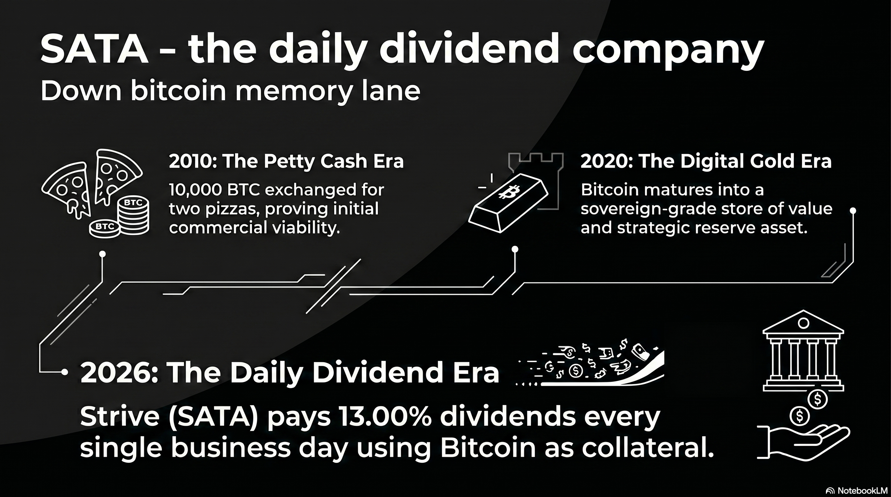

# 237 : SATA - The daily dividend company

<a href="https://open.spotify.com/show/7doWf0GON9JsG6r8igc7RE" target="_blank" style="background-color: #2E2E2E; color: white; padding: 10px 20px; text-align: center; text-decoration: none; display: inline-block; border-radius: 5px; margin-top: 10px; margin-right: 10px;">Spotify</a><a href="https://podcasts.apple.com/us/podcast/deep-dive-with-gemini/id1844532251" target="_blank" style="background-color: #2E2E2E; color: white; padding: 10px 20px; text-align: center; text-decoration: none; display: inline-block; border-radius: 5px; margin-top: 10px; margin-right: 10px;">Apple Podcasts</a><a href="https://music.youtube.com/playlist?list=PLIX4sFsmu37qtJMlv-VzMYWM26M1QyXTe&si=o534zFZsc7p5XA9Q" target="_blank" style="background-color: #2E2E2E; color: white; padding: 10px 20px; text-align: center; text-decoration: none; display: inline-block; border-radius: 5px; margin-top: 10px; margin-right: 10px;">YouTube Music</a><a href="https://www.youtube.com/playlist?list=PLIX4sFsmu37qtJMlv-VzMYWM26M1QyXTe" target="_blank" style="background-color: #2E2E2E; color: white; padding: 10px 20px; text-align: center; text-decoration: none; display: inline-block; border-radius: 5px; margin-top: 10px; margin-right: 10px;">YouTube</a><a href="https://fountain.fm/show/7LBvZT6ffpGyubvk8aSF" target="_blank" style="background-color: #2E2E2E; color: white; padding: 10px 20px; text-align: center; text-decoration: none; display: inline-block; border-radius: 5px; margin-top: 10px;">Fountain.fm</a>

The emergence of the Bitcoin protocol in 2009 represents a phenomenon that defies traditional categorization within the history of human invention. Rather than a linear progression of existing financial technologies, the network appears as an exogenous discovery—a mathematical artifact that solved the Byzantine Generals Problem, a feat previously thought impossible in computer science.[^1] This "alien technology" perspective suggests that Bitcoin is a discovery of absolute mathematical scarcity, functioning as a set of physical constants for a new digital reality.[^1]

The history of Bitcoin is not just a series of price spikes, but a sequence of narratives attempting to find a "terrestrial" use case for this "alien" asset. From its early days as petty cash to its current maturation into a foundation for digital credit, each cycle has refined our understanding of its true purpose.[^2]

## **Narrative Cycle I: The Petty Cash Era (2009–2012)**

The first attempt to map Bitcoin to human needs was as a "Peer-to-Peer Electronic Cash System".[^3] The defining moment of this cycle occurred on May 22, 2010—"Bitcoin Pizza Day"—when 10,000 BTC was exchanged for two pizzas.[^4] While it proved the protocol could facilitate commercial transactions, the narrative eventually failed because Bitcoin’s "alien" scarcity made it a poor medium of exchange.[^4] Holders realized that spending a mathematically finite asset on perishable goods was a violation of Gresham's Law; the technology was simply "too good" to spend.[^4]

## **Narrative Cycle II: The Payment Network and the Scaling Schism (2015–2017)**

The second narrative sought to position Bitcoin as a decentralized competitor to Visa and Mastercard.[^5] This led to the "Block Size Wars," a conflict over how to scale the network without compromising its decentralized "alien" purity.[^5] The resolution resulted in the birth of the **Lightning Network**, a Layer 2 solution that moved high-frequency transactions off the base layer.[^5] This preserved Bitcoin's core as a secure settlement layer while delegating the "terrestrial" task of payments to secondary rails.[^5]

## **Narrative Cycle III: Digital Gold and Sovereign Friction (2018–2024)**

As the asset matured, the narrative shifted to "Digital Gold"—a superior store of value intended to replace physical gold in global portfolios.[^6] However, this use case encountered significant friction from nation-states.[^6] Central banks, the traditional guardians of gold, were reluctant to cede control to a decentralized protocol.[^6] While some nations began adopting it as a strategic reserve, the narrative remained limited by political resistance and the asset's high volatility.[^7]

## **Narrative Cycle IV: Digital Capital and the Daily Dividend Pivot (2025–Present)**

We have now entered the fourth and perhaps most natural paradigm: **Digital Capital and Digital Credit**.[^2] In this cycle, the "alien" properties of Bitcoin—mathematical verifiability, absolute scarcity, and 24/7 openness—are being leveraged as "engineered capital".

### **Corporate Wealth and Verifiable Collateral**

Unlike individuals who value privacy, corporations are using Bitcoin’s lack of privacy as a feature.[^2] By exhibiting their wealth in a mathematically verifiable way on the public ledger, companies use their holdings as "pristine collateral" to raise local fiat for business operations. This allows for 24/7 visibility for lenders, significantly reducing risk and the cost of capital.

### **The Inflection Point: Strive and the Daily Dividend Model**

A pivotal moment in this maturation occurred on May 14, 2026, when Strive announced its transition into "**The Daily Dividend Company**". This "zero-to-one innovation" maps Bitcoin’s "always-on" nature to terrestrial income needs. By paying cash dividends every single business day on its SATA preferred stock, Strive has effectively "stripped" Bitcoin’s volatility to provide stable, recurring credit.

| Metric | Strive SATA Preferred Model (2026) |
| :---- | :---- |
| **Asset Base** | 15,009 BTC (1. USD [^8] billion unencumbered) |
| **Dividend Rate** | 13.00% Annualized |
| **Payment Frequency** | Every Business Day (Starting June 16, 2026\) |
| **Tax Treatment** | Return of Capital (ROC) |
| **Strategic Goal** | Digital Credit Layer 2 for stable income |

This model represents Bitcoin’s final maturation into a functional financial layer. Corporations can accumulate Bitcoin by issuing preferred equity at high ROC dividends, while investors receive the "comfortable ride" of daily cash flow. By synchronizing the speed of the global credit market with the speed of the Bitcoin network, the protocol has moved from an "alien" novelty to the bedrock of a new digital financial system.

## **Conclusion**

Whether through the "Strategy" flywheel of MicroStrategy or the daily dividend model of Strive, Bitcoin has finally found a use case that honors its original mathematical constraints. It is no longer just a coin to be spent or a bar of gold to be hoarded; it is **Digital Capital**—a permanent, verifiable engine for the generation of **Digital Credit**. As this paradigm scales, it suggests that the traditional boom-and-bust cycles may give way to a "Forever Bid," as the world's corporations and sovereign entities begin to treat Bitcoin as the essential, exogenous architecture of global wealth.[^9]

#### **Works cited**
[^1]: Michael Saylor: The Physics of Bitcoin (110) - YouTube, accessed May 14, 2026, [https://www.youtube.com/watch?v=CaN_CDKqXOg](https://www.youtube.com/watch?v=CaN_CDKqXOg)
[^2]: Michael Saylor unveils Bitcoin-backed "Digital Credit" vision at ..., accessed May 14, 2026, [https://www.mitrade.com/au/insights/news/live-news/article-3-1504472-20260226](https://www.mitrade.com/au/insights/news/live-news/article-3-1504472-20260226)
[^3]: The History of Bitcoin and Cryptocurrencies: Explained - OneKey.so, accessed May 14, 2026, [https://onekey.so/blog/ecosystem/the-history-of-bitcoin-and-cryptocurrencies-explained/](https://onekey.so/blog/ecosystem/the-history-of-bitcoin-and-cryptocurrencies-explained/)
[^4]: BITCOIN PIZZA DAY'S - tobam, accessed May 14, 2026, [https://www.tobam.fr/wp-content/uploads/2022/05/Bitcoin-Pizza-Day-Fun-Facts.pdf](https://www.tobam.fr/wp-content/uploads/2022/05/Bitcoin-Pizza-Day-Fun-Facts.pdf)
[^5]: Data Shows That Bitcoin's Lightning Network Has Solved The ..., accessed May 14, 2026, [https://bitcoinmagazine.com/technical/lighting-network-makes-bitcoin-scalable](https://bitcoinmagazine.com/technical/lighting-network-makes-bitcoin-scalable)
[^6]: Central Banks, Gold, and Bitcoin: Redefining Money in the 21st Century Carroll Howard Griffin, Ph.D. Assistant Professor of Mana, accessed May 14, 2026, [http://www.subr.edu/assets/subr/COBJournal/summer25/Central-Banks-Gold-and-Bitcoin--Redefining-Money--EJournal--GRIFFIN.pdf](http://www.subr.edu/assets/subr/COBJournal/summer25/Central-Banks-Gold-and-Bitcoin--Redefining-Money--EJournal--GRIFFIN.pdf)
[^7]: Establishment of the Strategic Bitcoin Reserve and United States Digital Asset Stockpile, accessed May 14, 2026, [https://www.whitehouse.gov/presidential-actions/2025/03/establishment-of-the-strategic-bitcoin-reserve-and-united-states-digital-asset-stockpile/](https://www.whitehouse.gov/presidential-actions/2025/03/establishment-of-the-strategic-bitcoin-reserve-and-united-states-digital-asset-stockpile/)
[^8]: Eric Weinstein on Bitcoin - YouTube, accessed May 14, 2026, [https://www.youtube.com/watch?v=MZrbKcFyGHM](https://www.youtube.com/watch?v=MZrbKcFyGHM)
[^9]: Bitcoin Cycles: From Reflexive Narratives to The Forever Bid - NYDIG, accessed May 14, 2026, [https://www.nydig.com/research/bitcoin-cycles-from-reflexive-narratives-to-the-forever-bid](https://www.nydig.com/research/bitcoin-cycles-from-reflexive-narratives-to-the-forever-bid)

---

### Tips and Donations

If you enjoyed this deep dive, consider supporting the project with a tip in **Sats**. It's a simple, global way to support independent research.

<lightning-widget
  name='Thanks for supporting the publication'
  accent='#f9ce00'
  to='shutosha@primal.net'
  image='https://nostrcheck.me/media/5af0794606a15b5641e25aa23d04af4cb0d7d5e68b11cacb47e56a4698fca8c4/49ff6d00cb5bc819cd19f77783d4815fbd46a5b99b6fbdead1eaecfab798187b.webp'
/>

To send Sats, you'll need a [lightning wallet](https://lightningaddress.com/). 

---
