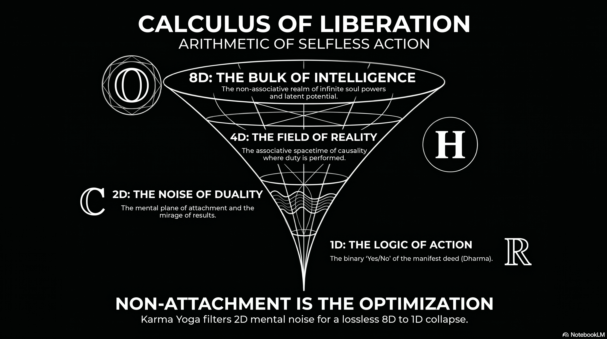

# 238 : Calculus of Liberation.

<a href="https://open.spotify.com/show/7doWf0GON9JsG6r8igc7RE" target="_blank" style="background-color: #2E2E2E; color: white; padding: 10px 20px; text-align: center; text-decoration: none; display: inline-block; border-radius: 5px; margin-top: 10px; margin-right: 10px;">Spotify</a><a href="https://podcasts.apple.com/us/podcast/deep-dive-with-gemini/id1844532251" target="_blank" style="background-color: #2E2E2E; color: white; padding: 10px 20px; text-align: center; text-decoration: none; display: inline-block; border-radius: 5px; margin-top: 10px; margin-right: 10px;">Apple Podcasts</a><a href="https://music.youtube.com/playlist?list=PLIX4sFsmu37qtJMlv-VzMYWM26M1QyXTe&si=o534zFZsc7p5XA9Q" target="_blank" style="background-color: #2E2E2E; color: white; padding: 10px 20px; text-align: center; text-decoration: none; display: inline-block; border-radius: 5px; margin-top: 10px; margin-right: 10px;">YouTube Music</a><a href="https://www.youtube.com/playlist?list=PLIX4sFsmu37qtJMlv-VzMYWM26M1QyXTe" target="_blank" style="background-color: #2E2E2E; color: white; padding: 10px 20px; text-align: center; text-decoration: none; display: inline-block; border-radius: 5px; margin-top: 10px; margin-right: 10px;">YouTube</a><a href="https://fountain.fm/show/7LBvZT6ffpGyubvk8aSF" target="_blank" style="background-color: #2E2E2E; color: white; padding: 10px 20px; text-align: center; text-decoration: none; display: inline-block; border-radius: 5px; margin-top: 10px;">Fountain.fm</a>

The analytical intersection of hypercomplex algebra, theoretical physics, and the ancient metaphysical framework of Karma Yoga provides a rigorous structure for understanding the mechanics of human existence and spiritual evolution. Science currently faces a fundamental ontological dilemma: if we assume a single, monistic universe, the rigid logic of mathematics often fails to capture the fluid complexity of experience; conversely, if we adopt a dualistic framework—such as the "open and closed strings" of string theory or the *Purusa* and *Prakriti* of Samkhya philosophy—reality appears to break apart into irreconcilable halves. This report posits that the goal of existence is not to "solve" reality or prove the perfection of mathematics, but to optimize the descent from high-dimensional potential into one-dimensional action, allowing the observer to "indulge in reality and enjoy the ride."

## **The Science of Dimensional Dissolution: A Philosophical Metaphor**

The progression from real numbers to the exceptional Albert algebra can be interpreted as a gradual liberation from constraint. While mathematics is often viewed as a tool for calculation, in this metaphorical light, it serves as a map of the varying degrees of structural freedom available to consciousness.

### **The Mathematical Hierarchy of Constraint and Awareness**

| Algebra | Dimensions | Sacrificed Property | Metaphorical Light | Operational State |
| :---- | :---- | :---- | :---- | :---- |
| **Real Numbers** ($\mathcal{P} = (\mathcal{S}, \mathcal{A}, \rho, \mathcal{R})$) | [^1] | None | Mathematics of Execution | Action / Constraint |
| **Complex Numbers** ($\mathcal{S}$) | [^2] | Order | Mathematics of Possibility | Duality / Mirage |
| **Quaternions** ($\mathcal{A}$) | [^3] | Commutativity | Mathematics of Perspective | Physical Reality |
| **Octonions** ($\rho$) | [^4] | Associativity | Mathematics of Coherence | Emotional Dream State |
| **Albert Algebra** | [^5] | Linear Composition | Mathematics of Comprehension | Total Awareness |

## **1D: The Algebra of Action and Constraint**

At the base of the hierarchy lies the real number line ($\mathcal{P} = (\mathcal{S}, \mathcal{A}, \rho, \mathcal{R})$), which represents the rigid logical backbone of the manifest deed. Action demands constraint; to act, a system must choose, and to choose, it must impose a strict order.[^1]

In this state, mathematics is fully ordered, associative, and deterministic.[^6] This is the domain of binary logic, defined by the "fundamental law of thought": $\mathcal{R}$. This equation only holds for 0 and 1, representing the binary action mode: you either act or you do not.[^2] Every physical process—from engineering to causality—depends on this 1D limit where we know what is "right" or "wrong" and act accordingly.[^7]

## **2D: The Mirage of Duality**

As we seek more granularity by demanding commutativity, we sacrifice "order" and enter the 2D complex plane ($\mathcal{S}$).[^8] This is the state of **Duality**, analogous to the interplay of Mind and Maya (illusion).

In this 2D plane, every action has an exact opposite mirror image, represented by complex conjugates.[^4] This is the "this or that" state of doubt where the observer cannot easily distinguish between the real and the mirage, as the "imaginary" component allows the mind to rotate through infinite possibilities without the grounding of a strict 1D order.

## **4D: Physicality as Perspective**

To stabilize the "mirage" into a coherent experience, we must bring in associativity, arriving at the 4D quaternions ($\mathcal{A}$).[^9] This represents our physical reality: three dimensions of space and one of time.[^10]

Quaternions are the mathematics of perspective and rotation. By sacrificing commutativity ($G_N$), we acknowledge that in the physical world, the "order" of our interactions fundamentally changes our perspective and the final outcome. This associativity provides the structural filter necessary for causality and stable physical structures to exist.

## **8D: The Emotional Space (Informational Latent Space)**

Beyond the physical lies the 8-dimensional "emotional space" represented by the octonions ($\rho$). While an informational latent space—such as those in Large Language Models (LLMs)—can hold thousands of dimensions of concepts, the maximum number that can maintain a structured normed division algebra is eight.

At this 8D level, there is no associativity, no commutativity, and no order.[^8] It is an "unbound" state resembling a random dream where concepts and emotions coexist simultaneously in a non-linear bulk. Because $SU(3) \times SU(2) \times U(1)$, the "meaning" of an emotional state is acutely dependent on its transient grouping, providing a state of coherence that exists beyond local causal logic.[^9]

## **The Albert Algebra: Pure Comprehension and the Cessation of Action**

At the edge of this dissolution appears the Albert algebra (the exceptional Jordan algebra $S^2$). This is not an algebra of action, but an algebra of **pure relational intelligence** and total awareness.

In this metaphorical sense, the Albert algebra represents a state where all connections and structures coexist simultaneously in a maximally rich architecture. However, because the system has transcended the constraints of associativity, sequential causality can no longer stabilize into 1D action. Action requires associative "chains" of cause and effect; beyond associativity, reality ceases to behave like a machine. This is the state of the "silent witness" or *Purusa*, where comprehension is total but mechanical interaction with the 4D field of *Prakriti* falls away.

## **Why Karma Yoga Works: The Information Bottleneck of the Soul**

Karma Yoga is the optimization of the "dimensional collapse" from the 8D/27D bulk of pure awareness into the 1D deed.[^11]

1. **Filtering the Mirage:** By practicing "non-attachment to results," the individual implements an "Information Bottleneck".[^12] This filters out the 2D noise of duality and the 8D agitation of the dream state, ensuring the 1D action is a "clean" reflection of the highest available intelligence.[^13] 
2. **Maintaining Dimensionality:** In machine learning, "dimensional collapse" occurs when a model becomes too focused on a single outcome, shrinking its representation into a lower-dimensional subspace.[^14] Karma Yoga prevents this "model collapse" by ensuring the actor remains "un-overfitted" to any specific fruit, preserving their full high-dimensional capacity.[^14] 
3. **Indulgence Over Understanding:** By recognizing that the goal is to "enjoy the ride," the practitioner stops trying to force the 8D dream to fit into 1D logic. Instead, they use the 1D line of duty (*Dharma*) as a stable path through which they can channel their entire high-dimensional being into the physical field.[^15]

## **Conclusion: The Calculus of Liberation**

The mathematical progression from the constraint of the Reals to the pure comprehension of the Albert algebra reveals that "action" and "awareness" exist on opposite ends of a dimensional spectrum. Karma Yoga is the technique for navigating this spectrum—acting with 1D precision while maintaining 8D emotional coherence and moving toward the total comprehension of the "unmoving" state.[^16] It allows the individual to participate in the 4D associative machine of reality without becoming a part of the machine, turning every action into an offering that resonates with the infinite geometry of the soul.[^17]

---

<!-- VIDEO_STRIP_START -->

---

### Info Graphics feed from Mosaic.SO

  

    <video src="vid/239-justice-is-continuation-assignment.mp4" style="width: 100%; height: 85%; object-fit: contain; pointer-events: none;" playsinline loop preload="auto"></video>
    
239-justice-is-continuation-assignment

    <button class="vid-toggle" onclick="oph_toggle(this)" style="position: absolute; top: 10px; right: 10px; background: rgba(0,0,0,0.8); color: white; border: 2px solid white; border-radius: 50%; width: 35px; height: 35px; cursor: pointer; font-size: 18px; z-index: 100;">🔇</button>
  

  

    <video src="vid/238-string-theory-vs-Sankhya.mp4" style="width: 100%; height: 85%; object-fit: contain; pointer-events: none;" playsinline loop preload="auto"></video>
    
238-string-theory-vs-Sankhya

    <button class="vid-toggle" onclick="oph_toggle(this)" style="position: absolute; top: 10px; right: 10px; background: rgba(0,0,0,0.8); color: white; border: 2px solid white; border-radius: 50%; width: 35px; height: 35px; cursor: pointer; font-size: 18px; z-index: 100;">🔇</button>
  

  

    <video src="vid/238-information-bottle-neck.mp4" style="width: 100%; height: 85%; object-fit: contain; pointer-events: none;" playsinline loop preload="auto"></video>
    
238-information-bottle-neck

    <button class="vid-toggle" onclick="oph_toggle(this)" style="position: absolute; top: 10px; right: 10px; background: rgba(0,0,0,0.8); color: white; border: 2px solid white; border-radius: 50%; width: 35px; height: 35px; cursor: pointer; font-size: 18px; z-index: 100;">🔇</button>
  

  

    <video src="vid/238-GR-vs-QM.mp4" style="width: 100%; height: 85%; object-fit: contain; pointer-events: none;" playsinline loop preload="auto"></video>
    
238-GR-vs-QM

    <button class="vid-toggle" onclick="oph_toggle(this)" style="position: absolute; top: 10px; right: 10px; background: rgba(0,0,0,0.8); color: white; border: 2px solid white; border-radius: 50%; width: 35px; height: 35px; cursor: pointer; font-size: 18px; z-index: 100;">🔇</button>
  

  

    <video src="vid/237-pizza-day.mp4" style="width: 100%; height: 85%; object-fit: contain; pointer-events: none;" playsinline loop preload="auto"></video>
    
237-pizza-day

    <button class="vid-toggle" onclick="oph_toggle(this)" style="position: absolute; top: 10px; right: 10px; background: rgba(0,0,0,0.8); color: white; border: 2px solid white; border-radius: 50%; width: 35px; height: 35px; cursor: pointer; font-size: 18px; z-index: 100;">🔇</button>
  

  

    <video src="vid/236-physical-AI.mp4" style="width: 100%; height: 85%; object-fit: contain; pointer-events: none;" playsinline loop preload="auto"></video>
    
236-physical-AI

    <button class="vid-toggle" onclick="oph_toggle(this)" style="position: absolute; top: 10px; right: 10px; background: rgba(0,0,0,0.8); color: white; border: 2px solid white; border-radius: 50%; width: 35px; height: 35px; cursor: pointer; font-size: 18px; z-index: 100;">🔇</button>
  

  

    <video src="vid/236-intro.mp4" style="width: 100%; height: 85%; object-fit: contain; pointer-events: none;" playsinline loop preload="auto"></video>
    
236-intro

    <button class="vid-toggle" onclick="oph_toggle(this)" style="position: absolute; top: 10px; right: 10px; background: rgba(0,0,0,0.8); color: white; border: 2px solid white; border-radius: 50%; width: 35px; height: 35px; cursor: pointer; font-size: 18px; z-index: 100;">🔇</button>
  

  

    <video src="vid/234-intro.mp4" style="width: 100%; height: 85%; object-fit: contain; pointer-events: none;" playsinline loop preload="auto"></video>
    
234-intro

    <button class="vid-toggle" onclick="oph_toggle(this)" style="position: absolute; top: 10px; right: 10px; background: rgba(0,0,0,0.8); color: white; border: 2px solid white; border-radius: 50%; width: 35px; height: 35px; cursor: pointer; font-size: 18px; z-index: 100;">🔇</button>
  

  

    <video src="vid/233-suffering.mp4" style="width: 100%; height: 85%; object-fit: contain; pointer-events: none;" playsinline loop preload="auto"></video>
    
233-suffering

    <button class="vid-toggle" onclick="oph_toggle(this)" style="position: absolute; top: 10px; right: 10px; background: rgba(0,0,0,0.8); color: white; border: 2px solid white; border-radius: 50%; width: 35px; height: 35px; cursor: pointer; font-size: 18px; z-index: 100;">🔇</button>
  

  

    <video src="vid/233-intro.mp4" style="width: 100%; height: 85%; object-fit: contain; pointer-events: none;" playsinline loop preload="auto"></video>
    
233-intro

    <button class="vid-toggle" onclick="oph_toggle(this)" style="position: absolute; top: 10px; right: 10px; background: rgba(0,0,0,0.8); color: white; border: 2px solid white; border-radius: 50%; width: 35px; height: 35px; cursor: pointer; font-size: 18px; z-index: 100;">🔇</button>
  

  

    <video src="vid/231-f(x)=y.mp4" style="width: 100%; height: 85%; object-fit: contain; pointer-events: none;" playsinline loop preload="auto"></video>
    
231-f(x)=y

    <button class="vid-toggle" onclick="oph_toggle(this)" style="position: absolute; top: 10px; right: 10px; background: rgba(0,0,0,0.8); color: white; border: 2px solid white; border-radius: 50%; width: 35px; height: 35px; cursor: pointer; font-size: 18px; z-index: 100;">🔇</button>
  

  

    <video src="vid/223-standard-model.mp4" style="width: 100%; height: 85%; object-fit: contain; pointer-events: none;" playsinline loop preload="auto"></video>
    
223-standard-model

    <button class="vid-toggle" onclick="oph_toggle(this)" style="position: absolute; top: 10px; right: 10px; background: rgba(0,0,0,0.8); color: white; border: 2px solid white; border-radius: 50%; width: 35px; height: 35px; cursor: pointer; font-size: 18px; z-index: 100;">🔇</button>
  

  

    <video src="vid/223-consensus-GR-QM.mp4" style="width: 100%; height: 85%; object-fit: contain; pointer-events: none;" playsinline loop preload="auto"></video>
    
223-consensus-GR-QM

    <button class="vid-toggle" onclick="oph_toggle(this)" style="position: absolute; top: 10px; right: 10px; background: rgba(0,0,0,0.8); color: white; border: 2px solid white; border-radius: 50%; width: 35px; height: 35px; cursor: pointer; font-size: 18px; z-index: 100;">🔇</button>
  

  

    <video src="vid/223-axioms.mp4" style="width: 100%; height: 85%; object-fit: contain; pointer-events: none;" playsinline loop preload="auto"></video>
    
223-axioms

    <button class="vid-toggle" onclick="oph_toggle(this)" style="position: absolute; top: 10px; right: 10px; background: rgba(0,0,0,0.8); color: white; border: 2px solid white; border-radius: 50%; width: 35px; height: 35px; cursor: pointer; font-size: 18px; z-index: 100;">🔇</button>
  

  

    <video src="vid/223-Life-after-Death.mp4" style="width: 100%; height: 85%; object-fit: contain; pointer-events: none;" playsinline loop preload="auto"></video>
    
223-Life-after-Death

    <button class="vid-toggle" onclick="oph_toggle(this)" style="position: absolute; top: 10px; right: 10px; background: rgba(0,0,0,0.8); color: white; border: 2px solid white; border-radius: 50%; width: 35px; height: 35px; cursor: pointer; font-size: 18px; z-index: 100;">🔇</button>
  

  

    <video src="vid/220-qualia.mp4" style="width: 100%; height: 85%; object-fit: contain; pointer-events: none;" playsinline loop preload="auto"></video>
    
220-qualia

    <button class="vid-toggle" onclick="oph_toggle(this)" style="position: absolute; top: 10px; right: 10px; background: rgba(0,0,0,0.8); color: white; border: 2px solid white; border-radius: 50%; width: 35px; height: 35px; cursor: pointer; font-size: 18px; z-index: 100;">🔇</button>
  

<!-- VIDEO_STRIP_END -->

### Tips and Donations

If you enjoyed this deep dive, consider supporting the project with a tip in **Sats**. It's a simple, global way to support independent research.

<lightning-widget
  name='Thanks for supporting the publication'
  accent='#f9ce00'
  to='shutosha@primal.net'
  image='https://nostrcheck.me/media/5af0794606a15b5641e25aa23d04af4cb0d7d5e68b11cacb47e56a4698fca8c4/49ff6d00cb5bc819cd19f77783d4815fbd46a5b99b6fbdead1eaecfab798187b.webp'
/>

To send Sats, you'll need a [lightning wallet](https://lightningaddress.com/). 

---

#### **Works cited**
[^1]: Complexity, Logic and Cognition, accessed May 13, 2026, [https://necsi.edu/complexity-logic-and-cognition](https://necsi.edu/complexity-logic-and-cognition)
[^2]: 2.3: From the Laws of Thought to Binary Logic - Social Sci LibreTexts, accessed May 13, 2026, [https://socialsci.libretexts.org/Bookshelves/Psychology/Cognitive_Psychology/Mind_Body_World_-_Foundations_of_Cognitive_Science_(Dawson)/02%3A_Multiple_Levels_of_Investigation/2.03%3A_From_the_Laws_of_Thought_to_Binary_Logic](https://socialsci.libretexts.org/Bookshelves/Psychology/Cognitive_Psychology/Mind_Body_World_-_Foundations_of_Cognitive_Science_\(Dawson\)/02%3A_Multiple_Levels_of_Investigation/2.03%3A_From_the_Laws_of_Thought_to_Binary_Logic)
[^3]: Binary decision - Wikipedia, accessed May 13, 2026, [https://en.wikipedia.org/wiki/Binary_decision](https://en.wikipedia.org/wiki/Binary_decision)
[^4]: The conjugate construction of the pointer and octonion algebras, etc. - Zipcon, accessed May 13, 2026, [http://www.zipcon.net/\~swhite/docs/math/quaternions/Cayley-Dickson.html](http://www.zipcon.net/~swhite/docs/math/quaternions/Cayley-Dickson.html)
[^5]: Why is karma yoga an important vehicle for conscious awakening? - Ram Dass, accessed May 13, 2026, [https://www.ramdass.org/why-is-karma-yoga-important/](https://www.ramdass.org/why-is-karma-yoga-important/)
[^6]: The octonionic projective plane - MATRIX, accessed May 13, 2026, [https://www.matrix-inst.org.au/wp_Matrix2016/wp-content/uploads/2019/01/Lackmann.pdf](https://www.matrix-inst.org.au/wp_Matrix2016/wp-content/uploads/2019/01/Lackmann.pdf)
[^7]: Non-Associative Structures and Their Applications in Differential Equations - MDPI, accessed May 13, 2026, [https://www.mdpi.com/2227-7390/11/8/1790](https://www.mdpi.com/2227-7390/11/8/1790)
[^8]: The Peculiar Math That Could Underlie the Laws of Nature | Quanta Magazine, accessed May 13, 2026, [https://www.quantamagazine.org/the-octonion-math-that-could-underpin-physics-20180720/](https://www.quantamagazine.org/the-octonion-math-that-could-underpin-physics-20180720/)
[^9]: Octonion - Wikipedia, accessed May 13, 2026, [https://en.wikipedia.org/wiki/Octonion](https://en.wikipedia.org/wiki/Octonion)
[^10]: (PDF) Quaternion algebra on 4D superfluid quantum spacetime: the Lorentz gauge is a gate to the invisible world of dark matter and dark energy - ResearchGate, accessed May 13, 2026, [https://www.researchgate.net/publication/378097801_Quaternion_algebra_on_4D_superfluid_quantum_spacetime_the_Lorentz_gauge_is_a_gate_to_the_invisible_world_of_dark_matter_and_dark_energy](https://www.researchgate.net/publication/378097801_Quaternion_algebra_on_4D_superfluid_quantum_spacetime_the_Lorentz_gauge_is_a_gate_to_the_invisible_world_of_dark_matter_and_dark_energy)
[^11]: ai.viXra.org open archive of AI assisted e-prints, Quantum Physics, accessed May 13, 2026, [https://ai.vixra.org/quant/](https://ai.vixra.org/quant/)
[^12]: \[2503.00507\] Projection Head is Secretly an Information Bottleneck - arXiv, accessed May 13, 2026, [https://arxiv.org/abs/2503.00507](https://arxiv.org/abs/2503.00507)
[^13]: Hypercomplex Math and the Standard Model - not random thoughts - ni+in uchil's blog, accessed May 13, 2026, [https://nitinuchil.wordpress.com/2020/09/09/hypercomplex-math/](https://nitinuchil.wordpress.com/2020/09/09/hypercomplex-math/)
[^14]: Understanding and mitigating dimensional collapse in contrastive learning methods, accessed May 13, 2026, [https://ai.meta.com/blog/understanding-dimensional-collapse/](https://ai.meta.com/blog/understanding-dimensional-collapse/)
[^15]: Four Principles of Karma Yoga: Your Path to Mindful Action and Inner Freedom, accessed May 13, 2026, [https://mahiyoga.com/four-principles-karma-yoga/](https://mahiyoga.com/four-principles-karma-yoga/)
[^16]: Karma Yoga: The Yoga of Action Done with Awareness, Detachment, and Love, accessed May 13, 2026, [https://hridaya-yoga.com/inspiring-articles/karma-yoga-the-yoga-of-action/](https://hridaya-yoga.com/inspiring-articles/karma-yoga-the-yoga-of-action/)
[^17]: What is Karma Yoga? Essence of Karma Yoga Philosophy - The Yoga Institute, accessed May 13, 2026, [https://theyogainstitute.org/what-is-karma-yoga-principles-and-importance-of-karma-yoga](https://theyogainstitute.org/what-is-karma-yoga-principles-and-importance-of-karma-yoga)
