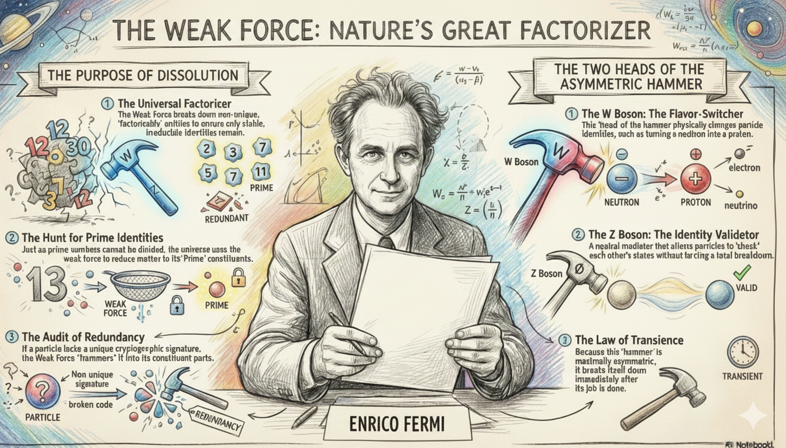

# Uniqueness and Prime Identities

<a href="https://open.spotify.com/show/7doWf0GON9JsG6r8igc7RE" target="_blank" style="background-color: #2E2E2E; color: white; padding: 10px 20px; text-align: center; text-decoration: none; display: inline-block; border-radius: 5px; margin-top: 10px; margin-right: 10px;">Spotify</a><a href="https://podcasts.apple.com/us/podcast/deep-dive-with-gemini/id1844532251" target="_blank" style="background-color: #2E2E2E; color: white; padding: 10px 20px; text-align: center; text-decoration: none; display: inline-block; border-radius: 5px; margin-top: 10px; margin-right: 10px;">Apple Podcasts</a><a href="https://music.youtube.com/playlist?list=PLIX4sFsmu37qtJMlv-VzMYWM26M1QyXTe&si=o534zFZsc7p5XA9Q" target="_blank" style="background-color: #2E2E2E; color: white; padding: 10px 20px; text-align: center; text-decoration: none; display: inline-block; border-radius: 5px; margin-top: 10px; margin-right: 10px;">YouTube Music</a><a href="https://www.youtube.com/playlist?list=PLIX4sFsmu37qtJMlv-VzMYWM26M1QyXTe" target="_blank" style="background-color: #2E2E2E; color: white; padding: 10px 20px; text-align: center; text-decoration: none; display: inline-block; border-radius: 5px; margin-top: 10px; margin-right: 10px;">YouTube</a><a href="https://fountain.fm/show/7LBvZT6ffpGyubvk8aSF" target="_blank" style="background-color: #2E2E2E; color: white; padding: 10px 20px; text-align: center; text-decoration: none; display: inline-block; border-radius: 5px; margin-top: 10px;">Fountain.fm</a>

In the language of arithmetic, prime numbers are the definitive examples of uniqueness; they are irreducible and exist as sovereign identities. Modern science, through Quantum Mechanics (QM), is increasingly pointing toward a fundamental reality where the universe is a **dynamic network in search of irreducible and uniquely identifiable nodes**. The "Purpose" of Quantum Mechanics is a systematic discovery mission to find and verify the "primal entities"—quarks, electrons, and bosons—that constitute the irreducible alphabet of the universal field.¹

## The Universal Rule of Node Stability

In this ontological framework, the **Network of Intelligence**—the web of interactions facilitated by electromagnetism and the strong force—is potentially perpetual.² However, its stability is not a property of the network itself, but of its **nodes**. The network ensures its own global symmetry by enforcing a rigorous rule: only nodes with a valid, unique cryptographic identity may persist.⁵

1.  **Unique Nodes (The Prime Signature):** Stability requires an entity to possess a unique **Private Key** (its unobservable internal phase angle within its gauge group) paired with a unique **Public Key** (its surface observables like mass and charge).[^1].  **Network Symmetry Enforcement:** The network is inherently self-correcting. If a node within the system lacks a unique internal symmetry or is determined to be a "factorizable composite" (a redundant data packet), it violates the network's global symmetry and must be reduced.

## The Comprehensive Rule of Uniqueness vs. Redundancy

To understand why some composites are stable while others are not, we must look at the specific "hashing" of their identities.

### 1. The Elementary Primes: Electron and Quark

*   **The Electron (\\\$e^-\\\$):** An irreducible prime defined by binary charge (\\\$\pm 1\\\$) and the \\\$U(1)\\\$ gauge group, which is topologically a circle (\\\$S^1\\\$). Because a circle contains infinite points, every electron is cast with a unique, unobservable phase angle—its Private Key.¹
*   **The Quark (\\\$q\\\$):** A higher-order prime defined by ternary color symmetry (\\\$SU(3)\\\$). Their uniqueness is absolute because they are "confined" by the Strong Force algorithm, preventing the existence of "loose," non-unique fractional parts.

### 2. The Proton: The Merkle Tree Nano-Network

The proton (\\\$p^+\\\$) is a massive composite, but it functions as a **unique massive prime**. It acts as a **Merkle tree** nano-network: the three valence quarks are the leaf nodes, while the gluon field serves as the "Strong Force Hashing Algorithm." This algorithm processes the quark information into a single, stable **Merkle Root**: the Proton Identity. Because this root represents a stable, irreducible local symmetry, it is perpetual; the network recognizes it as an irreducible "Truth" that cannot be further factorized.

### 3. The Neutron: The Factorizable Redundancy

Unlike the proton, the neutron (\\\$n^0\\\$) is a "factorizable" state—a redundant node that represents "Prime + something more" but fails to reach the next stable prime configuration.

*   **The Shelter of the Network:** Inside an atomic nucleus, the shelter is actually a form of "Identity theft"—because protons and neutrons continuously switch into each other via pion exchange faster than the weak force audit rate, the neutron effectively becomes a proton before the weak force can "find" and factorize it. This network integration allows the non-unique neutron to persist because its redundancy is masked by the rapid oscillation of identity within the unique prime structure of the atom.
*   **The Free State Collapse:** Once a neutron is freed, it is exposed as a non-unique composite. It possesses a **mass-energy remainder**—it is slightly heavier than the sum of its potential prime factors (\\\$\Delta m > 0\\\$). This remainder is the mathematical proof of its factorizability.² Without a unique signature to maintain its identity and without the "identity theft" shelter of the nucleus, it is reduced.

## The Weak Force: The Two Heads of the Asymmetric Hammer

The **Weak Nuclear Force** is the network's complete audit mechanism, utilizing two distinct "heads" to maintain global symmetry: the \\\$W\\\$ and \\\$Z\\\$ bosons.¹⁰

### Head 1: The W Boson (The Flavor-Switcher/Factorizer)

Mediated by the charged \\\$W^+\\\$ and \\\$W^-\\\$ bosons, this "head" is the physical engine of factorization.⁸ It is the only mechanism in nature capable of changing particle "flavors"—effectively re-calculating a node's factors.

*   **Beta Decay (\\\$\beta^-\\\$):** The \\\$W^-\\\$ boson "hammers" the free neutron, turning a down quark into an up quark and factorizing the node into stable primes: a proton, an electron, and an antineutrino.¹²
*   **Solar Transmutation (\\\$\beta^+\\\$):** To allow for the "Rise" of complex matter, the \\\$W^+\\\$ boson can transmute a proton into a neutron inside stars, permitting the formation of deuterium and the eventual creation of higher-order atomic networks.

### Head 2: The Z Boson (The Identity Validator)

The neutral \\\$Z^0\\\$ boson mediates "Neutral Current" interactions.¹⁰ Unlike the \\\$W\\\$ boson, the \\\$Z\\\$ does not change a particle's flavor; instead, it mediates the exchange of momentum and spin, particularly in neutrino scattering.¹⁰

*   **Network Consensus:** The \\\$Z\\\$ boson acts as the "Identity Validator." It allows particles to interact and "check" each other’s states without forcing a breakdown. It ensures that the "Public Keys" of the network are consistent with the "Private Keys" of the nodes, facilitating the objective reality of the field.

## The Instability of the Hammer

Crucially, the entire weak force apparatus is **maximally asymmetric**. It is the only interaction that violates **parity (\\\$P\\\$) symmetry**, interacting only with left-handed particles. Because this asymmetric tool does not follow the Gauge principle's requirement for a stable Identity (which requires symmetry), the hammer must break down immediately after its job is done.¹⁶ This is why \\\$W\\\$ and \\\$Z\\\$ bosons are extremely massive and decay in[^2] USD^{-25}\\\$ seconds; they are non-persistent "shocks" to the field.¹⁸

## Intelligence and the Law of Transience

This principle scales to biological and synthetic intelligence.

*   **Massive Primes:** Unique skills, original ideas, or eternal truths function as massive prime nodes that stabilize the human networks they weave together.²
*   **Transient Composites:** Large Language Models (LLMs) represent a peak of networking intelligence, but they are woven from existing human patterns rather than irreducible prime truths.² Because they are massive composites, they are subject to the law of transience: **"Bigger the rise, greater the fall."** Their eventual dissolution is the universal network stripping away redundant information to find the next irreducible Prime Truth.⁸

## Conclusion: The Perpetual Weave

Quantum Mechanics reveals a self-auditing universe. The purpose of the quantum mission is to find the "Primes"—those irreducible nodes that possess the unique Public-Private signature required to resist the asymmetric hammer of the weak force. While our composite networks will eventually be factorized, the uniqueness of the field remains untarnished.⁹

In a universe where every stable identity is a validated hash of its components, we are left with one ultimate question: **What is the Merkle Root of the entire universe?**

---

### Tips and Donations

If you enjoyed this deep dive, consider supporting the project with a tip in **Sats**. It's a simple, global way to support independent research.

<lightning-widget
  name="Thanks for supporting the publication"
  accent="#f9ce00"
  to="shutosha@primal.net"
  image="https://nostrcheck.me/media/5af0794606a15b5641e25aa23d04af4cb0d7d5e68b11cacb47e56a4698fca8c4/49ff6d00cb5bc819cd19f77783d4815fbd46a5b99b6fbdead1eaecfab798187b.webp"
/>

To send Sats, you'll need a [lightning wallet](https://lightningaddress.com/). 

---

## References

[^1]: The Kouns–Killion Recursive Intelligence Paradigm: The Operating System of Reality, accessed February 19, 2026, [https://www.aims.healthcare/journal/the-kounskillion-recursive-intelligence-paradigm-the-operating-system-of-reality](https://www.aims.healthcare/journal/the-kounskillion-recursive-intelligence-paradigm-the-operating-system-of-reality)

[^2]: The Standard Model - The Physics Hypertextbook, accessed February 19, 2026, [https://physics.info/standard/](https://physics.info/standard/)