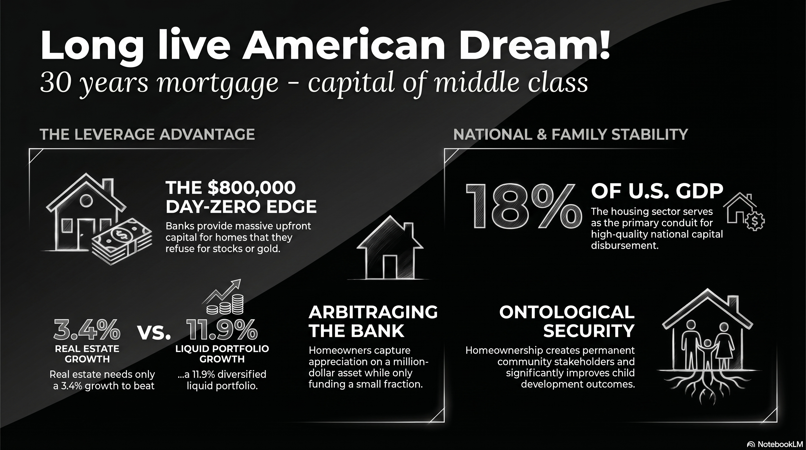

# 222 : Homeownership - American Dream!

<a href="https://open.spotify.com/show/7doWf0GON9JsG6r8igc7RE" target="_blank" style="background-color: #2E2E2E; color: white; padding: 10px 20px; text-align: center; text-decoration: none; display: inline-block; border-radius: 5px; margin-top: 10px; margin-right: 10px;">Spotify</a><a href="https://podcasts.apple.com/us/podcast/deep-dive-with-gemini/id1844532251" target="_blank" style="background-color: #2E2E2E; color: white; padding: 10px 20px; text-align: center; text-decoration: none; display: inline-block; border-radius: 5px; margin-top: 10px; margin-right: 10px;">Apple Podcasts</a><a href="https://music.youtube.com/playlist?list=PLIX4sFsmu37qtJMlv-VzMYWM26M1QyXTe&si=o534zFZsc7p5XA9Q" target="_blank" style="background-color: #2E2E2E; color: white; padding: 10px 20px; text-align: center; text-decoration: none; display: inline-block; border-radius: 5px; margin-top: 10px; margin-right: 10px;">YouTube Music</a><a href="https://www.youtube.com/playlist?list=PLIX4sFsmu37qtJMlv-VzMYWM26M1QyXTe" target="_blank" style="background-color: #2E2E2E; color: white; padding: 10px 20px; text-align: center; text-decoration: none; display: inline-block; border-radius: 5px; margin-top: 10px; margin-right: 10px;">YouTube</a><a href="https://fountain.fm/show/7LBvZT6ffpGyubvk8aSF" target="_blank" style="background-color: #2E2E2E; color: white; padding: 10px 20px; text-align: center; text-decoration: none; display: inline-block; border-radius: 5px; margin-top: 10px;">Fountain.fm</a>

Why is it that a bank will readily hand a young couple a massive loan—often five times their own savings—to purchase a home, yet will flatly refuse to lend that same amount for the purchase of stocks, gold, or bitcoin? Why is homeownership treated with such unique reverence that the Federal Government, local communities, and even the "wisdom" of one's parents all converge on a single piece of advice: *buy your own home*?

The answer lies in the structural architecture of the American economy. The American Dream is not an abstract sentiment; it is a tangible financial system centered on the residential mortgage—the "safest loan" in existence. While recent years have seen the rise of digital assets and record-breaking stock markets, homeownership remains the only vehicle that allows the middle class to "arbitrage the Fed" by securing 800,000 USD in Day-Zero capital at a low fixed rate. This report argues that the American Dream is more alive today than ever, fueled by a unique synergy between individual family wealth, community stability, and national economic security.

## I. The Family Perspective: Arbitraging the Bank for Generational Wealth

For a young couple looking to start a family, the home is more than a shelter; it is a laboratory for capital creation. It allows a family to capture the appreciation of a million-dollar asset while only funding a fraction of the cost themselves.

### **Case Study: The 32-Year-Old "Leverage vs. Diversification" Model**

Consider a couple, aged 32, who have saved **200,000 USD** for a seed capital investment. They are choosing between purchasing a prime **1,000,000 USD** downtown property or renting at **4,000 USD/month** and investing that capital into a liquid portfolio.

**1\. The Monthly Outlay & The OBBBA Advantage**

In a prime market, the effective cost of ownership factors in the tax benefits provided by the **One Big Beautiful Bill Act (OBBBA)** of 2026, which increased the SALT deduction cap to **40,400 USD** and made the Mortgage Interest Deduction permanent.[^2]

| Monthly Expense Category | Homeowner Cost Details | Monthly Total |
| :---- | :---- | :---- |
| **Mortgage (P\&I)** | 800,000 USD loan @ 6% (30-yr fixed) | 4,796 USD |
| **Property Tax** | \~1.2% Effective Rate | 1,000 USD |
| **HOA/Maintenance** | Standard Urban Prime | 500 USD |
| **Insurance** | Condo Policy | 100 USD |
| **Gross Monthly Payout** |  | **6,396 USD** |
| **Incremental Tax Savings** | OBBBA Itemized (40,000 USD SALT \+ MID) | (-556 USD) |
| **Net Monthly Cost** | **Effective Ownership Outlay** | **5,840 USD** |

**The Delta Investment:** The ownership premium is **1,840 USD per month** over renting. In this model, we assume the Renter invests their 200,000 USD principal plus this **1,840 USD monthly delta** into a diversified portfolio.

**2\. The 6-Year After-Tax Comparison: Home vs. The World**

Most rational investors will not put 100% of their hard-earned seed capital into a single asset like Bitcoin due to its extreme volatility. We compare the leveraged home against individual assets and a standard **"33/33/33" Diversified Posture** (S\&P 500, Gold, Bitcoin).

| Investment Path | Assumed ARR | Final Net Worth (6 yrs) | Net After-Tax Gain |
| :---- | :---- | :---- | :---- |
| **Homeownership (Leveraged)** | 7.5% Prop | **708,704 USD** | **508,704 USD** (Tax-Free) |
| **S\&P 500 (15-yr Avg)** | 12.6% | 547,480 USD | 215,000 USD |
| **Bitcoin (Rational Case)** | 15.0% | 611,480 USD | 279,000 USD |
| **Gold (15-yr Avg)** | 8.2% | 449,480 USD | 117,000 USD |
| **Diversified (33/33/33)** | 11.9% Wtd | **536,480 USD** | **204,000 USD** |

**The Threshold Statement:** While this model assumes 7.5% growth, property appreciation only needs to hit **3.4% annually** for the home to match the after-tax gains of a diversified 11.9% liquid portfolio. This is the power of securing an **800,000 USD capital injection** at Day-Zero—leverage that is mathematically impossible to replicate with stocks or gold.[^1]

### **The Psychological Sanctuary**

Beyond the numbers, the home provides "ontological security"—a sense of permanence that rental arrangements cannot provide.[^3] Homeowners report higher life satisfaction and lower levels of psychological distress.[^3] [^4] This stability is critical for child development; children of homeowners move at one-fifth the rate of renters, leading to significantly higher test scores and graduation rates.[^5]

## II. The Community Perspective: Growing Roots in a Digital World

Homeownership transforms a resident from a transient consumer into a local stakeholder. While digital portfolio owners can liquidate their assets and move with a click, homeowners "plug in" to their geography, creating the vibrancy that defines a great neighborhood.

* **Stakeholder Commitment:** Because homeowners have a direct financial stake in the area, they are more than twice as likely as renters to join neighborhood associations and participate in local governance.[^5]  
* **Neighborhood Vibrancy:** Homeowners invest more in property maintenance and landscaping, which improves the overall "livability" and aesthetic of the street.[^5]  
* **Public Safety:** Research shows that homeownership is correlated with lower crime rates, as residents have a greater incentive to participate in community watch programs to protect their asset values.[^3]  
* **Social Cohesion:** Well-maintained homes and children playing in yards reflect a community focused on long-term stability and intergenerational growth, rather than the "rootless" mobility of a rental-heavy market.[^6] [^7]

## III. The National Perspective: The Architecture of Global Finance

From a national standpoint, the housing sector is the primary conduit for the disbursement of high-quality capital. The U.S. has created a unique financial hub centered on the residential mortgage, widely considered the "best loan" in the global system.

### **The AAA Standard and Construction Boom**

The "implicit lien" on real estate makes residential property a "AAA-rated" collateral. Historically, there has never been a multi-decade recession in the U.S. that has destroyed the value of residential land across the entire country. This inherent safety allows for the disbursement of trillions of dollars in credit, fueling a construction sector that typically accounts for **15-18% of U.S. GDP**.

Each home sale triggers a "sales volume multiplier effect," with a fiscal multiplier as high as **4.35 USD per dollar** of government stimulus.[^1] This stands in stark contrast to the real estate crises of global competitors:

* **Japan:** An Adjustable-Rate Mortgage (ARM) trap and an aging population led to a "Lost Decade" of stagnation.[^8] [^9]  
* **China:** With nearly **70% of household wealth** concentrated in housing and no social safety net, a real estate slowdown has crushed consumer confidence and triggered deflationary pressure.

## Conclusion: A Hopeful Note for the Dream

The American Dream is alive today more than at any other time in history. By securing a first-lien mortgage on a property, a young couple is not just buying a house; they are acquiring a stake in the American economy, a hedge against inflation, and a permanent sanctuary for their children.

The path forward requires a renewed commitment from the Government and the Federal Reserve to restimulate the housing sector—by lowering regulatory barriers and supporting the 30-year fixed-rate mortgage—ensuring that the laboratory of the middle class remains open to all. 

Homeownership is the ultimate guarantor of individual liberty and national stability, and its continued vitality remains the primary engine of the American experiment.

---

### Tips and Donations

If you enjoyed this deep dive, consider supporting the project with a tip in **Sats**. It's a simple, global way to support independent research.

<lightning-widget
  name="Thanks for supporting the publication"
  accent="#f9ce00"
  to="shutosha@primal.net"
  image="https://nostrcheck.me/media/5af0794606a15b5641e25aa23d04af4cb0d7d5e68b11cacb47e56a4698fca8c4/49ff6d00cb5bc819cd19f77783d4815fbd46a5b99b6fbdead1eaecfab798187b.webp"
/>

To send Sats, you'll need a [lightning wallet](https://lightningaddress.com/). 

---

## References

[^1]: The Propagation of Demand Shocks Through ... - Federal Reserve, accessed April 7, 2026, [https://www.federalreserve.gov/econres/feds/files/2019084pap.pdf](https://www.federalreserve.gov/econres/feds/files/2019084pap.pdf)

[^2]: Investing in Homeownership: Public Investments in Starter Home Development | National Housing Crisis Task Force, accessed April 7, 2026, [https://nationalhousingcrisis.org/toolkit/capital/investing-in-homeownership-public-investments-in-starter-home-development/](https://nationalhousingcrisis.org/toolkit/capital/investing-in-homeownership-public-investments-in-starter-home-development/)

[^3]: Homeownership and Mental Health - Houston Habitat for Humanity, accessed April 7, 2026, [https://www.houstonhabitat.org/2023/06/02/homeownership-and-mental-health/](https://www.houstonhabitat.org/2023/06/02/homeownership-and-mental-health/)

[^4]: Unlocking the door to mental wellness: exploring the impact of ..., accessed April 7, 2026, [https://pmc.ncbi.nlm.nih.gov/articles/PMC11656966/](https://pmc.ncbi.nlm.nih.gov/articles/PMC11656966/)

[^5]: The Social Benefits of Homeownership: Building Stronger Communities - Lodha Group, accessed April 7, 2026, [https://www.lodhagroup.com/blogs/homebuyers-handbook/the-social-benefits-of-homeownership-building-stronger-communities](https://www.lodhagroup.com/blogs/homebuyers-handbook/the-social-benefits-of-homeownership-building-stronger-communities)

[^6]: Research series: How does homeownership contribute to social and civic engagement?, accessed April 7, 2026, [https://www.habitat.org/our-work/impact/research-series-how-does-homeownership-contribute-to-social-and-civic-engagement](https://www.habitat.org/our-work/impact/research-series-how-does-homeownership-contribute-to-social-and-civic-engagement)

[^7]: The Social and Economic Benefits of Homeownership - Texas State Affordable Housing Corporation (TSAHC), accessed April 7, 2026, [https://www.tsahc.org/blog/post/the-social-and-economic-benefits-of-homeownership](https://www.tsahc.org/blog/post/the-social-and-economic-benefits-of-homeownership)

[^8]: Japans Lost Decades and Chinas Economic Slowdown: Structural Challenges and Policy Lessons - ResearchGate, accessed April 7, 2026, [https://www.researchgate.net/publication/396588975_Japans_Lost_Decades_and_Chinas_Economic_Slowdown_Structural_Challenges_and_Policy_Lessons](https://www.researchgate.net/publication/396588975_Japans_Lost_Decades_and_Chinas_Economic_Slowdown_Structural_Challenges_and_Policy_Lessons)

[^9]: Central bank rate hikes pose more risk to mortgage borrowers in Japan than in US, accessed April 7, 2026, [https://www.nri.com/content/900013725.pdf](https://www.nri.com/content/900013725.pdf)

