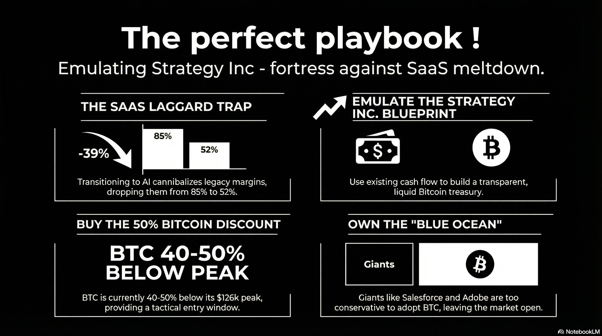

# 221 : The perfect playbook

<a href="https://open.spotify.com/show/7doWf0GON9JsG6r8igc7RE" target="_blank" style="background-color: #2E2E2E; color: white; padding: 10px 20px; text-align: center; text-decoration: none; display: inline-block; border-radius: 5px; margin-top: 10px; margin-right: 10px;">Spotify</a><a href="https://podcasts.apple.com/us/podcast/deep-dive-with-gemini/id1844532251" target="_blank" style="background-color: #2E2E2E; color: white; padding: 10px 20px; text-align: center; text-decoration: none; display: inline-block; border-radius: 5px; margin-top: 10px; margin-right: 10px;">Apple Podcasts</a><a href="https://music.youtube.com/playlist?list=PLIX4sFsmu37qtJMlv-VzMYWM26M1QyXTe&si=o534zFZsc7p5XA9Q" target="_blank" style="background-color: #2E2E2E; color: white; padding: 10px 20px; text-align: center; text-decoration: none; display: inline-block; border-radius: 5px; margin-top: 10px; margin-right: 10px;">YouTube Music</a><a href="https://www.youtube.com/playlist?list=PLIX4sFsmu37qtJMlv-VzMYWM26M1QyXTe" target="_blank" style="background-color: #2E2E2E; color: white; padding: 10px 20px; text-align: center; text-decoration: none; display: inline-block; border-radius: 5px; margin-top: 10px; margin-right: 10px;">YouTube</a><a href="https://fountain.fm/show/7LBvZT6ffpGyubvk8aSF" target="_blank" style="background-color: #2E2E2E; color: white; padding: 10px 20px; text-align: center; text-decoration: none; display: inline-block; border-radius: 5px; margin-top: 10px;">Fountain.fm</a>

In the April 2026 financial landscape, the "SaaSpocalypse" has transitioned from a theoretical risk into a structural market reality. While the global economy shows resilience, the horizontal and mid-market SaaS sectors are being "starved" of capital, with the iShares Expanded Tech-Software Sector ETF (IGV) down [^1]% and nearly [^2]% of the S\&P 500 heading for a negative year. This report outlines why the "Saylor Playbook"—pioneered by Strategy Inc. (formerly MicroStrategy)—is no longer a fringe strategy but the most viable exit ramp for SaaS players and Private Equity (PE) firms trapped in a cycle of inaction.

## ---

**1\. The "Full Throttle" Mandate: AI Infrastructure vs. Bitcoin Treasury**

The 2026 market demands extreme strategic conviction. There is no longer a rewarded "middle line" for enterprise technology companies. Investors have split the market into two "blessed" categories:

### **The AI Infrastructure Winners**

Companies like **Oracle and Google** have gone "full throttle" into AI infrastructure. Oracle reported a staggering 325% year-over-year increase in Remaining Performance Obligations (RPO) to 553 billion USD, primarily driven by massive multi-year deals for AI training. Because they provide the "picks and shovels" (data centers and compute), their stocks are hitting record highs as they deploy liquid-cooled NVIDIA Blackwell racks at a "zettascale" level.

### **The SaaS Laggard Trap**

Traditional SaaS companies face a "Full AI" paradox. Unlike infrastructure providers, a SaaS company attempting to pivot "Full AI" often cannibalizes its own high-margin legacy business. Transitioning from seat-based subscriptions to AI outcomes forces a recalibration of pricing that often results in lower gross margins—averaging 52% for AI products compared to the 80-85% standard in legacy SaaS.[^3]

| Strategy Path | Execution Style | Investor Sentiment | Competitive Risk |
| :---- | :---- | :---- | :---- |
| **Full AI Infrastructure** | High CapEx/Data Centers | **Blessed**: Massive Backlogs. | Low: Dominated by "CapEx Arms Race". |
| **Full Bitcoin Treasury** | Treasury Accumulation | **Blessed**: Proxy for Hard Asset.[^4] | Low: Supply capped at 21M. |
| **Legacy SaaS Pivot** | Incremental AI Add-ons | **Hammered**: Future expectations bleak. | High: Disrupted by AI-native players.[^3] |

## ---

**2\. The Expectations Gap: Moat Erosion vs. Reality**

The primary pressure on SaaS valuations is not immediate seat-count erosion—which remains "not fully in the realm of reality" for many legacy workflows—but rather the **death of investor confidence**.

* **Market Skepticism:** SaaS stocks like Adobe and Salesforce have seen billions in market value evaporate not because their "cash cows" died, but because future expectations are bleak. Investors are no longer waiting to validate if a moat has eroded; they are selling ahead of perceived disruption.[^5]  
* **AI-Native Disruption:** The real threat is specialized, AI-native competitors. For example, the **Mosaic AI Video Editor** is systematically disrupting the time-tested Adobe Creative Suite by offering cinematic AI motion and production speeds that make legacy tools look like "dinosaurs".  
* **Big Tech Encroachment:** The "impenetrable" ERP and HR tools of the past are being breached. Google, Microsoft, and Meta are capturing these markets because their traditional consumer tech is being replaced by novel AI apps; to survive, they are moving up-market into enterprise tools. To the next generation of professionals, legacy SaaS is viewed as "grandma's tech".[^6]

## ---

**3\. The 10:1 Match: Why Strategy Inc. is the Perfect Blueprint**

It is often forgotten that MicroStrategy was a pure-play SaaS/Business Intelligence company before adopting its current mandate. The Saylor Playbook is a 100% match for the current ailing SaaS sector because it was born from the same industry constraints.

* **Open-Sourced Model:** Michael Saylor effectively "open-sourced" the corporate Bitcoin strategy five years ahead of his peers, providing a blueprint for how a software company can use its cash flow to become a "digital fortress".[^7]  
* **Conviction Over Inaction:** SaaS laggards must adopt this model in full earnest—open, transparent, and immediate. The market only rewards early movers. Just as Oracle and Microsoft were early in AI, Strategy Inc. was early in Bitcoin. There is still space for SaaS companies to claim the "Bitcoin side" of the valuation ledger.[^8]

## ---

**4\. The "Good Luck" Window: Buying the Bitcoin Discount**

For SaaS players looking to enter the fray in April 2026, the current market provides a significant tactical advantage.

* **Pricing Opportunity:** Bitcoin hit an all-time high of approximately 126,000 USD in October 2025\. As of April 2026, Bitcoin is trading in the **66,500 USD to 71,000 USD** range—representing a **40% to 45% discount** from its peak.  
* **Institutional Support:** Despite this correction, analysts like Bernstein reiterate long-term targets of 150,000 USD by year-end, driven by resilient ETF flows and new institutional on-ramps. SaaS companies can "front-run" this recovery to repair their balance sheets.

## ---

**5\. Private Equity's Role: Mandating Capitalization**

Private Equity firms should no longer view Bitcoin as a speculative distraction but as a mandatory tool for capital discipline among their portfolio borrowers.

* **Real-Time Health Checks:** Unlike IP or real estate—which are vague, illiquid, and difficult to value—Bitcoin provides a transparent, real-time health check on a company's property via fair value reporting under **FASB ASU 2023-08**.  
* **Lien-Backed Collateral:** Under **UCC Article 12**, finalized and effective in states like New York as of June 2026, lenders can perfect a security interest in Bitcoin by **"control"**. This allows PE lenders to claim a superior, liquid lien that is secure and instantly auditable.[^9]

## ---

**6\. The Schrodinger’s SaaS Dilemma: AI Pivot vs. Bitcoin Certainty**

At this stage, pivoting to AI is for many SaaS companies a "Schrodinger’s Cat" scenario. Until the results are proven in 2-3 years, these firms are simultaneously alive (clinging to legacy contracts) and dead (losing the R\&D arms race against trillion-dollar giants and nimble AI-native startups).

* **No "Coin Toss" Required:** While an AI pivot is a high-stakes gamble against Google and Microsoft, the Bitcoin strategy is **100% proven**. Strategy Inc. has already validated the model, raising over 4 billion USD to expand its holdings to 762,099 BTC and delivering consistent BTC Yield.  
* **Zero Competition from Giants:** There is literally no competition from the bigger players on the Bitcoin side. Salesforce, Workday, and Adobe cannot easily adopt a Bitcoin treasury without risking massive institutional fallout from their conservative shareholder bases, leaving a "Blue Ocean" for mid-market SaaS laggards to execute without competition.[^8]  
* **Investor Fatigue:** Investors have lost faith in "coin flips" and pivots that offer no clear path to revenue durability. The Bitcoin strategy provides a clear, mathematical path to value that doesn't rely on "winning" a software category that is being commoditized by agents.[^6]

## ---

**7\. Verdict: Speed and Transparent Execution**

The name of the game in 2026 is **speed and transparent execution**. SaaS companies are currently in a "deep hole" dug by inaction. By shifting from a seat-based "headcount tax" to a **BTC Yield** engine, ailing SaaS companies can provide investors with a reason to buy the stock that is untethered from the specific risks of AI substitution. Emulating Strategy Inc. is no longer a choice—it is the only proven path out of the hole.[^7]

---

### Tips and Donations

If you enjoyed this deep dive, consider supporting the project with a tip in **Sats**. It's a simple, global way to support independent research.

<lightning-widget
  name="Thanks for supporting the publication"
  accent="#f9ce00"
  to="shutosha@primal.net"
  image="https://nostrcheck.me/media/5af0794606a15b5641e25aa23d04af4cb0d7d5e68b11cacb47e56a4698fca8c4/49ff6d00cb5bc819cd19f77783d4815fbd46a5b99b6fbdead1eaecfab798187b.webp"
/>

To send Sats, you'll need a [lightning wallet](https://lightningaddress.com/). 

---

## References

[^1]: iShares Expanded Tech-Software Sector ETF (IGV) performance, April 2026 market data.

[^2]: S&P 500 Software Sector analysis, April 2026 market data.

[^3]: 2026 Digital Asset Outlook: Dawn of the Institutional Era - Grayscale Research, accessed April 9, 2026, [https://research.grayscale.com/reports/2026-digital-asset-outlook-dawn-of-the-institutional-era](https://research.grayscale.com/reports/2026-digital-asset-outlook-dawn-of-the-institutional-era)

[^4]: Bitcoin for Corporations | February 24–25, 2026 | Las Vegas - Strategy, accessed April 9, 2026, [https://www.strategy.com/pt/world26/bitcoin-for-corporations](https://www.strategy.com/pt/world26/bitcoin-for-corporations)

[^5]: FASB Issues Standard to Improve the Accounting for and Disclosure of Certain Crypto Assets, accessed April 9, 2026, [https://www.fasb.org/news-and-meetings/in-the-news/fasb-issues-standard-to-improve-the-accounting-for-and-disclosure-of-certain-crypto-assets-397718](https://www.fasb.org/news-and-meetings/in-the-news/fasb-issues-standard-to-improve-the-accounting-for-and-disclosure-of-certain-crypto-assets-397718)

[^6]: Workday, Salesforce FY26 Q4 Earnings Show Growth, Scale, and ..., accessed April 9, 2026, [https://erp.today/workday-salesforce-fy26-q4-earnings-show-growth-scale-and-platform-competition/](https://erp.today/workday-salesforce-fy26-q4-earnings-show-growth-scale-and-platform-competition/)

[^7]: Strategy Announces Fourth Quarter 2025 Financial Results, accessed April 9, 2026, [https://www.strategy.com/press/strategy-announces-fourth-quarter-2025-financial-results_02-05-2026](https://www.strategy.com/press/strategy-announces-fourth-quarter-2025-financial-results_02-05-2026)

[^8]: Key capital market trends: Digital asset treasuries | DLA Piper, accessed April 9, 2026, [https://www.dlapiper.com/insights/publications/2025/10/key-capital-market-trends-digital-asset-treasuries](https://www.dlapiper.com/insights/publications/2025/10/key-capital-market-trends-digital-asset-treasuries)

[^9]: UCC Article 12, Bitcoin as Collateral under Control, New York State Law updates, June 2026.
